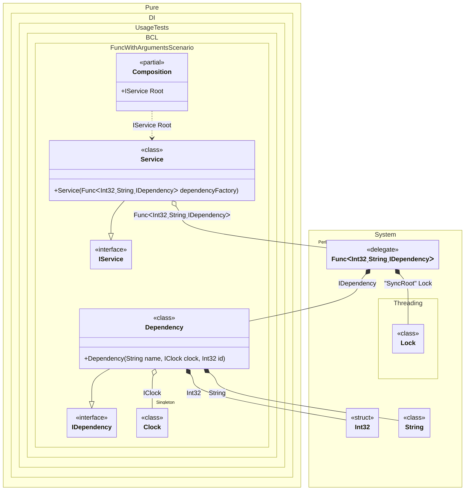

#### Func with arguments


```c#
using Shouldly;
using Pure.DI;
using System.Collections.Immutable;

DI.Setup(nameof(Composition))
    .Bind().As(Lifetime.Singleton).To<Clock>()
    .Bind().To<Dependency>()
    .Bind().To<Service>()

    // Composition root
    .Root<IService>("Root");

var composition = new Composition();
var service = composition.Root;
service.Dependencies.Length.ShouldBe(3);

service.Dependencies[0].Name.ShouldBe("Abc");
service.Dependencies[0].Id.ShouldBe(0);

service.Dependencies[1].Name.ShouldBe("Xyz");
service.Dependencies[1].Id.ShouldBe(1);

service.Dependencies[2].Id.ShouldBe(2);
service.Dependencies[2].Name.ShouldBe("");

interface IClock
{
    DateTimeOffset Now { get; }
}

class Clock : IClock
{
    public DateTimeOffset Now => DateTimeOffset.Now;
}

interface IDependency
{
    string Name { get; }
    int Id { get; }
}

class Dependency(string name, IClock clock, int id)
    : IDependency
{
    public string Name => name;
    public int Id => id;
}

interface IService
{
    ImmutableArray<IDependency> Dependencies { get; }
}

class Service(Func<int, string, IDependency> dependencyFactory): IService
{
    public ImmutableArray<IDependency> Dependencies { get; } =
    [
        dependencyFactory(0, "Abc"),
        dependencyFactory(1, "Xyz"),
        dependencyFactory(2, "")
    ];
}
```

<details>
<summary>Running this code sample locally</summary>

- Make sure you have the [.NET SDK 9.0](https://dotnet.microsoft.com/en-us/download/dotnet/9.0) or later is installed
```bash
dotnet --list-sdk
```
- Create a net9.0 (or later) console application
```bash
dotnet new console -n Sample
```
- Add references to NuGet packages
  - [Pure.DI](https://www.nuget.org/packages/Pure.DI)
  - [Shouldly](https://www.nuget.org/packages/Shouldly)
```bash
dotnet add package Pure.DI
dotnet add package Shouldly
```
- Copy the example code into the _Program.cs_ file

You are ready to run the example 🚀
```bash
dotnet run
```

</details>

The following partial class will be generated:

```c#
partial class Composition
{
  private readonly Composition _root;
#if NET9_0_OR_GREATER
  private readonly Lock _lock;
#else
  private readonly Object _lock;
#endif

  private Clock? _singleClock52;

  [OrdinalAttribute(256)]
  public Composition()
  {
    _root = this;
#if NET9_0_OR_GREATER
    _lock = new Lock();
#else
    _lock = new Object();
#endif
  }

  internal Composition(Composition parentScope)
  {
    _root = (parentScope ?? throw new ArgumentNullException(nameof(parentScope)))._root;
    _lock = parentScope._lock;
  }

  public IService Root
  {
    [MethodImpl(MethodImplOptions.AggressiveInlining)]
    get
    {
      Func<int, string, IDependency> blockFunc1;
      Func<int, string, IDependency> localFactory116 = new Func<int, string, IDependency>((int localArg114, string localArg224) =>
      {
        Lock transLock2 = _lock;
        Lock localLockObject117 = transLock2;
        lock (localLockObject117)
        {
          int overrInt32 = localArg114;
          string overrString2 = localArg224;
          if (_root._singleClock52 is null)
          {
            lock (_lock)
            {
              _root._singleClock52 = new Clock();
            }
          }

          IDependency localValue118 = new Dependency(overrString2, _root._singleClock52, overrInt32);
          return localValue118;
        }
      });
      blockFunc1 = localFactory116;
      return new Service(blockFunc1);
    }
  }
}
```

Class diagram:



