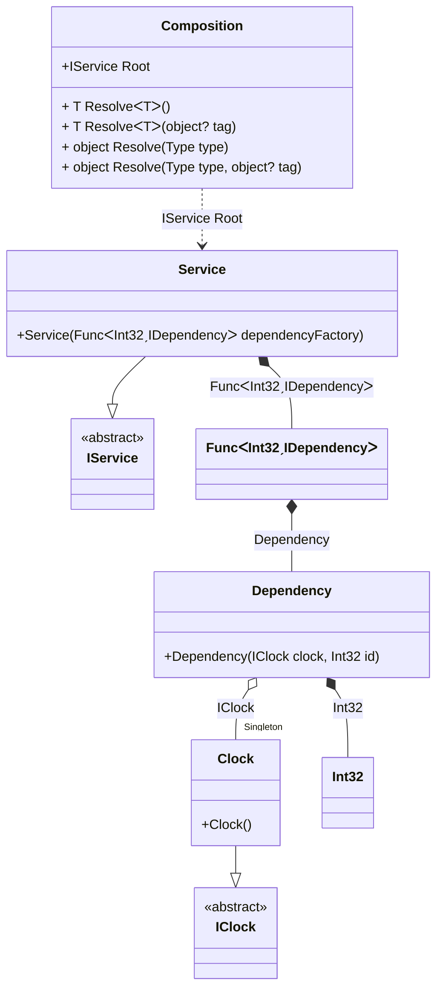

#### Func with arguments

[](../tests/Pure.DI.UsageTests/BaseClassLibrary/FuncWithArgumentsScenario.cs)

```c#
interface IClock
{
    DateTimeOffset Now { get; }
}

class Clock : IClock
{
    public DateTimeOffset Now => DateTimeOffset.Now;
}

interface IDependency
{
    int Id { get; }
}

class Dependency : IDependency
{
    public Dependency(IClock clock, int id) =>
        Id = id;

    public int Id { get; }
}

interface IService
{
    ImmutableArray<IDependency> Dependencies { get; }
}

class Service : IService
{
    public Service(Func<int, IDependency> dependencyFactory) =>
        Dependencies = Enumerable
            .Range(0, 10)
            .Select((_, index) => dependencyFactory(index))
            .ToImmutableArray();

    public ImmutableArray<IDependency> Dependencies { get; }
}

DI.Setup("Composition")
    .Bind<IClock>().As(Lifetime.Singleton).To<Clock>()
    // Binds a dependency of type int
    // to the source code statement "dependencyId"
    .Bind<int>().To<int>("dependencyId")
    .Bind<Func<int, IDependency>>()
        .To<Func<int, IDependency>>(ctx =>
            dependencyId =>
            {
                // Builds up an instance of type Dependency
                // referring the source code statement "dependencyId"
                ctx.Inject<Dependency>(out var dependency);
                return dependency;
            })
    .Bind<IService>().To<Service>().Root<IService>("Root");

var composition = new Composition();
var service = composition.Root;
service.Dependencies.Length.ShouldBe(10);
service.Dependencies[3].Id.ShouldBe(3);
```

<details open>
<summary>Class Diagram</summary>



</details>

<details>
<summary>Pure.DI-generated partial class Composition</summary><blockquote>

```c#
partial class Composition
{
  private readonly global::System.IDisposable[] _disposableSingletonsM12D26di;
  private Pure.DI.UsageTests.BCL.FuncWithArgumentsScenario.Clock _singletonM12D26di21;
  
  public Composition()
  {
    _disposableSingletonsM12D26di = new global::System.IDisposable[0];
  }
  
  internal Composition(Composition parent)
  {
    _disposableSingletonsM12D26di = new global::System.IDisposable[0];
    lock (parent._disposableSingletonsM12D26di)
    {
      _singletonM12D26di21 = parent._singletonM12D26di21;
    }
  }
  
  #region Composition Roots
  public Pure.DI.UsageTests.BCL.FuncWithArgumentsScenario.IService Root
  {
    #if NETSTANDARD2_0_OR_GREATER || NETCOREAPP || NET40_OR_GREATER || NET
    [global::System.Diagnostics.Contracts.Pure]
    #endif
    get
    {
      System.Func<int, Pure.DI.UsageTests.BCL.FuncWithArgumentsScenario.IDependency> transientM12D26di1 = default(System.Func<int, Pure.DI.UsageTests.BCL.FuncWithArgumentsScenario.IDependency>);
      transientM12D26di1 = dependencyId =>
      {
          int transientM12D26di3 = default(int);
          transientM12D26di3 = dependencyId;
          if (object.ReferenceEquals(_singletonM12D26di21, null))
          {
              _singletonM12D26di21 = new Pure.DI.UsageTests.BCL.FuncWithArgumentsScenario.Clock();
          }
          var localM12D26di1 = new Pure.DI.UsageTests.BCL.FuncWithArgumentsScenario.Dependency(_singletonM12D26di21, transientM12D26di3);
          return localM12D26di1;
      };
      return new Pure.DI.UsageTests.BCL.FuncWithArgumentsScenario.Service(transientM12D26di1);
    }
  }
  #endregion
  
  #region API
  #if NETSTANDARD2_0_OR_GREATER || NETCOREAPP || NET40_OR_GREATER || NET
  [global::System.Diagnostics.Contracts.Pure]
  #endif
  public T Resolve<T>()
  {
    return ResolverM12D26di<T>.Value.Resolve(this);
  }
  
  #if NETSTANDARD2_0_OR_GREATER || NETCOREAPP || NET40_OR_GREATER || NET
  [global::System.Diagnostics.Contracts.Pure]
  #endif
  public T Resolve<T>(object? tag)
  {
    return ResolverM12D26di<T>.Value.ResolveByTag(this, tag);
  }
  
  #if NETSTANDARD2_0_OR_GREATER || NETCOREAPP || NET40_OR_GREATER || NET
  [global::System.Diagnostics.Contracts.Pure]
  #endif
  public object Resolve(global::System.Type type)
  {
    var index = (int)(_bucketSizeM12D26di * ((uint)global::System.Runtime.CompilerServices.RuntimeHelpers.GetHashCode(type) % 1));
    var finish = index + _bucketSizeM12D26di;
    do {
      ref var pair = ref _bucketsM12D26di[index];
      if (ReferenceEquals(pair.Key, type))
      {
        return pair.Value.Resolve(this);
      }
    } while (++index < finish);
    
    throw new global::System.InvalidOperationException($"Cannot resolve composition root of type {type}.");
  }
  
  #if NETSTANDARD2_0_OR_GREATER || NETCOREAPP || NET40_OR_GREATER || NET
  [global::System.Diagnostics.Contracts.Pure]
  #endif
  public object Resolve(global::System.Type type, object? tag)
  {
    var index = (int)(_bucketSizeM12D26di * ((uint)global::System.Runtime.CompilerServices.RuntimeHelpers.GetHashCode(type) % 1));
    var finish = index + _bucketSizeM12D26di;
    do {
      ref var pair = ref _bucketsM12D26di[index];
      if (ReferenceEquals(pair.Key, type))
      {
        return pair.Value.ResolveByTag(this, tag);
      }
    } while (++index < finish);
    
    throw new global::System.InvalidOperationException($"Cannot resolve composition root \"{tag}\" of type {type}.");
  }
  #endregion
  
  public override string ToString()
  {
    return
      "classDiagram\n" +
        "  class Composition {\n" +
          "    +IService Root\n" +
          "    + T ResolveᐸTᐳ()\n" +
          "    + T ResolveᐸTᐳ(object? tag)\n" +
          "    + object Resolve(Type type)\n" +
          "    + object Resolve(Type type, object? tag)\n" +
        "  }\n" +
        "  class Dependency {\n" +
          "    +Dependency(IClock clock, Int32 id)\n" +
        "  }\n" +
        "  Service --|> IService : \n" +
        "  class Service {\n" +
          "    +Service(FuncᐸInt32ˏIDependencyᐳ dependencyFactory)\n" +
        "  }\n" +
        "  Clock --|> IClock : \n" +
        "  class Clock {\n" +
          "    +Clock()\n" +
        "  }\n" +
        "  class Int32\n" +
        "  class FuncᐸInt32ˏIDependencyᐳ\n" +
        "  class IService {\n" +
          "    <<abstract>>\n" +
        "  }\n" +
        "  class IClock {\n" +
          "    <<abstract>>\n" +
        "  }\n" +
        "  Dependency o--  \"Singleton\" Clock : IClock\n" +
        "  Dependency *--  Int32 : Int32\n" +
        "  Service *--  FuncᐸInt32ˏIDependencyᐳ : FuncᐸInt32ˏIDependencyᐳ\n" +
        "  FuncᐸInt32ˏIDependencyᐳ *--  Dependency : Dependency\n" +
        "  Composition ..> Service : IService Root";
  }
  
  private readonly static int _bucketSizeM12D26di;
  private readonly static global::Pure.DI.Pair<global::System.Type, global::Pure.DI.IResolver<Composition, object>>[] _bucketsM12D26di;
  
  
  static Composition()
  {
    var valResolverM12D26di_0000 = new ResolverM12D26di_0000();
    ResolverM12D26di<Pure.DI.UsageTests.BCL.FuncWithArgumentsScenario.IService>.Value = valResolverM12D26di_0000;
    _bucketsM12D26di = global::Pure.DI.Buckets<global::System.Type, global::Pure.DI.IResolver<Composition, object>>.Create(
      1,
      out _bucketSizeM12D26di,
      new global::Pure.DI.Pair<global::System.Type, global::Pure.DI.IResolver<Composition, object>>[1]
      {
         new global::Pure.DI.Pair<global::System.Type, global::Pure.DI.IResolver<Composition, object>>(typeof(Pure.DI.UsageTests.BCL.FuncWithArgumentsScenario.IService), valResolverM12D26di_0000)
      });
  }
  
  #region Resolvers
  private sealed class ResolverM12D26di<T>: global::Pure.DI.IResolver<Composition, T>
  {
    public static global::Pure.DI.IResolver<Composition, T> Value = new ResolverM12D26di<T>();
    
    public T Resolve(Composition composite)
    {
      throw new global::System.InvalidOperationException($"Cannot resolve composition root of type {typeof(T)}.");
    }
    
    public T ResolveByTag(Composition composite, object tag)
    {
      throw new global::System.InvalidOperationException($"Cannot resolve composition root \"{tag}\" of type {typeof(T)}.");
    }
  }
  
  private sealed class ResolverM12D26di_0000: global::Pure.DI.IResolver<Composition, Pure.DI.UsageTests.BCL.FuncWithArgumentsScenario.IService>
  {
    public Pure.DI.UsageTests.BCL.FuncWithArgumentsScenario.IService Resolve(Composition composition)
    {
      return composition.Root;
    }
    
    public Pure.DI.UsageTests.BCL.FuncWithArgumentsScenario.IService ResolveByTag(Composition composition, object tag)
    {
      if (Equals(tag, null)) return composition.Root;;
      throw new global::System.InvalidOperationException($"Cannot resolve composition root \"{tag}\" of type Pure.DI.UsageTests.BCL.FuncWithArgumentsScenario.IService.");
    }
  }
  #endregion
}
```

</blockquote></details>

