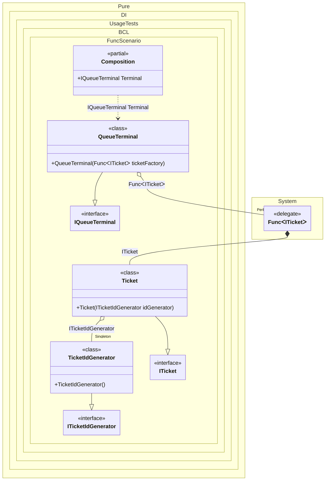

#### Func

_Func<T>_ helps when the logic must enter instances of some type on demand or more than once. This is a very handy mechanism for instance replication. For example it is used when implementing the `Lazy<T>` injection.


```c#
using Shouldly;
using Pure.DI;
using System.Collections.Immutable;

DI.Setup(nameof(Composition))
    .Bind().As(Lifetime.Singleton).To<TicketIdGenerator>()
    .Bind().To<Ticket>()
    .Bind().To<QueueTerminal>()

    // Composition root
    .Root<IQueueTerminal>("Terminal");

var composition = new Composition();
var terminal = composition.Terminal;

terminal.Tickets.Length.ShouldBe(3);

terminal.Tickets[0].Id.ShouldBe(1);
terminal.Tickets[1].Id.ShouldBe(2);
terminal.Tickets[2].Id.ShouldBe(3);

interface ITicketIdGenerator
{
    int NextId { get; }
}

class TicketIdGenerator : ITicketIdGenerator
{
    public int NextId => ++field;
}

interface ITicket
{
    int Id { get; }
}

class Ticket(ITicketIdGenerator idGenerator) : ITicket
{
    public int Id { get; } = idGenerator.NextId;
}

interface IQueueTerminal
{
    ImmutableArray<ITicket> Tickets { get; }
}

class QueueTerminal(Func<ITicket> ticketFactory) : IQueueTerminal
{
    public ImmutableArray<ITicket> Tickets { get; } =
    [
        // The factory creates a new instance of the ticket each time it is called
        ticketFactory(),
        ticketFactory(),
        ticketFactory()
    ];
}
```

<details>
<summary>Running this code sample locally</summary>

- Make sure you have the [.NET SDK 10.0](https://dotnet.microsoft.com/en-us/download/dotnet/10.0) or later is installed
```bash
dotnet --list-sdk
```
- Create a net10.0 (or later) console application
```bash
dotnet new console -n Sample
```
- Add references to NuGet packages
  - [Pure.DI](https://www.nuget.org/packages/Pure.DI)
  - [Shouldly](https://www.nuget.org/packages/Shouldly)
```bash
dotnet add package Pure.DI
dotnet add package Shouldly
```
- Copy the example code into the _Program.cs_ file

You are ready to run the example 🚀
```bash
dotnet run
```

</details>

Be careful, replication takes into account the lifetime of the object.

The following partial class will be generated:

```c#
partial class Composition
{
#if NET9_0_OR_GREATER
  private readonly Lock _lock = new Lock();
#else
  private readonly Object _lock = new Object();
#endif

  private TicketIdGenerator? _singletonTicketIdGenerator51;

  public IQueueTerminal Terminal
  {
    [MethodImpl(MethodImplOptions.AggressiveInlining)]
    get
    {
      Func<ITicket> transientFunc1 = new Func<ITicket>(
      [MethodImpl(MethodImplOptions.AggressiveInlining)]
      () =>
      {
        if (_singletonTicketIdGenerator51 is null)
          lock (_lock)
            if (_singletonTicketIdGenerator51 is null)
            {
              _singletonTicketIdGenerator51 = new TicketIdGenerator();
            }

        ITicket localValue19 = new Ticket(_singletonTicketIdGenerator51);
        return localValue19;
      });
      return new QueueTerminal(transientFunc1);
    }
  }
}
```

Class diagram:



