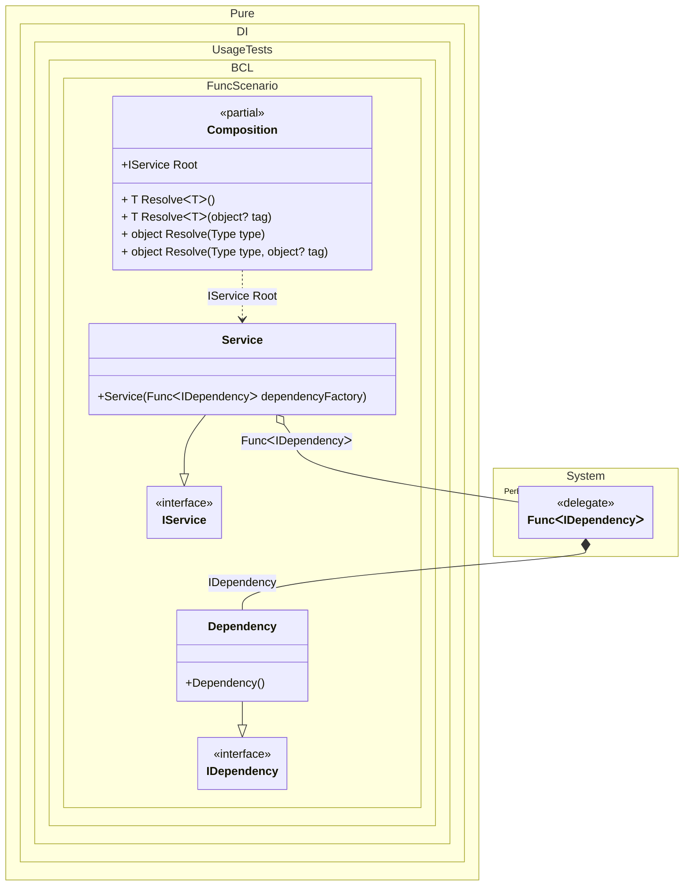

#### Func

[](../tests/Pure.DI.UsageTests/BaseClassLibrary/FuncScenario.cs)

_Func<T>_ helps when the logic must enter instances of some type on demand or more than once. This is a very handy mechanism for instance replication. For example it is used when implementing the `Lazy<T>` injection.


```c#
using Pure.DI;
using Shouldly;
using System.Collections.Immutable;

DI.Setup(nameof(Composition))
    .Bind<IDependency>().To<Dependency>()
    .Bind<IService>().To<Service>()

    // Composition root
    .Root<IService>("Root");

var composition = new Composition();
var service = composition.Root;
service.Dependencies.Length.ShouldBe(3);

interface IDependency;

class Dependency : IDependency;

interface IService
{
    ImmutableArray<IDependency> Dependencies { get; }
}

class Service(Func<IDependency> dependencyFactory): IService
{
    public ImmutableArray<IDependency> Dependencies =>
    [
        dependencyFactory(),
        dependencyFactory(),
        dependencyFactory()
    ];
}
```

Be careful, replication takes into account the lifetime of the object.


Class diagram:



