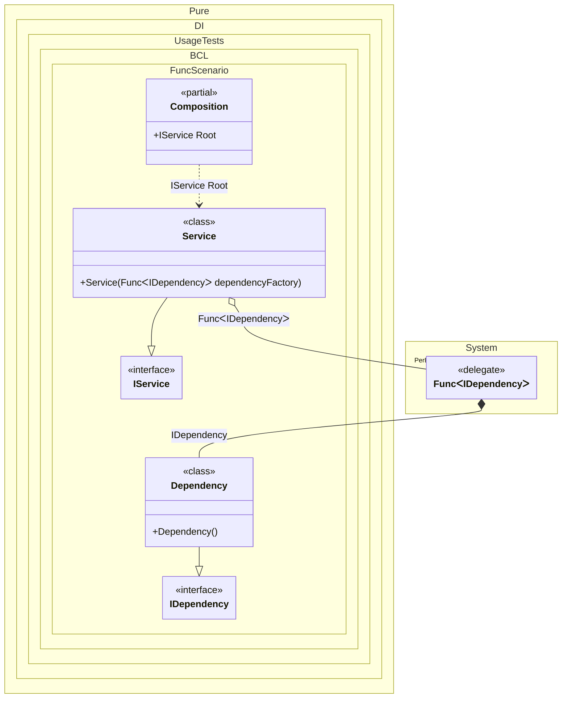

#### Func

_Func<T>_ helps when the logic must enter instances of some type on demand or more than once. This is a very handy mechanism for instance replication. For example it is used when implementing the `Lazy<T>` injection.


```c#
using Shouldly;
using Pure.DI;
using System.Collections.Immutable;

DI.Setup(nameof(Composition))
    .Bind().To<Dependency>()
    .Bind().To<Service>()

    // Composition root
    .Root<IService>("Root");

var composition = new Composition();
var service = composition.Root;
service.Dependencies.Length.ShouldBe(3);

interface IDependency;

class Dependency : IDependency;

interface IService
{
    ImmutableArray<IDependency> Dependencies { get; }
}

class Service(Func<IDependency> dependencyFactory): IService
{
    public ImmutableArray<IDependency> Dependencies =>
    [
        dependencyFactory(),
        dependencyFactory(),
        dependencyFactory()
    ];
}
```

<details>
<summary>Running this code sample locally</summary>

- Make sure you have the [.NET SDK 9.0](https://dotnet.microsoft.com/en-us/download/dotnet/9.0) or later is installed
```bash
dotnet --list-sdk
```
- Create a net9.0 (or later) console application
```bash
dotnet new console -n Sample
```
- Add references to NuGet packages
  - [Pure.DI](https://www.nuget.org/packages/Pure.DI)
  - [Shouldly](https://www.nuget.org/packages/Shouldly)
```bash
dotnet add package Pure.DI
dotnet add package Shouldly
```
- Copy the example code into the _Program.cs_ file

You are ready to run the example 🚀
```bash
dotnet run
```

</details>

Be careful, replication takes into account the lifetime of the object.

The following partial class will be generated:

```c#
partial class Composition
{
  private readonly Composition _root;

  [OrdinalAttribute(256)]
  public Composition()
  {
    _root = this;
  }

  internal Composition(Composition parentScope)
  {
    _root = (parentScope ?? throw new ArgumentNullException(nameof(parentScope)))._root;
  }

  public IService Root
  {
    [MethodImpl(MethodImplOptions.AggressiveInlining)]
    get
    {
      Func<IDependency> perBlockFunc1 = new Func<IDependency>(
      [MethodImpl(MethodImplOptions.AggressiveInlining)]
      () =>
      {
        IDependency localValue108 = new Dependency();
        return localValue108;
      });
      return new Service(perBlockFunc1);
    }
  }
}
```

Class diagram:



