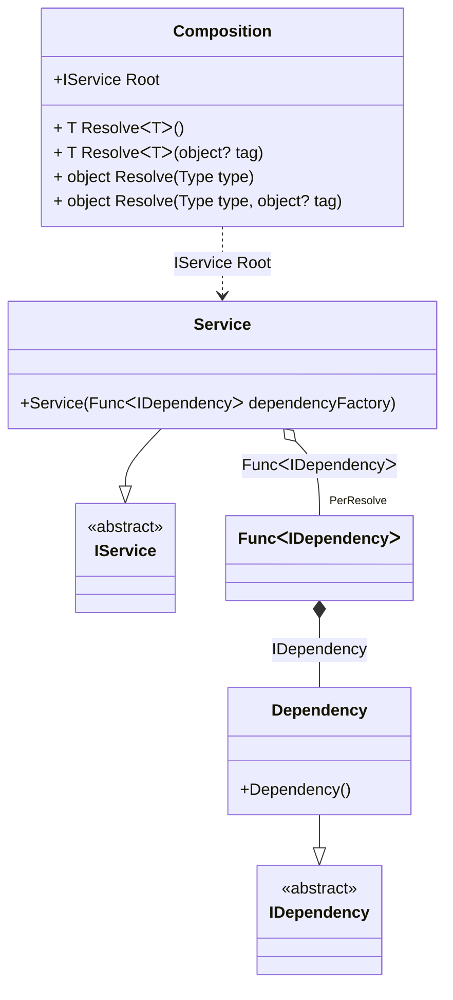

#### Func

[](../tests/Pure.DI.UsageTests/BaseClassLibrary/FuncScenario.cs)

_Func<T>_ helps when the logic must enter instances of some type on demand or more than once. This is a very handy mechanism for instance replication. For example it is used when implementing the `Lazy<T>` injection.

```c#
interface IDependency;

class Dependency : IDependency;

interface IService
{
    ImmutableArray<IDependency> Dependencies { get; }
}

class Service(Func<IDependency> dependencyFactory) : IService
{
    public ImmutableArray<IDependency> Dependencies { get; } =
        Enumerable
            .Range(0, 10)
            .Select(_ => dependencyFactory())
            .ToImmutableArray();
}

DI.Setup(nameof(Composition))
    .Bind<IDependency>().To<Dependency>()
    .Bind<IService>().To<Service>().Root<IService>("Root");

var composition = new Composition();
var service = composition.Root;
service.Dependencies.Length.ShouldBe(10);
```

Be careful, replication takes into account the lifetime of the object.

<details open>
<summary>Class Diagram</summary>



</details>

<details>
<summary>Pure.DI-generated partial class Composition</summary><blockquote>

```c#
partial class Composition
{
  private readonly Composition _rootM03D17di;
  private readonly object _lockM03D17di;
  
  public Composition()
  {
    _rootM03D17di = this;
    _lockM03D17di = new object();
  }
  
  internal Composition(Composition baseComposition)
  {
    _rootM03D17di = baseComposition._rootM03D17di;
    _lockM03D17di = _rootM03D17di._lockM03D17di;
  }
  
  public Pure.DI.UsageTests.BCL.FuncScenario.IService Root
  {
    get
    {
      var perResolveM03D17di36_Func = default(System.Func<Pure.DI.UsageTests.BCL.FuncScenario.IDependency>);
      perResolveM03D17di36_Func = new global::System.Func<Pure.DI.UsageTests.BCL.FuncScenario.IDependency>(
      [global::System.Runtime.CompilerServices.MethodImpl((global::System.Runtime.CompilerServices.MethodImplOptions)768)]
      () =>
      {
          var factory_M03D17di1 = new Pure.DI.UsageTests.BCL.FuncScenario.Dependency();
          return factory_M03D17di1;
      });
      return new Pure.DI.UsageTests.BCL.FuncScenario.Service(perResolveM03D17di36_Func);
    }
  }
  
  public T Resolve<T>()
  {
    return ResolverM03D17di<T>.Value.Resolve(this);
  }
  
  public T Resolve<T>(object? tag)
  {
    return ResolverM03D17di<T>.Value.ResolveByTag(this, tag);
  }
  
  public object Resolve(global::System.Type type)
  {
    var index = (int)(_bucketSizeM03D17di * ((uint)global::System.Runtime.CompilerServices.RuntimeHelpers.GetHashCode(type) % 1));
    var finish = index + _bucketSizeM03D17di;
    do {
      ref var pair = ref _bucketsM03D17di[index];
      if (ReferenceEquals(pair.Key, type))
      {
        return pair.Value.Resolve(this);
      }
    } while (++index < finish);
    
    throw new global::System.InvalidOperationException($"Cannot resolve composition root of type {type}.");
  }
  
  public object Resolve(global::System.Type type, object? tag)
  {
    var index = (int)(_bucketSizeM03D17di * ((uint)global::System.Runtime.CompilerServices.RuntimeHelpers.GetHashCode(type) % 1));
    var finish = index + _bucketSizeM03D17di;
    do {
      ref var pair = ref _bucketsM03D17di[index];
      if (ReferenceEquals(pair.Key, type))
      {
        return pair.Value.ResolveByTag(this, tag);
      }
    } while (++index < finish);
    
    throw new global::System.InvalidOperationException($"Cannot resolve composition root \"{tag}\" of type {type}.");
  }
  
  public override string ToString()
  {
    return
      "classDiagram\n" +
        "  class Composition {\n" +
          "    +IService Root\n" +
          "    + T ResolveᐸTᐳ()\n" +
          "    + T ResolveᐸTᐳ(object? tag)\n" +
          "    + object Resolve(Type type)\n" +
          "    + object Resolve(Type type, object? tag)\n" +
        "  }\n" +
        "  Dependency --|> IDependency : \n" +
        "  class Dependency {\n" +
          "    +Dependency()\n" +
        "  }\n" +
        "  Service --|> IService : \n" +
        "  class Service {\n" +
          "    +Service(FuncᐸIDependencyᐳ dependencyFactory)\n" +
        "  }\n" +
        "  class FuncᐸIDependencyᐳ\n" +
        "  class IDependency {\n" +
          "    <<abstract>>\n" +
        "  }\n" +
        "  class IService {\n" +
          "    <<abstract>>\n" +
        "  }\n" +
        "  Service o--  \"PerResolve\" FuncᐸIDependencyᐳ : FuncᐸIDependencyᐳ\n" +
        "  Composition ..> Service : IService Root\n" +
        "  FuncᐸIDependencyᐳ *--  Dependency : IDependency";
  }
  
  private readonly static int _bucketSizeM03D17di;
  private readonly static global::Pure.DI.Pair<global::System.Type, global::Pure.DI.IResolver<Composition, object>>[] _bucketsM03D17di;
  
  static Composition()
  {
    var valResolverM03D17di_0000 = new ResolverM03D17di_0000();
    ResolverM03D17di<Pure.DI.UsageTests.BCL.FuncScenario.IService>.Value = valResolverM03D17di_0000;
    _bucketsM03D17di = global::Pure.DI.Buckets<global::System.Type, global::Pure.DI.IResolver<Composition, object>>.Create(
      1,
      out _bucketSizeM03D17di,
      new global::Pure.DI.Pair<global::System.Type, global::Pure.DI.IResolver<Composition, object>>[1]
      {
         new global::Pure.DI.Pair<global::System.Type, global::Pure.DI.IResolver<Composition, object>>(typeof(Pure.DI.UsageTests.BCL.FuncScenario.IService), valResolverM03D17di_0000)
      });
  }
  
  private sealed class ResolverM03D17di<T>: global::Pure.DI.IResolver<Composition, T>
  {
    public static global::Pure.DI.IResolver<Composition, T> Value = new ResolverM03D17di<T>();
    
    public T Resolve(Composition composite)
    {
      throw new global::System.InvalidOperationException($"Cannot resolve composition root of type {typeof(T)}.");
    }
    
    public T ResolveByTag(Composition composite, object tag)
    {
      throw new global::System.InvalidOperationException($"Cannot resolve composition root \"{tag}\" of type {typeof(T)}.");
    }
  }
  
  private sealed class ResolverM03D17di_0000: global::Pure.DI.IResolver<Composition, Pure.DI.UsageTests.BCL.FuncScenario.IService>
  {
    public Pure.DI.UsageTests.BCL.FuncScenario.IService Resolve(Composition composition)
    {
      return composition.Root;
    }
    
    public Pure.DI.UsageTests.BCL.FuncScenario.IService ResolveByTag(Composition composition, object tag)
    {
      switch (tag)
      {
        case null:
          return composition.Root;
      }
      throw new global::System.InvalidOperationException($"Cannot resolve composition root \"{tag}\" of type Pure.DI.UsageTests.BCL.FuncScenario.IService.");
    }
  }
}
```

</blockquote></details>

