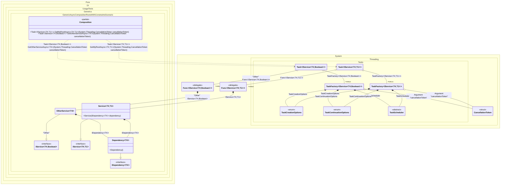

#### Generic async composition roots with constraints

[](../tests/Pure.DI.UsageTests/Generics/GenericAsyncCompositionRootsWithConstraintsScenario.cs)

> [!IMPORTANT]
> `Resolve' methods cannot be used to resolve generic composition roots.


```c#
using Pure.DI;

DI.Setup(nameof(Composition))
    // This hint indicates to not generate methods such as Resolve
    .Hint(Hint.Resolve, "Off")
    .Bind().To<Dependency<TTDisposable>>()
    .Bind().To<Service<TTDisposable, TTS>>()
    // Creates OtherService manually,
    // just for the sake of example
    .Bind("Other").To(ctx =>
    {
        ctx.Inject(out IDependency<TTDisposable> dependency);
        return new OtherService<TTDisposable>(dependency);
    })

    // Specifies to use CancellationToken from the argument
    // when resolving a composition root
    .RootArg<CancellationToken>("cancellationToken")

    // Specifies to create a regular public method
    // to get a composition root of type Task<Service<T, TStruct>>
    // with the name "GetMyRootAsync"
    .Root<Task<IService<TTDisposable, TTS>>>("GetMyRootAsync")

    // Specifies to create a regular public method
    // to get a composition root of type Task<OtherService<T>>
    // with the name "GetOtherServiceAsync"
    // using the "Other" tag
    .Root<Task<IService<TTDisposable, bool>>>("GetOtherServiceAsync", "Other");

var composition = new Composition();

// Resolves composition roots asynchronously
var service = await composition.GetMyRootAsync<Stream, double>(CancellationToken.None);
var someOtherService = await composition.GetOtherServiceAsync<BinaryReader>(CancellationToken.None);

interface IDependency<T>
    where T : IDisposable;

class Dependency<T> : IDependency<T>
    where T : IDisposable;

interface IService<T, TStruct>
    where T : IDisposable
    where TStruct : struct;

class Service<T, TStruct>(IDependency<T> dependency) : IService<T, TStruct>
    where T : IDisposable
    where TStruct : struct;

class OtherService<T>(IDependency<T> dependency) : IService<T, bool>
    where T : IDisposable;
```

<details>
<summary>Running this code sample locally</summary>

- Make sure you have the [.NET SDK 9.0](https://dotnet.microsoft.com/en-us/download/dotnet/9.0) or later is installed
```bash
dotnet --list-sdk
```
- Create a net9.0 (or later) console application
```bash
dotnet new console -n Sample
```
- Add reference to NuGet package
  - [Pure.DI](https://www.nuget.org/packages/Pure.DI)
```bash
dotnet add package Pure.DI
```
- Copy the example code into the _Program.cs_ file

You are ready to run the example 🚀
```bash
dotnet run
```

</details>

> [!IMPORTANT]
> The method `Inject()`cannot be used outside of the binding setup.

The following partial class will be generated:

```c#
partial class Composition
{
  private readonly Composition _root;

  [OrdinalAttribute(128)]
  public Composition()
  {
    _root = this;
  }

  internal Composition(Composition parentScope)
  {
    _root = (parentScope ?? throw new ArgumentNullException(nameof(parentScope)))._root;
  }

  [MethodImpl(MethodImplOptions.AggressiveInlining)]
  public Task<IService<T4, bool>> GetOtherServiceAsync<T4>(CancellationToken cancellationToken)
    where T4: IDisposable
  {
    TaskFactory<IService<T4, bool>> perBlockTaskFactory2;
    CancellationToken localCancellationToken74 = cancellationToken;
    TaskCreationOptions transientTaskCreationOptions3 = TaskCreationOptions.None;
    TaskCreationOptions localTaskCreationOptions75 = transientTaskCreationOptions3;
    TaskContinuationOptions transientTaskContinuationOptions4 = TaskContinuationOptions.None;
    TaskContinuationOptions localTaskContinuationOptions76 = transientTaskContinuationOptions4;
    TaskScheduler transientTaskScheduler5 = TaskScheduler.Default;
    TaskScheduler localTaskScheduler77 = transientTaskScheduler5;
    perBlockTaskFactory2 = new TaskFactory<IService<T4, bool>>(localCancellationToken74, localTaskCreationOptions75, localTaskContinuationOptions76, localTaskScheduler77);
    Func<IService<T4, bool>> perBlockFunc1 = new Func<IService<T4, bool>>(
    [MethodImpl(MethodImplOptions.AggressiveInlining)]
    () =>
    {
      OtherService<T4> transientOtherService6;
      IDependency<T4> localDependency79 = new Dependency<T4>();
      transientOtherService6 = new OtherService<T4>(localDependency79);
      IService<T4, bool> localValue78 = transientOtherService6;
      return localValue78;
    });
    Task<IService<T4, bool>> transientTask0;
    // Injects an instance factory
    Func<IService<T4, bool>> localFactory80 = perBlockFunc1;
    // Injects a task factory creating and scheduling task objects
    TaskFactory<IService<T4, bool>> localTaskFactory81 = perBlockTaskFactory2;
    // Creates and starts a task using the instance factory
    transientTask0 = localTaskFactory81.StartNew(localFactory80);
    return transientTask0;
  }

  [MethodImpl(MethodImplOptions.AggressiveInlining)]
  public Task<IService<T4, T1>> GetMyRootAsync<T4, T1>(CancellationToken cancellationToken)
    where T4: IDisposable
    where T1: struct
  {
    TaskFactory<IService<T4, T1>> perBlockTaskFactory2;
    CancellationToken localCancellationToken82 = cancellationToken;
    TaskCreationOptions transientTaskCreationOptions3 = TaskCreationOptions.None;
    TaskCreationOptions localTaskCreationOptions83 = transientTaskCreationOptions3;
    TaskContinuationOptions transientTaskContinuationOptions4 = TaskContinuationOptions.None;
    TaskContinuationOptions localTaskContinuationOptions84 = transientTaskContinuationOptions4;
    TaskScheduler transientTaskScheduler5 = TaskScheduler.Default;
    TaskScheduler localTaskScheduler85 = transientTaskScheduler5;
    perBlockTaskFactory2 = new TaskFactory<IService<T4, T1>>(localCancellationToken82, localTaskCreationOptions83, localTaskContinuationOptions84, localTaskScheduler85);
    Func<IService<T4, T1>> perBlockFunc1 = new Func<IService<T4, T1>>(
    [MethodImpl(MethodImplOptions.AggressiveInlining)]
    () =>
    {
      IService<T4, T1> localValue86 = new Service<T4, T1>(new Dependency<T4>());
      return localValue86;
    });
    Task<IService<T4, T1>> transientTask0;
    // Injects an instance factory
    Func<IService<T4, T1>> localFactory87 = perBlockFunc1;
    // Injects a task factory creating and scheduling task objects
    TaskFactory<IService<T4, T1>> localTaskFactory88 = perBlockTaskFactory2;
    // Creates and starts a task using the instance factory
    transientTask0 = localTaskFactory88.StartNew(localFactory87);
    return transientTask0;
  }
}
```

Class diagram:



