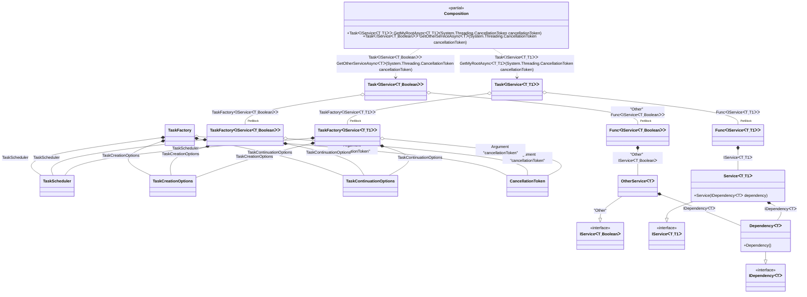

#### Generic async composition roots with constraints

[](../tests/Pure.DI.UsageTests/Generics/GenericAsyncCompositionRootsWithConstraintsScenario.cs)

> [!IMPORTANT]
> `Resolve' methods cannot be used to resolve generic composition roots.


```c#
interface IDependency<T>
    where T : IDisposable;

class Dependency<T> : IDependency<T>
    where T : IDisposable;

interface IService<T, TStruct>
    where T : IDisposable
    where TStruct : struct;

class Service<T, TStruct>(IDependency<T> dependency) : IService<T, TStruct>
    where T : IDisposable
    where TStruct : struct;

class OtherService<T>(IDependency<T> dependency) : IService<T, bool>
    where T : IDisposable;

DI.Setup(nameof(Composition))
    // This hint indicates to not generate methods such as Resolve
    .Hint(Hint.Resolve, "Off")
    .Bind().To<Dependency<TTDisposable>>()
    .Bind().To<Service<TTDisposable, TTS>>()
    // Creates OtherService manually,
    // just for the sake of example
    .Bind("Other").To(ctx =>
    {
        ctx.Inject(out IDependency<TTDisposable> dependency);
        return new OtherService<TTDisposable>(dependency);
    })

    // Specifies to use CancellationToken from the argument
    // when resolving a composition root
    .RootArg<CancellationToken>("cancellationToken")

    // Specifies to create a regular public method
    // to get a composition root of type Task<Service<T, TStruct>>
    // with the name "GetMyRootAsync"
    .Root<Task<IService<TTDisposable, TTS>>>("GetMyRootAsync")

    // Specifies to create a regular public method
    // to get a composition root of type Task<OtherService<T>>
    // with the name "GetOtherServiceAsync"
    // using the "Other" tag
    .Root<Task<IService<TTDisposable, bool>>>("GetOtherServiceAsync", "Other");

var composition = new Composition();

// Resolves composition roots asynchronously
var service = await composition.GetMyRootAsync<Stream, double>(CancellationToken.None);
var someOtherService = await composition.GetOtherServiceAsync<BinaryReader>(CancellationToken.None);
```

> [!IMPORTANT]
> The method `Inject()`cannot be used outside of the binding setup.

The following partial class will be generated:

```c#
partial class Composition
{
  private readonly Composition _root;

  [OrdinalAttribute(10)]
  public Composition()
  {
    _root = this;
  }

  internal Composition(Composition parentScope)
  {
    _root = (parentScope ?? throw new ArgumentNullException(nameof(parentScope)))._root;
  }

  [MethodImpl(MethodImplOptions.AggressiveInlining)]
  public Task<IService<T, bool>> GetOtherServiceAsync<T>(CancellationToken cancellationToken)
    where T: IDisposable
  {
    TaskScheduler transientTaskScheduler5 = TaskScheduler.Default;
    TaskContinuationOptions transientTaskContinuationOptions4 = TaskContinuationOptions.None;
    TaskCreationOptions transientTaskCreationOptions3 = TaskCreationOptions.None;
    TaskFactory<IService<T, bool>> perBlockTaskFactory2;
    CancellationToken localCancellationToken47 = cancellationToken;
    TaskCreationOptions localTaskCreationOptions48 = transientTaskCreationOptions3;
    TaskContinuationOptions localTaskContinuationOptions49 = transientTaskContinuationOptions4;
    TaskScheduler localTaskScheduler50 = transientTaskScheduler5;
    perBlockTaskFactory2 = new TaskFactory<IService<T, bool>>(localCancellationToken47, localTaskCreationOptions48, localTaskContinuationOptions49, localTaskScheduler50);
    Func<IService<T, bool>> perBlockFunc1 = new Func<IService<T, bool>>([MethodImpl(MethodImplOptions.AggressiveInlining)] () =>
    {
      OtherService<T> transientOtherService6;
      IDependency<T> localDependency52 = new Dependency<T>();
      transientOtherService6 = new OtherService<T>(localDependency52);
      IService<T, bool> localValue51 = transientOtherService6;
      return localValue51;
    });
    Task<IService<T, bool>> transientTask0;
    // Injects an instance factory
    Func<IService<T, bool>> localFactory53 = perBlockFunc1;
    // Injects a task factory creating and scheduling task objects
    TaskFactory<IService<T, bool>> localTaskFactory54 = perBlockTaskFactory2;
    // Creates and starts a task using the instance factory
    transientTask0 = localTaskFactory54.StartNew(localFactory53);
    return transientTask0;
  }

  [MethodImpl(MethodImplOptions.AggressiveInlining)]
  public Task<IService<T, T1>> GetMyRootAsync<T, T1>(CancellationToken cancellationToken)
    where T: IDisposable
    where T1: struct
  {
    TaskScheduler transientTaskScheduler5 = TaskScheduler.Default;
    TaskContinuationOptions transientTaskContinuationOptions4 = TaskContinuationOptions.None;
    TaskCreationOptions transientTaskCreationOptions3 = TaskCreationOptions.None;
    TaskFactory<IService<T, T1>> perBlockTaskFactory2;
    CancellationToken localCancellationToken55 = cancellationToken;
    TaskCreationOptions localTaskCreationOptions56 = transientTaskCreationOptions3;
    TaskContinuationOptions localTaskContinuationOptions57 = transientTaskContinuationOptions4;
    TaskScheduler localTaskScheduler58 = transientTaskScheduler5;
    perBlockTaskFactory2 = new TaskFactory<IService<T, T1>>(localCancellationToken55, localTaskCreationOptions56, localTaskContinuationOptions57, localTaskScheduler58);
    Func<IService<T, T1>> perBlockFunc1 = new Func<IService<T, T1>>([MethodImpl(MethodImplOptions.AggressiveInlining)] () =>
    {
      IService<T, T1> localValue59 = new Service<T, T1>(new Dependency<T>());
      return localValue59;
    });
    Task<IService<T, T1>> transientTask0;
    // Injects an instance factory
    Func<IService<T, T1>> localFactory60 = perBlockFunc1;
    // Injects a task factory creating and scheduling task objects
    TaskFactory<IService<T, T1>> localTaskFactory61 = perBlockTaskFactory2;
    // Creates and starts a task using the instance factory
    transientTask0 = localTaskFactory61.StartNew(localFactory60);
    return transientTask0;
  }
}
```

Class diagram:



