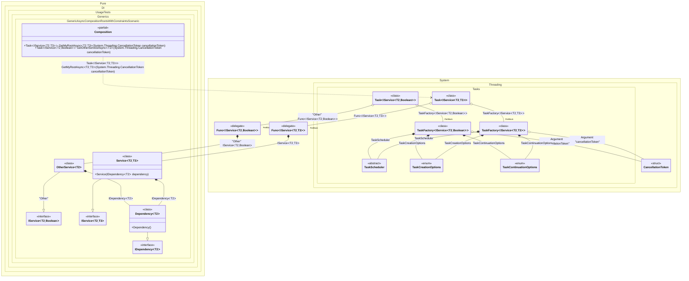

#### Generic async composition roots with constraints

> [!IMPORTANT]
> `Resolve' methods cannot be used to resolve generic composition roots.


```c#
using Pure.DI;

DI.Setup(nameof(Composition))
    // This hint indicates to not generate methods such as Resolve
    .Hint(Hint.Resolve, "Off")
    .Bind().To<Dependency<TTDisposable>>()
    .Bind().To<Service<TTDisposable, TTS>>()
    // Creates OtherService manually,
    // just for the sake of example
    .Bind("Other").To(ctx =>
    {
        ctx.Inject(out IDependency<TTDisposable> dependency);
        return new OtherService<TTDisposable>(dependency);
    })

    // Specifies to use CancellationToken from the argument
    // when resolving a composition root
    .RootArg<CancellationToken>("cancellationToken")

    // Specifies to create a regular public method
    // to get a composition root of type Task<Service<T, TStruct>>
    // with the name "GetMyRootAsync"
    .Root<Task<IService<TTDisposable, TTS>>>("GetMyRootAsync")

    // Specifies to create a regular public method
    // to get a composition root of type Task<OtherService<T>>
    // with the name "GetOtherServiceAsync"
    // using the "Other" tag
    .Root<Task<IService<TTDisposable, bool>>>("GetOtherServiceAsync", "Other");

var composition = new Composition();

// Resolves composition roots asynchronously
var service = await composition.GetMyRootAsync<Stream, double>(CancellationToken.None);
var someOtherService = await composition.GetOtherServiceAsync<BinaryReader>(CancellationToken.None);

interface IDependency<T>
    where T : IDisposable;

class Dependency<T> : IDependency<T>
    where T : IDisposable;

interface IService<T, TStruct>
    where T : IDisposable
    where TStruct : struct;

class Service<T, TStruct>(IDependency<T> dependency) : IService<T, TStruct>
    where T : IDisposable
    where TStruct : struct;

class OtherService<T>(IDependency<T> dependency) : IService<T, bool>
    where T : IDisposable;
```

<details>
<summary>Running this code sample locally</summary>

- Make sure you have the [.NET SDK 9.0](https://dotnet.microsoft.com/en-us/download/dotnet/9.0) or later is installed
```bash
dotnet --list-sdk
```
- Create a net9.0 (or later) console application
```bash
dotnet new console -n Sample
```
- Add reference to NuGet package
  - [Pure.DI](https://www.nuget.org/packages/Pure.DI)
```bash
dotnet add package Pure.DI
```
- Copy the example code into the _Program.cs_ file

You are ready to run the example 🚀
```bash
dotnet run
```

</details>

> [!IMPORTANT]
> The method `Inject()`cannot be used outside of the binding setup.

The following partial class will be generated:

```c#
partial class Composition
{
#if NET9_0_OR_GREATER
  private readonly Lock _lock;
#else
  private readonly Object _lock;
#endif

  [OrdinalAttribute(256)]
  public Composition()
  {
#if NET9_0_OR_GREATER
    _lock = new Lock();
#else
    _lock = new Object();
#endif
  }

  internal Composition(Composition parentScope)
  {
    _lock = parentScope._lock;
  }

  [MethodImpl(MethodImplOptions.AggressiveInlining)]
  public Task<IService<T2, bool>> GetOtherServiceAsync<T2>(CancellationToken cancellationToken)
    where T2: IDisposable
  {
    Task<IService<T2, bool>> transientTask;
    // Injects an instance factory
    Func<IService<T2, bool>> transientFunc1 = new Func<IService<T2, bool>>(
    [MethodImpl(MethodImplOptions.AggressiveInlining)]
    () =>
    {
      OtherService<T2> transientOtherService3;
      IDependency<T2> localDependency6 = new Dependency<T2>();
      transientOtherService3 = new OtherService<T2>(localDependency6);
      IService<T2, bool> localValue25 = transientOtherService3;
      return localValue25;
    });
    Func<IService<T2, bool>> localFactory6 = transientFunc1;
    // Injects a task factory creating and scheduling task objects
    TaskFactory<IService<T2, bool>> transientTaskFactory2;
    CancellationToken localCancellationToken3 = cancellationToken;
    TaskCreationOptions transientTaskCreationOptions6 = TaskCreationOptions.None;
    TaskCreationOptions localTaskCreationOptions2 = transientTaskCreationOptions6;
    TaskContinuationOptions transientTaskContinuationOptions7 = TaskContinuationOptions.None;
    TaskContinuationOptions localTaskContinuationOptions2 = transientTaskContinuationOptions7;
    TaskScheduler transientTaskScheduler8 = TaskScheduler.Default;
    TaskScheduler localTaskScheduler2 = transientTaskScheduler8;
    transientTaskFactory2 = new TaskFactory<IService<T2, bool>>(localCancellationToken3, localTaskCreationOptions2, localTaskContinuationOptions2, localTaskScheduler2);
    TaskFactory<IService<T2, bool>> localTaskFactory2 = transientTaskFactory2;
    // Creates and starts a task using the instance factory
    transientTask = localTaskFactory2.StartNew(localFactory6);
    return transientTask;
  }

  [MethodImpl(MethodImplOptions.AggressiveInlining)]
  public Task<IService<T2, T3>> GetMyRootAsync<T2, T3>(CancellationToken cancellationToken)
    where T2: IDisposable
    where T3: struct
  {
    Task<IService<T2, T3>> transientTask9;
    // Injects an instance factory
    Func<IService<T2, T3>> transientFunc10 = new Func<IService<T2, T3>>(
    [MethodImpl(MethodImplOptions.AggressiveInlining)]
    () =>
    {
      IService<T2, T3> localValue26 = new Service<T2, T3>(new Dependency<T2>());
      return localValue26;
    });
    Func<IService<T2, T3>> localFactory7 = transientFunc10;
    // Injects a task factory creating and scheduling task objects
    TaskFactory<IService<T2, T3>> transientTaskFactory11;
    CancellationToken localCancellationToken4 = cancellationToken;
    TaskCreationOptions transientTaskCreationOptions15 = TaskCreationOptions.None;
    TaskCreationOptions localTaskCreationOptions3 = transientTaskCreationOptions15;
    TaskContinuationOptions transientTaskContinuationOptions16 = TaskContinuationOptions.None;
    TaskContinuationOptions localTaskContinuationOptions3 = transientTaskContinuationOptions16;
    TaskScheduler transientTaskScheduler17 = TaskScheduler.Default;
    TaskScheduler localTaskScheduler3 = transientTaskScheduler17;
    transientTaskFactory11 = new TaskFactory<IService<T2, T3>>(localCancellationToken4, localTaskCreationOptions3, localTaskContinuationOptions3, localTaskScheduler3);
    TaskFactory<IService<T2, T3>> localTaskFactory3 = transientTaskFactory11;
    // Creates and starts a task using the instance factory
    transientTask9 = localTaskFactory3.StartNew(localFactory7);
    return transientTask9;
  }
}
```

Class diagram:



