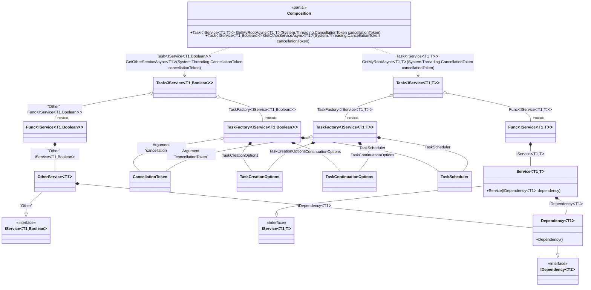

#### Generic async composition roots with constraints

[](../tests/Pure.DI.UsageTests/Generics/GenericAsyncCompositionRootsWithConstraintsScenario.cs)

> [!IMPORTANT]
> `Resolve' methods cannot be used to resolve generic composition roots.


```c#
interface IDependency<T>
    where T : IDisposable;

class Dependency<T> : IDependency<T>
    where T : IDisposable;

interface IService<T, TStruct>
    where T : IDisposable
    where TStruct : struct;

class Service<T, TStruct>(IDependency<T> dependency) : IService<T, TStruct>
    where T : IDisposable
    where TStruct : struct;

class OtherService<T>(IDependency<T> dependency) : IService<T, bool>
    where T : IDisposable;

DI.Setup(nameof(Composition))
    // This hint indicates to not generate methods such as Resolve
    .Hint(Hint.Resolve, "Off")
    .Bind().To<Dependency<TTDisposable>>()
    .Bind().To<Service<TTDisposable, TTS>>()
    // Creates OtherService manually,
    // just for the sake of example
    .Bind("Other").To(ctx =>
    {
        ctx.Inject(out IDependency<TTDisposable> dependency);
        return new OtherService<TTDisposable>(dependency);
    })

    // Specifies to use CancellationToken from the argument
    // when resolving a composition root
    .RootArg<CancellationToken>("cancellationToken")

    // Specifies to create a regular public method
    // to get a composition root of type Task<Service<T, TStruct>>
    // with the name "GetMyRootAsync"
    .Root<Task<IService<TTDisposable, TTS>>>("GetMyRootAsync")

    // Specifies to create a regular public method
    // to get a composition root of type Task<OtherService<T>>
    // with the name "GetOtherServiceAsync"
    // using the "Other" tag
    .Root<Task<IService<TTDisposable, bool>>>("GetOtherServiceAsync", "Other");

var composition = new Composition();

// Resolves composition roots asynchronously
var service = await composition.GetMyRootAsync<Stream, double>(CancellationToken.None);
var someOtherService = await composition.GetOtherServiceAsync<BinaryReader>(CancellationToken.None);
```

> [!IMPORTANT]
> The method `Inject()`cannot be used outside of the binding setup.

The following partial class will be generated:

```c#
partial class Composition
{
  private readonly Composition _root;

  [OrdinalAttribute(10)]
  public Composition()
  {
    _root = this;
  }

  internal Composition(Composition parentScope)
  {
    _root = (parentScope ?? throw new ArgumentNullException(nameof(parentScope)))._root;
  }

  [MethodImpl(MethodImplOptions.AggressiveInlining)]
  public Task<IService<T1, bool>> GetOtherServiceAsync<T1>(CancellationToken cancellationToken)
    where T1: IDisposable
  {
    TaskFactory<IService<T1, bool>> perBlockTaskFactory2;
    CancellationToken localCancellationToken61 = cancellationToken;
    TaskCreationOptions transientTaskCreationOptions3 = TaskCreationOptions.None;
    TaskCreationOptions localTaskCreationOptions62 = transientTaskCreationOptions3;
    TaskContinuationOptions transientTaskContinuationOptions4 = TaskContinuationOptions.None;
    TaskContinuationOptions localTaskContinuationOptions63 = transientTaskContinuationOptions4;
    TaskScheduler transientTaskScheduler5 = TaskScheduler.Default;
    TaskScheduler localTaskScheduler64 = transientTaskScheduler5;
    perBlockTaskFactory2 = new TaskFactory<IService<T1, bool>>(localCancellationToken61, localTaskCreationOptions62, localTaskContinuationOptions63, localTaskScheduler64);
    Func<IService<T1, bool>> perBlockFunc1 = new Func<IService<T1, bool>>([MethodImpl(MethodImplOptions.AggressiveInlining)] () =>
    {
      OtherService<T1> transientOtherService6;
      IDependency<T1> localDependency66 = new Dependency<T1>();
      transientOtherService6 = new OtherService<T1>(localDependency66);
      IService<T1, bool> localValue65 = transientOtherService6;
      return localValue65;
    });
    Task<IService<T1, bool>> transientTask0;
    // Injects an instance factory
    Func<IService<T1, bool>> localFactory67 = perBlockFunc1;
    // Injects a task factory creating and scheduling task objects
    TaskFactory<IService<T1, bool>> localTaskFactory68 = perBlockTaskFactory2;
    // Creates and starts a task using the instance factory
    transientTask0 = localTaskFactory68.StartNew(localFactory67);
    return transientTask0;
  }

  [MethodImpl(MethodImplOptions.AggressiveInlining)]
  public Task<IService<T1, T>> GetMyRootAsync<T1, T>(CancellationToken cancellationToken)
    where T1: IDisposable
    where T: struct
  {
    TaskFactory<IService<T1, T>> perBlockTaskFactory2;
    CancellationToken localCancellationToken69 = cancellationToken;
    TaskCreationOptions transientTaskCreationOptions3 = TaskCreationOptions.None;
    TaskCreationOptions localTaskCreationOptions70 = transientTaskCreationOptions3;
    TaskContinuationOptions transientTaskContinuationOptions4 = TaskContinuationOptions.None;
    TaskContinuationOptions localTaskContinuationOptions71 = transientTaskContinuationOptions4;
    TaskScheduler transientTaskScheduler5 = TaskScheduler.Default;
    TaskScheduler localTaskScheduler72 = transientTaskScheduler5;
    perBlockTaskFactory2 = new TaskFactory<IService<T1, T>>(localCancellationToken69, localTaskCreationOptions70, localTaskContinuationOptions71, localTaskScheduler72);
    Func<IService<T1, T>> perBlockFunc1 = new Func<IService<T1, T>>([MethodImpl(MethodImplOptions.AggressiveInlining)] () =>
    {
      IService<T1, T> localValue73 = new Service<T1, T>(new Dependency<T1>());
      return localValue73;
    });
    Task<IService<T1, T>> transientTask0;
    // Injects an instance factory
    Func<IService<T1, T>> localFactory74 = perBlockFunc1;
    // Injects a task factory creating and scheduling task objects
    TaskFactory<IService<T1, T>> localTaskFactory75 = perBlockTaskFactory2;
    // Creates and starts a task using the instance factory
    transientTask0 = localTaskFactory75.StartNew(localFactory74);
    return transientTask0;
  }
}
```

Class diagram:



