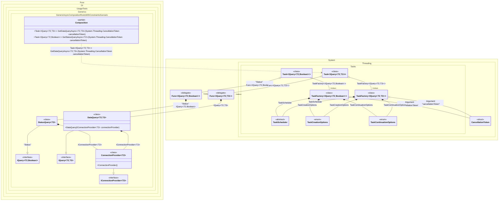

#### Generic async composition roots with constraints

> [!IMPORTANT]
> `Resolve' methods cannot be used to resolve generic composition roots.


```c#
using Pure.DI;

DI.Setup(nameof(Composition))
    // This hint indicates to not generate methods such as Resolve
    .Hint(Hint.Resolve, "Off")
    .Bind().To<ConnectionProvider<TTDisposable>>()
    .Bind().To<DataQuery<TTDisposable, TTS>>()
    // Creates StatusQuery manually,
    // just for the sake of example
    .Bind("Status").To(ctx => {
        ctx.Inject(out IConnectionProvider<TTDisposable> connectionProvider);
        return new StatusQuery<TTDisposable>(connectionProvider);
    })

    // Specifies to use CancellationToken from the argument
    // when resolving a composition root
    .RootArg<CancellationToken>("cancellationToken")

    // Specifies to create a regular public method
    // to get a composition root of type Task<DataQuery<T, TStruct>>
    // with the name "GetDataQueryAsync"
    .Root<Task<IQuery<TTDisposable, TTS>>>("GetDataQueryAsync")

    // Specifies to create a regular public method
    // to get a composition root of type Task<StatusQuery<T>>
    // with the name "GetStatusQueryAsync"
    // using the "Status" tag
    .Root<Task<IQuery<TTDisposable, bool>>>("GetStatusQueryAsync", "Status");

var composition = new Composition();

// Resolves composition roots asynchronously
var query = await composition.GetDataQueryAsync<Stream, double>(CancellationToken.None);
var status = await composition.GetStatusQueryAsync<BinaryReader>(CancellationToken.None);

interface IConnectionProvider<T>
    where T : IDisposable;

class ConnectionProvider<T> : IConnectionProvider<T>
    where T : IDisposable;

interface IQuery<TConnection, TResult>
    where TConnection : IDisposable
    where TResult : struct;

class DataQuery<TConnection, TResult>(IConnectionProvider<TConnection> connectionProvider)
    : IQuery<TConnection, TResult>
    where TConnection : IDisposable
    where TResult : struct;

class StatusQuery<TConnection>(IConnectionProvider<TConnection> connectionProvider)
    : IQuery<TConnection, bool>
    where TConnection : IDisposable;
```

<details>
<summary>Running this code sample locally</summary>

- Make sure you have the [.NET SDK 10.0](https://dotnet.microsoft.com/en-us/download/dotnet/10.0) or later is installed
```bash
dotnet --list-sdk
```
- Create a net10.0 (or later) console application
```bash
dotnet new console -n Sample
```
- Add reference to NuGet package
  - [Pure.DI](https://www.nuget.org/packages/Pure.DI)
```bash
dotnet add package Pure.DI
```
- Copy the example code into the _Program.cs_ file

You are ready to run the example 🚀
```bash
dotnet run
```

</details>

> [!IMPORTANT]
> The method `Inject()`cannot be used outside of the binding setup.

The following partial class will be generated:

```c#
partial class Composition
{
#if NET9_0_OR_GREATER
  private readonly Lock _lock = new Lock();
#else
  private readonly Object _lock = new Object();
#endif

  [MethodImpl(MethodImplOptions.AggressiveInlining)]
  public Task<IQuery<T2, bool>> GetStatusQueryAsync<T2>(CancellationToken cancellationToken)
    where T2: IDisposable
  {
    Task<IQuery<T2, bool>> transientTask;
    // Injects an instance factory
    Func<IQuery<T2, bool>> transientFunc1 = new Func<IQuery<T2, bool>>(
    [MethodImpl(MethodImplOptions.AggressiveInlining)]
    () =>
    {
      StatusQuery<T2> transientStatusQuery3;
      IConnectionProvider<T2> localConnectionProvider = new ConnectionProvider<T2>();
      transientStatusQuery3 = new StatusQuery<T2>(localConnectionProvider);
      IQuery<T2, bool> localValue26 = transientStatusQuery3;
      return localValue26;
    });
    Func<IQuery<T2, bool>> localFactory6 = transientFunc1;
    // Injects a task factory creating and scheduling task objects
    TaskFactory<IQuery<T2, bool>> transientTaskFactory2;
    CancellationToken localCancellationToken3 = cancellationToken;
    TaskCreationOptions transientTaskCreationOptions6 = TaskCreationOptions.None;
    TaskCreationOptions localTaskCreationOptions2 = transientTaskCreationOptions6;
    TaskContinuationOptions transientTaskContinuationOptions7 = TaskContinuationOptions.None;
    TaskContinuationOptions localTaskContinuationOptions2 = transientTaskContinuationOptions7;
    TaskScheduler transientTaskScheduler8 = TaskScheduler.Default;
    TaskScheduler localTaskScheduler2 = transientTaskScheduler8;
    transientTaskFactory2 = new TaskFactory<IQuery<T2, bool>>(localCancellationToken3, localTaskCreationOptions2, localTaskContinuationOptions2, localTaskScheduler2);
    TaskFactory<IQuery<T2, bool>> localTaskFactory2 = transientTaskFactory2;
    // Creates and starts a task using the instance factory
    transientTask = localTaskFactory2.StartNew(localFactory6);
    return transientTask;
  }

  [MethodImpl(MethodImplOptions.AggressiveInlining)]
  public Task<IQuery<T2, T3>> GetDataQueryAsync<T2, T3>(CancellationToken cancellationToken)
    where T2: IDisposable
    where T3: struct
  {
    Task<IQuery<T2, T3>> transientTask9;
    // Injects an instance factory
    Func<IQuery<T2, T3>> transientFunc10 = new Func<IQuery<T2, T3>>(
    [MethodImpl(MethodImplOptions.AggressiveInlining)]
    () =>
    {
      IQuery<T2, T3> localValue27 = new DataQuery<T2, T3>(new ConnectionProvider<T2>());
      return localValue27;
    });
    Func<IQuery<T2, T3>> localFactory7 = transientFunc10;
    // Injects a task factory creating and scheduling task objects
    TaskFactory<IQuery<T2, T3>> transientTaskFactory11;
    CancellationToken localCancellationToken4 = cancellationToken;
    TaskCreationOptions transientTaskCreationOptions15 = TaskCreationOptions.None;
    TaskCreationOptions localTaskCreationOptions3 = transientTaskCreationOptions15;
    TaskContinuationOptions transientTaskContinuationOptions16 = TaskContinuationOptions.None;
    TaskContinuationOptions localTaskContinuationOptions3 = transientTaskContinuationOptions16;
    TaskScheduler transientTaskScheduler17 = TaskScheduler.Default;
    TaskScheduler localTaskScheduler3 = transientTaskScheduler17;
    transientTaskFactory11 = new TaskFactory<IQuery<T2, T3>>(localCancellationToken4, localTaskCreationOptions3, localTaskContinuationOptions3, localTaskScheduler3);
    TaskFactory<IQuery<T2, T3>> localTaskFactory3 = transientTaskFactory11;
    // Creates and starts a task using the instance factory
    transientTask9 = localTaskFactory3.StartNew(localFactory7);
    return transientTask9;
  }
}
```

Class diagram:



