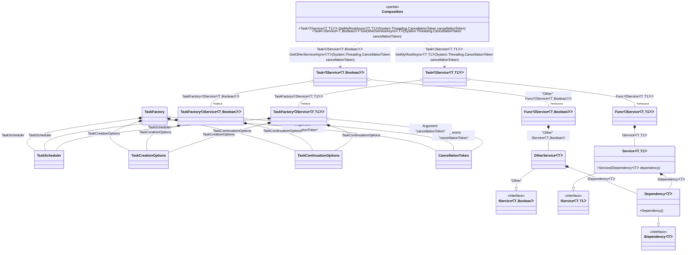

#### Generic async composition roots with constraints

[](../tests/Pure.DI.UsageTests/Generics/GenericAsyncCompositionRootsWithConstraintsScenario.cs)

> [!IMPORTANT]
> `Resolve' methods cannot be used to resolve generic composition roots.


```c#
interface IDependency<T>
    where T: IDisposable;

class Dependency<T> : IDependency<T>
    where T: IDisposable;

interface IService<T, TStruct>
    where T: IDisposable
    where TStruct: struct;

class Service<T, TStruct>(IDependency<T> dependency) : IService<T, TStruct>
    where T: IDisposable
    where TStruct: struct;

class OtherService<T>(IDependency<T> dependency) : IService<T, bool>
    where T: IDisposable;

DI.Setup(nameof(Composition))
    // This hint indicates to not generate methods such as Resolve
    .Hint(Hint.Resolve, "Off")
    .Bind().To<Dependency<TTDisposable>>()
    .Bind().To<Service<TTDisposable, TTS>>()
    // Creates OtherService manually,
    // just for the sake of example
    .Bind("Other").To(ctx =>
    {
        ctx.Inject(out IDependency<TTDisposable> dependency);
        return new OtherService<TTDisposable>(dependency);
    })

    // Specifies to use CancellationToken from the argument
    // when resolving a composition root
    .RootArg<CancellationToken>("cancellationToken")

    // Specifies to create a regular public method
    // to get a composition root of type Task<Service<T, TStruct>>
    // with the name "GetMyRootAsync"
    .Root<Task<IService<TTDisposable, TTS>>>("GetMyRootAsync")

    // Specifies to create a regular public method
    // to get a composition root of type Task<OtherService<T>>
    // with the name "GetOtherServiceAsync"
    // using the "Other" tag
    .Root<Task<IService<TTDisposable, bool>>>("GetOtherServiceAsync", "Other");

var composition = new Composition();
        
// Resolves composition roots asynchronously
var service = await composition.GetMyRootAsync<Stream, double>(CancellationToken.None);
var someOtherService = await composition.GetOtherServiceAsync<BinaryReader>(CancellationToken.None);
```

> [!IMPORTANT]
> The method `Inject()`cannot be used outside of the binding setup.

The following partial class will be generated:

```c#
partial class Composition
{
  private readonly Composition _root;
  private readonly object _lock;

  [OrdinalAttribute(10)]
  public Composition()
  {
    _root = this;
    _lock = new object();
  }

  internal Composition(Composition parentScope)
  {
    _root = (parentScope ?? throw new ArgumentNullException(nameof(parentScope)))._root;
    _lock = _root._lock;
  }

  [MethodImpl(MethodImplOptions.AggressiveInlining)]
  public Task<IService<T, bool>> GetOtherServiceAsync<T>(CancellationToken cancellationToken)
    where T: IDisposable
  {
    var perResolveFunc48 = default(Func<IService<T, bool>>);
    TaskScheduler transientTaskScheduler4 = TaskScheduler.Default;
    TaskContinuationOptions transientTaskContinuationOptions3 = TaskContinuationOptions.None;
    TaskCreationOptions transientTaskCreationOptions2 = TaskCreationOptions.None;
    TaskFactory<IService<T, bool>> perBlockTaskFactory1;
    {
        CancellationToken localCancellationToken41 = cancellationToken;
        TaskCreationOptions localTaskCreationOptions42 = transientTaskCreationOptions2;
        TaskContinuationOptions localTaskContinuationOptions43 = transientTaskContinuationOptions3;
        TaskScheduler localTaskScheduler44 = transientTaskScheduler4;
        perBlockTaskFactory1 = new TaskFactory<IService<T, bool>>(localCancellationToken41, localTaskCreationOptions42, localTaskContinuationOptions43, localTaskScheduler44);
    }

    if (perResolveFunc48 == null)
    {
        lock (_lock)
        {
            if (perResolveFunc48 == null)
            {
                perResolveFunc48 = new Func<IService<T, bool>>(
                [MethodImpl(MethodImplOptions.AggressiveInlining)]
                () =>
                {
                    OtherService<T> transientOtherService5;
                    {
                        IDependency<T> localDependency46 = new Dependency<T>();
                        transientOtherService5 = new OtherService<T>(localDependency46);
                    }

                    IService<T, bool> localValue45 = transientOtherService5;
                    return localValue45;
                });
            }
        }
    }

    Task<IService<T, bool>> transientTask0;
    {
        Func<IService<T, bool>> localFactory47 = perResolveFunc48!;
        TaskFactory<IService<T, bool>> localTaskFactory48 = perBlockTaskFactory1;
        transientTask0 = localTaskFactory48.StartNew(localFactory47);
    }

    return transientTask0;
  }

  [MethodImpl(MethodImplOptions.AggressiveInlining)]
  public Task<IService<T, T1>> GetMyRootAsync<T, T1>(CancellationToken cancellationToken)
    where T: IDisposable
    where T1: struct
  {
    var perResolveFunc50 = default(Func<IService<T, T1>>);
    TaskScheduler transientTaskScheduler4 = TaskScheduler.Default;
    TaskContinuationOptions transientTaskContinuationOptions3 = TaskContinuationOptions.None;
    TaskCreationOptions transientTaskCreationOptions2 = TaskCreationOptions.None;
    TaskFactory<IService<T, T1>> perBlockTaskFactory1;
    {
        CancellationToken localCancellationToken49 = cancellationToken;
        TaskCreationOptions localTaskCreationOptions50 = transientTaskCreationOptions2;
        TaskContinuationOptions localTaskContinuationOptions51 = transientTaskContinuationOptions3;
        TaskScheduler localTaskScheduler52 = transientTaskScheduler4;
        perBlockTaskFactory1 = new TaskFactory<IService<T, T1>>(localCancellationToken49, localTaskCreationOptions50, localTaskContinuationOptions51, localTaskScheduler52);
    }

    if (perResolveFunc50 == null)
    {
        lock (_lock)
        {
            if (perResolveFunc50 == null)
            {
                perResolveFunc50 = new Func<IService<T, T1>>(
                [MethodImpl(MethodImplOptions.AggressiveInlining)]
                () =>
                {
                    IService<T, T1> localValue53 = new Service<T, T1>(new Dependency<T>());
                    return localValue53;
                });
            }
        }
    }

    Task<IService<T, T1>> transientTask0;
    {
        Func<IService<T, T1>> localFactory54 = perResolveFunc50!;
        TaskFactory<IService<T, T1>> localTaskFactory55 = perBlockTaskFactory1;
        transientTask0 = localTaskFactory55.StartNew(localFactory54);
    }

    return transientTask0;
  }
}
```

Class diagram:



