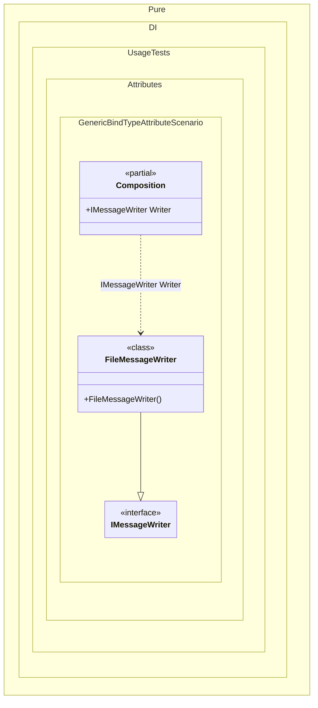

#### Generic bind type attribute

Shows how a custom generic attribute can declare a contract type on an implementation.


```c#
using Shouldly;
using Pure.DI;

DI.Setup(nameof(Composition))
    .TypeAttribute<BindingAttribute<TT>>()

    // Composition root
    .Root<IMessageWriter>("Writer");

var composition = new Composition();
var writer = composition.Writer;

writer.ShouldBeOfType<FileMessageWriter>();

[AttributeUsage(AttributeTargets.Class)]
class BindingAttribute<T> : Attribute;

interface IMessageWriter;

[Binding<IMessageWriter>]
class FileMessageWriter : IMessageWriter;
```

<details>
<summary>Running this code sample locally</summary>

- Make sure you have the [.NET SDK 10.0](https://dotnet.microsoft.com/en-us/download/dotnet/10.0) or later installed
```bash
dotnet --list-sdk
```
- Create a net10.0 (or later) console application
```bash
dotnet new console -n Sample
```
- Add references to the NuGet packages
  - [Pure.DI](https://www.nuget.org/packages/Pure.DI)
  - [Shouldly](https://www.nuget.org/packages/Shouldly)
```bash
dotnet add package Pure.DI
dotnet add package Shouldly
```
- Copy the example code into the _Program.cs_ file

You are ready to run the example 🚀
```bash
dotnet run
```

</details>

>[!NOTE]
>Registering the custom generic attribute with `TypeAttribute<T>()` lets Pure.DI read the contract from the attribute type argument.

<details>
<summary>The following partial class will be generated</summary>

```c#
partial class Composition
{
  public IMessageWriter Writer
  {
    [MethodImpl(MethodImplOptions.AggressiveInlining)]
    get
    {
      return new FileMessageWriter();
    }
  }
}
```

</details>

Class diagram:



See also:

- [Bind generic contract attribute](bind-generic-contract-attribute.md)

