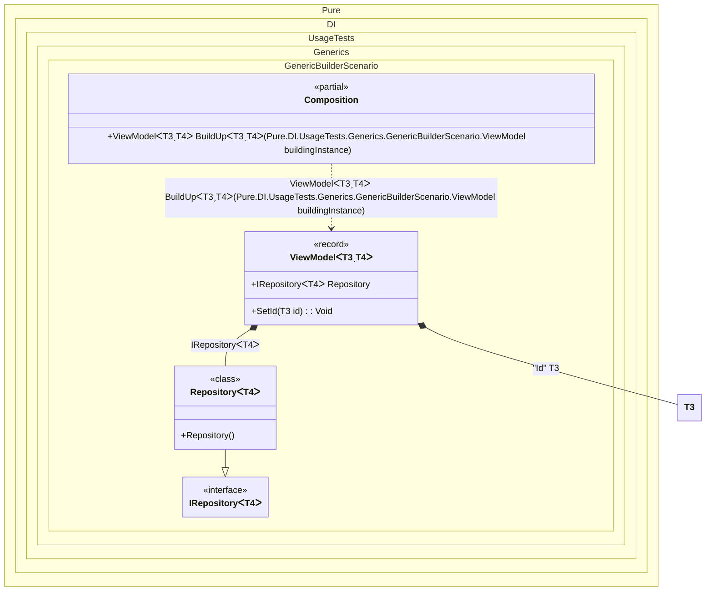

#### Generic builder


```c#
using Shouldly;
using Pure.DI;

DI.Setup(nameof(Composition))
    .Bind(Tag.Id).To<TT>(_ => (TT)(object)Guid.NewGuid())
    .Bind().To<Repository<TT>>()
    // Generic service builder
    // Defines a generic builder "BuildUp".
    // This is useful when instances are created by an external framework
    // (like a UI library or serialization) but require dependencies to be injected.
    .Builder<ViewModel<TTS, TT2>>("BuildUp");

var composition = new Composition();

// A view model instance created manually (or by a UI framework)
var viewModel = new ViewModel<Guid, Customer>();

// Inject dependencies (Id and Repository) into the existing instance
var builtViewModel = composition.BuildUp(viewModel);

builtViewModel.Id.ShouldNotBe(Guid.Empty);
builtViewModel.Repository.ShouldBeOfType<Repository<Customer>>();

// Domain model
record Customer;

interface IRepository<T>;

class Repository<T> : IRepository<T>;

interface IViewModel<out TId, TModel>
{
    TId Id { get; }

    IRepository<TModel>? Repository { get; }
}

// The view model is generic, allowing it to be used for various entities
record ViewModel<TId, TModel> : IViewModel<TId, TModel>
    where TId : struct
{
    public TId Id { get; private set; }

    // The dependency to be injected
    [Dependency]
    public IRepository<TModel>? Repository { get; set; }

    // Method injection for the ID
    [Dependency]
    public void SetId([Tag(Tag.Id)] TId id) => Id = id;
}
```

<details>
<summary>Running this code sample locally</summary>

- Make sure you have the [.NET SDK 10.0](https://dotnet.microsoft.com/en-us/download/dotnet/10.0) or later is installed
```bash
dotnet --list-sdk
```
- Create a net10.0 (or later) console application
```bash
dotnet new console -n Sample
```
- Add references to NuGet packages
  - [Pure.DI](https://www.nuget.org/packages/Pure.DI)
  - [Shouldly](https://www.nuget.org/packages/Shouldly)
```bash
dotnet add package Pure.DI
dotnet add package Shouldly
```
- Copy the example code into the _Program.cs_ file

You are ready to run the example 🚀
```bash
dotnet run
```

</details>

The following partial class will be generated:

```c#
partial class Composition
{
#if NET9_0_OR_GREATER
  private readonly Lock _lock;
#else
  private readonly Object _lock;
#endif

  [OrdinalAttribute(256)]
  public Composition()
  {
#if NET9_0_OR_GREATER
    _lock = new Lock();
#else
    _lock = new Object();
#endif
  }

  internal Composition(Composition parentScope)
  {
    _lock = parentScope._lock;
  }

  [MethodImpl(MethodImplOptions.AggressiveInlining)]
  public ViewModel<T3, T4> BuildUp<T3, T4>(ViewModel<T3, T4> buildingInstance)
    where T3: struct
  {
    if (buildingInstance is null) throw new ArgumentNullException(nameof(buildingInstance));
    ViewModel<T3, T4> transientViewModel;
    ViewModel<T3, T4> localBuildingInstance8 = buildingInstance;
    T3 transientTTS3 = (T3)(object)Guid.NewGuid();
    localBuildingInstance8.Repository = new Repository<T4>();
    localBuildingInstance8.SetId(transientTTS3);
    transientViewModel = localBuildingInstance8;
    return transientViewModel;
  }
}
```

Class diagram:



