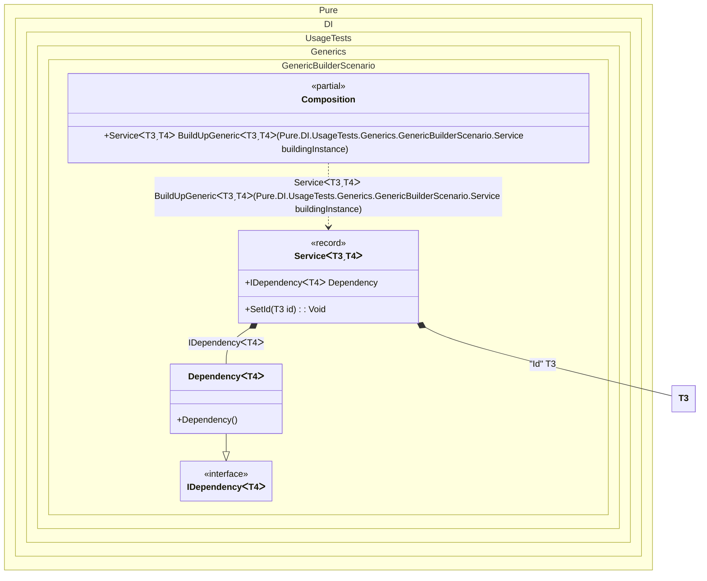

#### Generic builder


```c#
using Shouldly;
using Pure.DI;

DI.Setup(nameof(Composition))
    .Bind(Tag.Id).To<TT>(_ => (TT)(object)Guid.NewGuid())
    .Bind().To<Dependency<TT>>()
    // Generic service builder
    .Builder<Service<TTS, TT2>>("BuildUpGeneric");

var composition = new Composition();
var service = composition.BuildUpGeneric(new Service<Guid, string>());
service.Id.ShouldNotBe(Guid.Empty);
service.Dependency.ShouldBeOfType<Dependency<string>>();

interface IDependency<T>;

class Dependency<T> : IDependency<T>;

interface IService<out T, T2>
{
    T Id { get; }

    IDependency<T2>? Dependency { get; }
}

record Service<T, T2>: IService<T, T2>
    where T: struct
{
    public T Id { get; private set; }

    [Dependency]
    public IDependency<T2>? Dependency { get; set; }

    [Dependency]
    public void SetId([Tag(Tag.Id)] T id) => Id = id;
}
```

<details>
<summary>Running this code sample locally</summary>

- Make sure you have the [.NET SDK 9.0](https://dotnet.microsoft.com/en-us/download/dotnet/9.0) or later is installed
```bash
dotnet --list-sdk
```
- Create a net9.0 (or later) console application
```bash
dotnet new console -n Sample
```
- Add references to NuGet packages
  - [Pure.DI](https://www.nuget.org/packages/Pure.DI)
  - [Shouldly](https://www.nuget.org/packages/Shouldly)
```bash
dotnet add package Pure.DI
dotnet add package Shouldly
```
- Copy the example code into the _Program.cs_ file

You are ready to run the example 🚀
```bash
dotnet run
```

</details>

The following partial class will be generated:

```c#
partial class Composition
{
  private readonly Composition _root;

  [OrdinalAttribute(128)]
  public Composition()
  {
    _root = this;
  }

  internal Composition(Composition parentScope)
  {
    _root = (parentScope ?? throw new ArgumentNullException(nameof(parentScope)))._root;
  }

  [MethodImpl(MethodImplOptions.AggressiveInlining)]
  public Service<T3, T4> BuildUpGeneric<T3, T4>(Service<T3, T4> buildingInstance)
    where T3: struct
  {
    if (buildingInstance is null) throw new ArgumentNullException(nameof(buildingInstance));
    T3 transientTTS2 = (T3)(object)Guid.NewGuid();
    Service<T3, T4> transientService0;
    Service<T3, T4> localBuildingInstance136 = buildingInstance;
    localBuildingInstance136.Dependency = new Dependency<T4>();
    localBuildingInstance136.SetId(transientTTS2);
    transientService0 = localBuildingInstance136;
    return transientService0;
  }
}
```

Class diagram:



