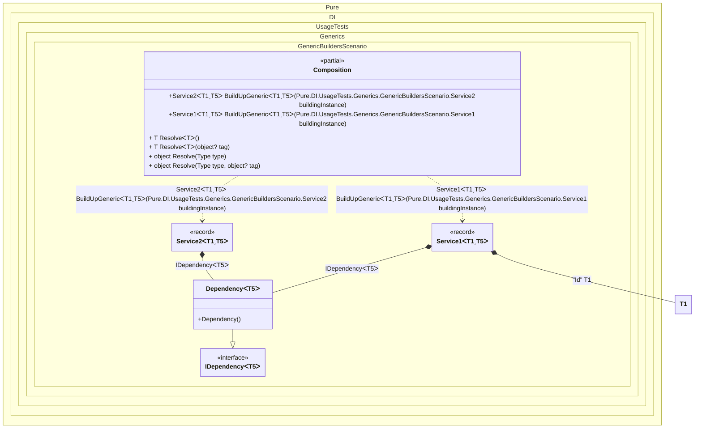

#### Generic builders


```c#
using Shouldly;
using Pure.DI;

DI.Setup(nameof(Composition))
    .Bind(Tag.Id).To<TT>(_ => (TT)(object)Guid.NewGuid())
    .Bind().To<Dependency<TT>>()
    // Generic service builder
    .Builders<IService<TT, TT2>>("BuildUpGeneric");

var composition = new Composition();

var service1 = composition.BuildUpGeneric(new Service1<Guid, string>());
service1.Id.ShouldNotBe(Guid.Empty);
service1.Dependency.ShouldBeOfType<Dependency<string>>();

var service2 = composition.BuildUpGeneric(new Service2<Guid, int>());
service2.Id.ShouldBe(Guid.Empty);
service2.Dependency.ShouldBeOfType<Dependency<int>>();

interface IDependency<T>;

class Dependency<T> : IDependency<T>;

interface IService<out T, T2>
{
    T Id { get; }

    IDependency<T2>? Dependency { get; }
}

record Service1<T, T2>: IService<T, T2>
    where T: struct
{
    public T Id { get; private set; }

    [Dependency]
    public IDependency<T2>? Dependency { get; set; }

    [Dependency]
    public void SetId([Tag(Tag.Id)] T id) => Id = id;
}

record Service2<T, T2>: IService<T, T2>
    where T: struct
{
    public T Id { get; }

    [Dependency]
    public IDependency<T2>? Dependency { get; set; }
}
```

<details>
<summary>Running this code sample locally</summary>

- Make sure you have the [.NET SDK 9.0](https://dotnet.microsoft.com/en-us/download/dotnet/9.0) or later is installed
```bash
dotnet --list-sdk
```
- Create a net9.0 (or later) console application
```bash
dotnet new console -n Sample
```
- Add references to NuGet packages
  - [Pure.DI](https://www.nuget.org/packages/Pure.DI)
  - [Shouldly](https://www.nuget.org/packages/Shouldly)
```bash
dotnet add package Pure.DI
dotnet add package Shouldly
```
- Copy the example code into the _Program.cs_ file

You are ready to run the example 🚀
```bash
dotnet run
```

</details>

The following partial class will be generated:

```c#
partial class Composition
{
  private readonly Composition _root;

  [OrdinalAttribute(128)]
  public Composition()
  {
    _root = this;
  }

  internal Composition(Composition parentScope)
  {
    _root = (parentScope ?? throw new ArgumentNullException(nameof(parentScope)))._root;
  }

  [MethodImpl(MethodImplOptions.AggressiveInlining)]
  public Service2<T1, T5> BuildUpGeneric<T1, T5>(Service2<T1, T5> buildingInstance)
    where T1: struct
  {
    if (buildingInstance is null) throw new ArgumentNullException(nameof(buildingInstance));
    Service2<T1, T5> transientService20;
    Service2<T1, T5> localBuildingInstance134 = buildingInstance;
    localBuildingInstance134.Dependency = new Dependency<T5>();
    transientService20 = localBuildingInstance134;
    return transientService20;
  }

  [MethodImpl(MethodImplOptions.AggressiveInlining)]
  public Service1<T1, T5> BuildUpGeneric<T1, T5>(Service1<T1, T5> buildingInstance)
    where T1: struct
  {
    if (buildingInstance is null) throw new ArgumentNullException(nameof(buildingInstance));
    T1 transientTT2 = (T1)(object)Guid.NewGuid();
    Service1<T1, T5> transientService10;
    Service1<T1, T5> localBuildingInstance135 = buildingInstance;
    localBuildingInstance135.Dependency = new Dependency<T5>();
    localBuildingInstance135.SetId(transientTT2);
    transientService10 = localBuildingInstance135;
    return transientService10;
  }

  [MethodImpl(MethodImplOptions.AggressiveInlining)]
  public T Resolve<T>()
  {
    return Resolver<T>.Value.Resolve(this);
  }

  [MethodImpl(MethodImplOptions.AggressiveInlining)]
  public T Resolve<T>(object? tag)
  {
    return Resolver<T>.Value.ResolveByTag(this, tag);
  }

  [MethodImpl(MethodImplOptions.AggressiveInlining)]
  public object Resolve(Type type)
  {
    throw new InvalidOperationException($"{CannotResolveMessage} {OfTypeMessage} {type}.");
  }

  [MethodImpl(MethodImplOptions.AggressiveInlining)]
  public object Resolve(Type type, object? tag)
  {
    throw new InvalidOperationException($"{CannotResolveMessage} \"{tag}\" {OfTypeMessage} {type}.");
  }

  private const string CannotResolveMessage = "Cannot resolve composition root ";
  private const string OfTypeMessage = "of type ";

  private class Resolver<T>: IResolver<Composition, T>
  {
    public static IResolver<Composition, T> Value = new Resolver<T>();

    public virtual T Resolve(Composition composite)
    {
      throw new InvalidOperationException($"{CannotResolveMessage}{OfTypeMessage}{typeof(T)}.");
    }

    public virtual T ResolveByTag(Composition composite, object tag)
    {
      throw new InvalidOperationException($"{CannotResolveMessage}\"{tag}\" {OfTypeMessage}{typeof(T)}.");
    }
  }
}
```

Class diagram:



