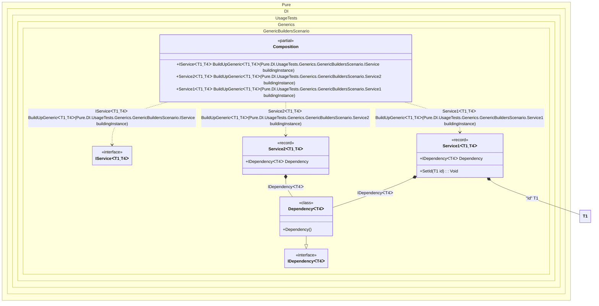

#### Generic builders


```c#
using Shouldly;
using Pure.DI;

DI.Setup(nameof(Composition))
    .Bind(Tag.Id).To<TT>(_ => (TT)(object)Guid.NewGuid())
    .Bind().To<Dependency<TT>>()
    // Generic service builder
    .Builders<IService<TT, TT2>>("BuildUpGeneric");

var composition = new Composition();

var service1 = composition.BuildUpGeneric(new Service1<Guid, string>());
service1.Id.ShouldNotBe(Guid.Empty);
service1.Dependency.ShouldBeOfType<Dependency<string>>();

var service2 = composition.BuildUpGeneric(new Service2<Guid, int>());
service2.Id.ShouldBe(Guid.Empty);
service2.Dependency.ShouldBeOfType<Dependency<int>>();

// Uses a common method to build an instance
IService<Guid, Uri> abstractService = new Service1<Guid, Uri>();
abstractService = composition.BuildUpGeneric(abstractService);
abstractService.ShouldBeOfType<Service1<Guid, Uri>>();
abstractService.Id.ShouldNotBe(Guid.Empty);
abstractService.Dependency.ShouldBeOfType<Dependency<Uri>>();

interface IDependency<T>;

class Dependency<T> : IDependency<T>;

interface IService<out T, T2>
{
    T Id { get; }

    IDependency<T2>? Dependency { get; }
}

record Service1<T, T2>: IService<T, T2>
    where T: struct
{
    public T Id { get; private set; }

    [Dependency]
    public IDependency<T2>? Dependency { get; set; }

    [Dependency]
    public void SetId([Tag(Tag.Id)] T id) => Id = id;
}

record Service2<T, T2>: IService<T, T2>
    where T: struct
{
    public T Id { get; }

    [Dependency]
    public IDependency<T2>? Dependency { get; set; }
}
```

<details>
<summary>Running this code sample locally</summary>

- Make sure you have the [.NET SDK 9.0](https://dotnet.microsoft.com/en-us/download/dotnet/9.0) or later is installed
```bash
dotnet --list-sdk
```
- Create a net9.0 (or later) console application
```bash
dotnet new console -n Sample
```
- Add references to NuGet packages
  - [Pure.DI](https://www.nuget.org/packages/Pure.DI)
  - [Shouldly](https://www.nuget.org/packages/Shouldly)
```bash
dotnet add package Pure.DI
dotnet add package Shouldly
```
- Copy the example code into the _Program.cs_ file

You are ready to run the example 🚀
```bash
dotnet run
```

</details>

The following partial class will be generated:

```c#
partial class Composition
{
#if NET9_0_OR_GREATER
  private readonly Lock _lock;
#else
  private readonly Object _lock;
#endif

  [OrdinalAttribute(256)]
  public Composition()
  {
#if NET9_0_OR_GREATER
    _lock = new Lock();
#else
    _lock = new Object();
#endif
  }

  internal Composition(Composition parentScope)
  {
  }

  #pragma warning disable CS0162
  [MethodImpl(MethodImplOptions.AggressiveInlining)]
  public IService<T1, T4> BuildUpGeneric<T1, T4>(IService<T1, T4> buildingInstance)
    where T1: struct
  {
    if (buildingInstance is null) throw new ArgumentNullException(nameof(buildingInstance));
    IService<T1, T4> transIService;
    IService<T1, T4> localBuildingInstance149 = buildingInstance;
    switch (localBuildingInstance149)
    {
      case Service1<T1, T4> localService1_TT_TT2150:
      {
        transIService = BuildUpGeneric(localService1_TT_TT2150);
        goto transIServiceFinish;
      }

      case Service2<T1, T4> localService2_TT_TT2151:
      {
        transIService = BuildUpGeneric(localService2_TT_TT2151);
        goto transIServiceFinish;
      }

      default:
        throw new ArgumentException($"Unable to build an instance of typeof type {localBuildingInstance149.GetType()}.", "buildingInstance");
    }

    transIService = localBuildingInstance149;
    transIServiceFinish:
      ;
    return transIService;
  }
  #pragma warning restore CS0162

  [MethodImpl(MethodImplOptions.AggressiveInlining)]
  public Service2<T1, T4> BuildUpGeneric<T1, T4>(Service2<T1, T4> buildingInstance)
    where T1: struct
  {
    if (buildingInstance is null) throw new ArgumentNullException(nameof(buildingInstance));
    Service2<T1, T4> transService22;
    Service2<T1, T4> localBuildingInstance152 = buildingInstance;
    localBuildingInstance152.Dependency = new Dependency<T4>();
    transService22 = localBuildingInstance152;
    return transService22;
  }

  [MethodImpl(MethodImplOptions.AggressiveInlining)]
  public Service1<T1, T4> BuildUpGeneric<T1, T4>(Service1<T1, T4> buildingInstance)
    where T1: struct
  {
    if (buildingInstance is null) throw new ArgumentNullException(nameof(buildingInstance));
    Service1<T1, T4> transService15;
    Service1<T1, T4> localBuildingInstance153 = buildingInstance;
    T1 transTT8 = (T1)(object)Guid.NewGuid();
    localBuildingInstance153.Dependency = new Dependency<T4>();
    localBuildingInstance153.SetId(transTT8);
    transService15 = localBuildingInstance153;
    return transService15;
  }
}
```

Class diagram:



