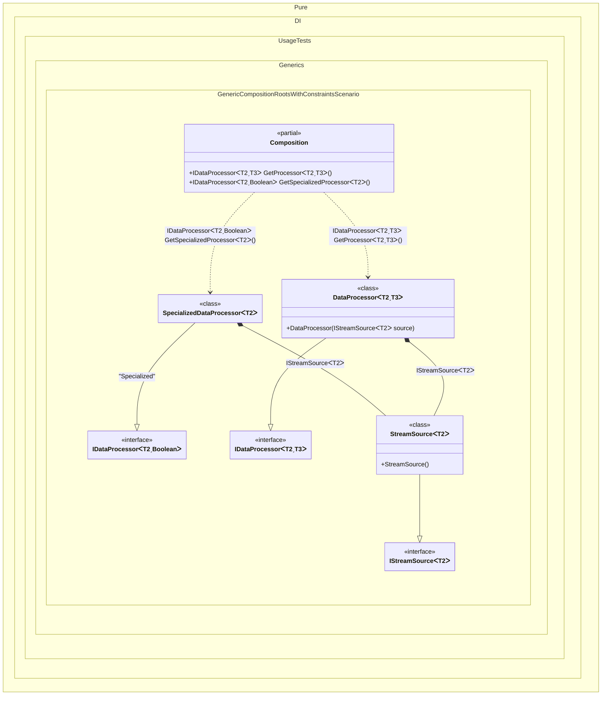

#### Generic composition roots with constraints

> [!IMPORTANT]
> `Resolve' methods cannot be used to resolve generic composition roots.


```c#
using Pure.DI;

DI.Setup(nameof(Composition))
    // This hint indicates to not generate methods such as Resolve
    .Hint(Hint.Resolve, "Off")
    .Bind().To<StreamSource<TTDisposable>>()
    .Bind().To<DataProcessor<TTDisposable, TTS>>()
    // Creates SpecializedDataProcessor manually,
    // just for the sake of example.
    // It treats 'bool' as the options type for specific boolean flags.
    .Bind("Specialized").To(ctx => {
        ctx.Inject(out IStreamSource<TTDisposable> source);
        return new SpecializedDataProcessor<TTDisposable>(source);
    })

    // Specifies to create a regular public method
    // to get a composition root of type DataProcessor<T, TOptions>
    // with the name "GetProcessor"
    .Root<IDataProcessor<TTDisposable, TTS>>("GetProcessor")

    // Specifies to create a regular public method
    // to get a composition root of type SpecializedDataProcessor<T>
    // with the name "GetSpecializedProcessor"
    // using the "Specialized" tag
    .Root<IDataProcessor<TTDisposable, bool>>("GetSpecializedProcessor", "Specialized");

var composition = new Composition();

// Creates a processor for a Stream with 'double' as options (e.g., threshold)
// processor = new DataProcessor<Stream, double>(new StreamSource<Stream>());
var processor = composition.GetProcessor<Stream, double>();

// Creates a specialized processor for a BinaryReader
// specializedProcessor = new SpecializedDataProcessor<BinaryReader>(new StreamSource<BinaryReader>());
var specializedProcessor = composition.GetSpecializedProcessor<BinaryReader>();

interface IStreamSource<T>
    where T : IDisposable;

class StreamSource<T> : IStreamSource<T>
    where T : IDisposable;

interface IDataProcessor<T, TOptions>
    where T : IDisposable
    where TOptions : struct;

class DataProcessor<T, TOptions>(IStreamSource<T> source) : IDataProcessor<T, TOptions>
    where T : IDisposable
    where TOptions : struct;

class SpecializedDataProcessor<T>(IStreamSource<T> source) : IDataProcessor<T, bool>
    where T : IDisposable;
```

<details>
<summary>Running this code sample locally</summary>

- Make sure you have the [.NET SDK 10.0](https://dotnet.microsoft.com/en-us/download/dotnet/10.0) or later is installed
```bash
dotnet --list-sdk
```
- Create a net10.0 (or later) console application
```bash
dotnet new console -n Sample
```
- Add reference to NuGet package
  - [Pure.DI](https://www.nuget.org/packages/Pure.DI)
```bash
dotnet add package Pure.DI
```
- Copy the example code into the _Program.cs_ file

You are ready to run the example 🚀
```bash
dotnet run
```

</details>

> [!IMPORTANT]
> The method `Inject()`cannot be used outside of the binding setup.

The following partial class will be generated:

```c#
partial class Composition
{
  [MethodImpl(MethodImplOptions.AggressiveInlining)]
  public IDataProcessor<T2, bool> GetSpecializedProcessor<T2>()
    where T2: IDisposable
  {
    SpecializedDataProcessor<T2> transientSpecializedDataProcessor;
    IStreamSource<T2> localSource = new StreamSource<T2>();
    transientSpecializedDataProcessor = new SpecializedDataProcessor<T2>(localSource);
    return transientSpecializedDataProcessor;
  }

  [MethodImpl(MethodImplOptions.AggressiveInlining)]
  public IDataProcessor<T2, T3> GetProcessor<T2, T3>()
    where T2: IDisposable
    where T3: struct
  {
    return new DataProcessor<T2, T3>(new StreamSource<T2>());
  }
}
```

Class diagram:



