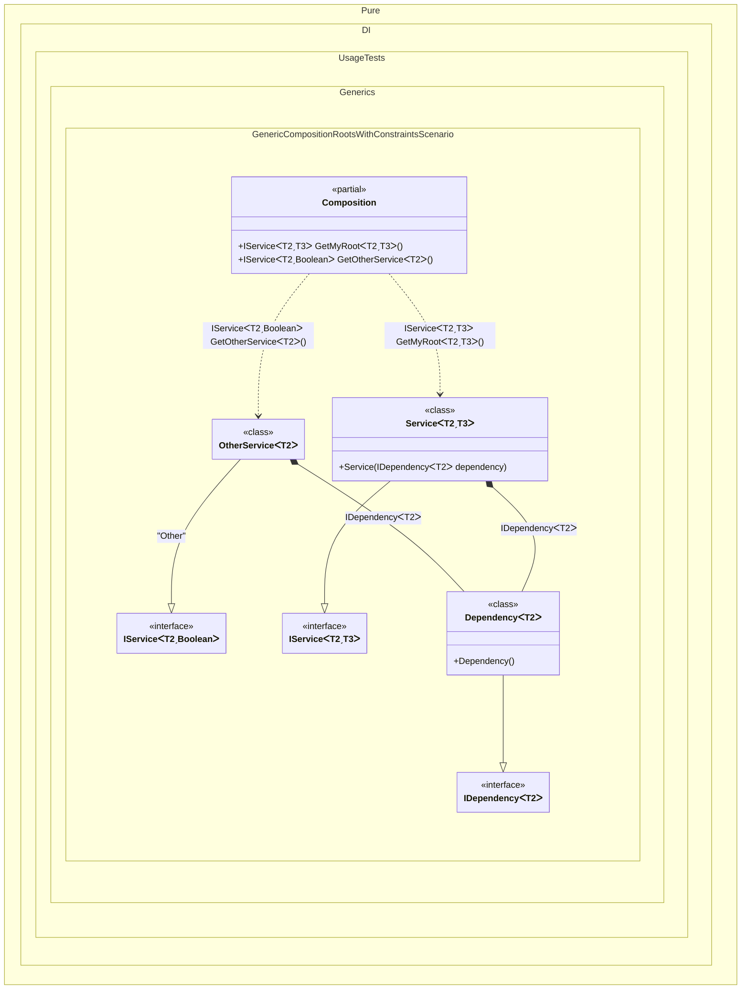

#### Generic composition roots with constraints

> [!IMPORTANT]
> `Resolve' methods cannot be used to resolve generic composition roots.


```c#
using Pure.DI;

DI.Setup(nameof(Composition))
    // This hint indicates to not generate methods such as Resolve
    .Hint(Hint.Resolve, "Off")
    .Bind().To<Dependency<TTDisposable>>()
    .Bind().To<Service<TTDisposable, TTS>>()
    // Creates OtherService manually,
    // just for the sake of example
    .Bind("Other").To(ctx =>
    {
        ctx.Inject(out IDependency<TTDisposable> dependency);
        return new OtherService<TTDisposable>(dependency);
    })

    // Specifies to create a regular public method
    // to get a composition root of type Service<T, TStruct>
    // with the name "GetMyRoot"
    .Root<IService<TTDisposable, TTS>>("GetMyRoot")

    // Specifies to create a regular public method
    // to get a composition root of type OtherService<T>
    // with the name "GetOtherService"
    // using the "Other" tag
    .Root<IService<TTDisposable, bool>>("GetOtherService", "Other");

var composition = new Composition();

// service = new Service<Stream, double>(new Dependency<Stream>());
var service = composition.GetMyRoot<Stream, double>();

// someOtherService = new OtherService<BinaryReader>(new Dependency<BinaryReader>());
var someOtherService = composition.GetOtherService<BinaryReader>();

interface IDependency<T>
    where T : IDisposable;

class Dependency<T> : IDependency<T>
    where T : IDisposable;

interface IService<T, TStruct>
    where T : IDisposable
    where TStruct : struct;

class Service<T, TStruct>(IDependency<T> dependency) : IService<T, TStruct>
    where T : IDisposable
    where TStruct : struct;

class OtherService<T>(IDependency<T> dependency) : IService<T, bool>
    where T : IDisposable;
```

<details>
<summary>Running this code sample locally</summary>

- Make sure you have the [.NET SDK 9.0](https://dotnet.microsoft.com/en-us/download/dotnet/9.0) or later is installed
```bash
dotnet --list-sdk
```
- Create a net9.0 (or later) console application
```bash
dotnet new console -n Sample
```
- Add reference to NuGet package
  - [Pure.DI](https://www.nuget.org/packages/Pure.DI)
```bash
dotnet add package Pure.DI
```
- Copy the example code into the _Program.cs_ file

You are ready to run the example 🚀
```bash
dotnet run
```

</details>

> [!IMPORTANT]
> The method `Inject()`cannot be used outside of the binding setup.

The following partial class will be generated:

```c#
partial class Composition
{
  private readonly Composition _root;

  [OrdinalAttribute(256)]
  public Composition()
  {
    _root = this;
  }

  internal Composition(Composition parentScope)
  {
    _root = (parentScope ?? throw new ArgumentNullException(nameof(parentScope)))._root;
  }

  [MethodImpl(MethodImplOptions.AggressiveInlining)]
  public IService<T2, bool> GetOtherService<T2>()
    where T2: IDisposable
  {
    OtherService<T2> transientOtherService0;
    IDependency<T2> localDependency140 = new Dependency<T2>();
    transientOtherService0 = new OtherService<T2>(localDependency140);
    return transientOtherService0;
  }

  [MethodImpl(MethodImplOptions.AggressiveInlining)]
  public IService<T2, T3> GetMyRoot<T2, T3>()
    where T2: IDisposable
    where T3: struct
  {
    return new Service<T2, T3>(new Dependency<T2>());
  }
}
```

Class diagram:



