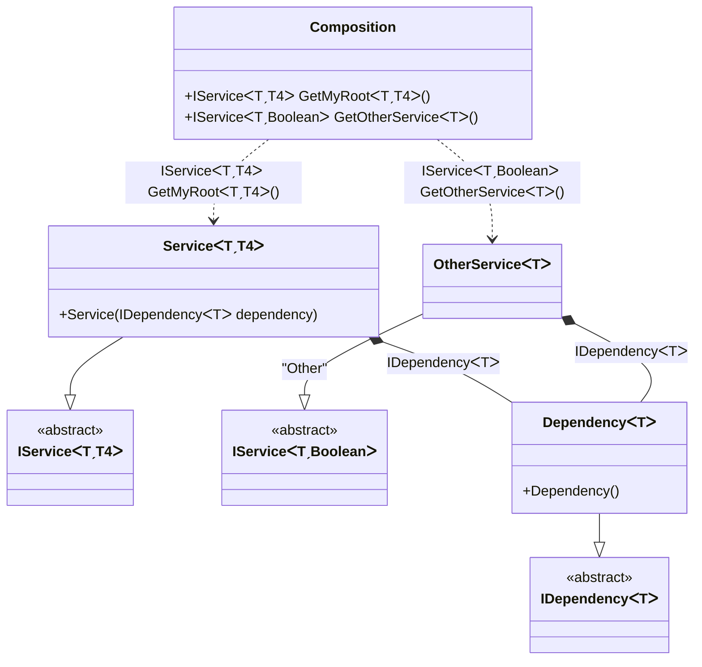

#### Generic composition roots with constraints

[](../tests/Pure.DI.UsageTests/Generics/GenericCompositionRootsWithConstraintsScenario.cs)

```c#
interface IDependency<T>
    where T: IDisposable;

class Dependency<T> : IDependency<T>
    where T: IDisposable;

interface IService<T, TStruct>
    where T: IDisposable
    where TStruct: struct;

class Service<T, TStruct>(IDependency<T> dependency) : IService<T, TStruct>
    where T: IDisposable
    where TStruct: struct;

class OtherService<T>(IDependency<T> dependency) : IService<T, bool>
    where T: IDisposable;

DI.Setup(nameof(Composition))
    // This hint indicates to not generate methods such as Resolve
    .Hint(Hint.Resolve, "Off")
    .Bind().To<Dependency<TTDisposable>>()
    .Bind().To<Service<TTDisposable, TTS>>()
    // Creates OtherService manually,
    // just for the sake of example
    .Bind("Other").To(ctx =>
    {
        ctx.Inject(out IDependency<TTDisposable> dependency);
        return new OtherService<TTDisposable>(dependency);
    })

    // Specifies to create a regular public method
    // to get a composition root of type Service<T, TStruct>
    // with the name "GetMyRoot"
    .Root<IService<TTDisposable, TTS>>("GetMyRoot")

    // Specifies to create a regular public method
    // to get a composition root of type OtherService<T>
    // with the name "GetOtherService"
    // using the "Other" tag
    .Root<IService<TTDisposable, bool>>("GetOtherService", "Other");

var composition = new Composition();
        
// service = new Service<Stream, double>(new Dependency<Stream>());
var service = composition.GetMyRoot<Stream, double>();
        
// someOtherService = new OtherService<BinaryReader>(new Dependency<BinaryReader>());
var someOtherService = composition.GetOtherService<BinaryReader>();
```

<details open>
<summary>Class Diagram</summary>



</details>

<details>
<summary>Pure.DI-generated partial class Composition</summary><blockquote>

```c#
partial class Composition
{
  private readonly Composition _rootM04D27di;
  
  public Composition()
  {
    _rootM04D27di = this;
  }
  
  internal Composition(Composition baseComposition)
  {
    _rootM04D27di = baseComposition._rootM04D27di;
  }
  
  [global::System.Runtime.CompilerServices.MethodImpl((global::System.Runtime.CompilerServices.MethodImplOptions)0x100)]
  public Pure.DI.UsageTests.Generics.GenericCompositionRootsWithConstraintsScenario.IService<T, T4> GetMyRoot<T, T4>()
    where T: System.IDisposable
    where T4: struct
  {
    return new Pure.DI.UsageTests.Generics.GenericCompositionRootsWithConstraintsScenario.Service<T, T4>(new Pure.DI.UsageTests.Generics.GenericCompositionRootsWithConstraintsScenario.Dependency<T>());
  }
  
  [global::System.Runtime.CompilerServices.MethodImpl((global::System.Runtime.CompilerServices.MethodImplOptions)0x100)]
  public Pure.DI.UsageTests.Generics.GenericCompositionRootsWithConstraintsScenario.IService<T, bool> GetOtherService<T>()
    where T: System.IDisposable
  {
    Pure.DI.UsageTests.Generics.GenericCompositionRootsWithConstraintsScenario.OtherService<T> transientM04D27di0_OtherService;
    {
        var dependency_M04D27di1 = new Pure.DI.UsageTests.Generics.GenericCompositionRootsWithConstraintsScenario.Dependency<T>();
        transientM04D27di0_OtherService = new OtherService<T>(dependency_M04D27di1);
    }
    return transientM04D27di0_OtherService;
  }
  
  public override string ToString()
  {
    return
      "classDiagram\n" +
        "  class Composition {\n" +
          "    +IServiceᐸTˏT4ᐳ GetMyRootᐸTˏT4ᐳ()\n" +
          "    +IServiceᐸTˏBooleanᐳ GetOtherServiceᐸTᐳ()\n" +
        "  }\n" +
        "  ServiceᐸTˏT4ᐳ --|> IServiceᐸTˏT4ᐳ : \n" +
        "  class ServiceᐸTˏT4ᐳ {\n" +
          "    +Service(IDependencyᐸTᐳ dependency)\n" +
        "  }\n" +
        "  OtherServiceᐸTᐳ --|> IServiceᐸTˏBooleanᐳ : \"Other\" \n" +
        "  class OtherServiceᐸTᐳ\n" +
        "  DependencyᐸTᐳ --|> IDependencyᐸTᐳ : \n" +
        "  class DependencyᐸTᐳ {\n" +
          "    +Dependency()\n" +
        "  }\n" +
        "  class IServiceᐸTˏT4ᐳ {\n" +
          "    <<abstract>>\n" +
        "  }\n" +
        "  class IServiceᐸTˏBooleanᐳ {\n" +
          "    <<abstract>>\n" +
        "  }\n" +
        "  class IDependencyᐸTᐳ {\n" +
          "    <<abstract>>\n" +
        "  }\n" +
        "  Composition ..> ServiceᐸTˏT4ᐳ : IServiceᐸTˏT4ᐳ GetMyRootᐸTˏT4ᐳ()\n" +
        "  Composition ..> OtherServiceᐸTᐳ : IServiceᐸTˏBooleanᐳ GetOtherServiceᐸTᐳ()\n" +
        "  ServiceᐸTˏT4ᐳ *--  DependencyᐸTᐳ : IDependencyᐸTᐳ\n" +
        "  OtherServiceᐸTᐳ *--  DependencyᐸTᐳ : IDependencyᐸTᐳ";
  }
  
}
```

</blockquote></details>

