#### Generic composition roots with constraints

[](../tests/Pure.DI.UsageTests/Generics/GenericCompositionRootsWithConstraintsScenario.cs)

> [!IMPORTANT]
> `Resolve' methods cannot be used to resolve generic composition roots.


```c#
interface IDependency<T>
    where T : IDisposable;

class Dependency<T> : IDependency<T>
    where T : IDisposable;

interface IService<T, TStruct>
    where T : IDisposable
    where TStruct : struct;

class Service<T, TStruct>(IDependency<T> dependency) : IService<T, TStruct>
    where T : IDisposable
    where TStruct : struct;

class OtherService<T>(IDependency<T> dependency) : IService<T, bool>
    where T : IDisposable;

DI.Setup(nameof(Composition))
    // This hint indicates to not generate methods such as Resolve
    .Hint(Hint.Resolve, "Off")
    .Bind().To<Dependency<TTDisposable>>()
    .Bind().To<Service<TTDisposable, TTS>>()
    // Creates OtherService manually,
    // just for the sake of example
    .Bind("Other").To(ctx =>
    {
        ctx.Inject(out IDependency<TTDisposable> dependency);
        return new OtherService<TTDisposable>(dependency);
    })

    // Specifies to create a regular public method
    // to get a composition root of type Service<T, TStruct>
    // with the name "GetMyRoot"
    .Root<IService<TTDisposable, TTS>>("GetMyRoot")

    // Specifies to create a regular public method
    // to get a composition root of type OtherService<T>
    // with the name "GetOtherService"
    // using the "Other" tag
    .Root<IService<TTDisposable, bool>>("GetOtherService", "Other");

var composition = new Composition();

// service = new Service<Stream, double>(new Dependency<Stream>());
var service = composition.GetMyRoot<Stream, double>();

// someOtherService = new OtherService<BinaryReader>(new Dependency<BinaryReader>());
var someOtherService = composition.GetOtherService<BinaryReader>();
```

> [!IMPORTANT]
> The method `Inject()`cannot be used outside of the binding setup.

The following partial class will be generated:

```c#
partial class Composition
{
  private readonly Composition _root;

  [OrdinalAttribute(20)]
  public Composition()
  {
    _root = this;
  }

  internal Composition(Composition parentScope)
  {
    _root = (parentScope ?? throw new ArgumentNullException(nameof(parentScope)))._root;
  }

  [MethodImpl(MethodImplOptions.AggressiveInlining)]
  public IService<T1, bool> GetOtherService<T1>()
    where T1: IDisposable
  {
    OtherService<T1> transientOtherService0;
    IDependency<T1> localDependency76 = new Dependency<T1>();
    transientOtherService0 = new OtherService<T1>(localDependency76);
    return transientOtherService0;
  }

  [MethodImpl(MethodImplOptions.AggressiveInlining)]
  public IService<T1, T> GetMyRoot<T1, T>()
    where T1: IDisposable
    where T: struct
  {
    return new Service<T1, T>(new Dependency<T1>());
  }
}
```

Class diagram:

```mermaid
classDiagram
	class Composition {
		<<partial>>
		+IServiceᐸT1ˏTᐳ GetMyRootᐸT1ˏTᐳ()
		+IServiceᐸT1ˏBooleanᐳ GetOtherServiceᐸT1ᐳ()
	}
	OtherServiceᐸT1ᐳ --|> IServiceᐸT1ˏBooleanᐳ : "Other" 
	class OtherServiceᐸT1ᐳ
	ServiceᐸT1ˏTᐳ --|> IServiceᐸT1ˏTᐳ
	class ServiceᐸT1ˏTᐳ {
		+Service(IDependencyᐸT1ᐳ dependency)
	}
	DependencyᐸT1ᐳ --|> IDependencyᐸT1ᐳ
	class DependencyᐸT1ᐳ {
		+Dependency()
	}
	class IServiceᐸT1ˏBooleanᐳ {
		<<interface>>
	}
	class IServiceᐸT1ˏTᐳ {
		<<interface>>
	}
	class IDependencyᐸT1ᐳ {
		<<interface>>
	}
	Composition ..> OtherServiceᐸT1ᐳ : IServiceᐸT1ˏBooleanᐳ GetOtherServiceᐸT1ᐳ()
	Composition ..> ServiceᐸT1ˏTᐳ : IServiceᐸT1ˏTᐳ GetMyRootᐸT1ˏTᐳ()
	OtherServiceᐸT1ᐳ *--  DependencyᐸT1ᐳ : IDependencyᐸT1ᐳ
	ServiceᐸT1ˏTᐳ *--  DependencyᐸT1ᐳ : IDependencyᐸT1ᐳ
```



