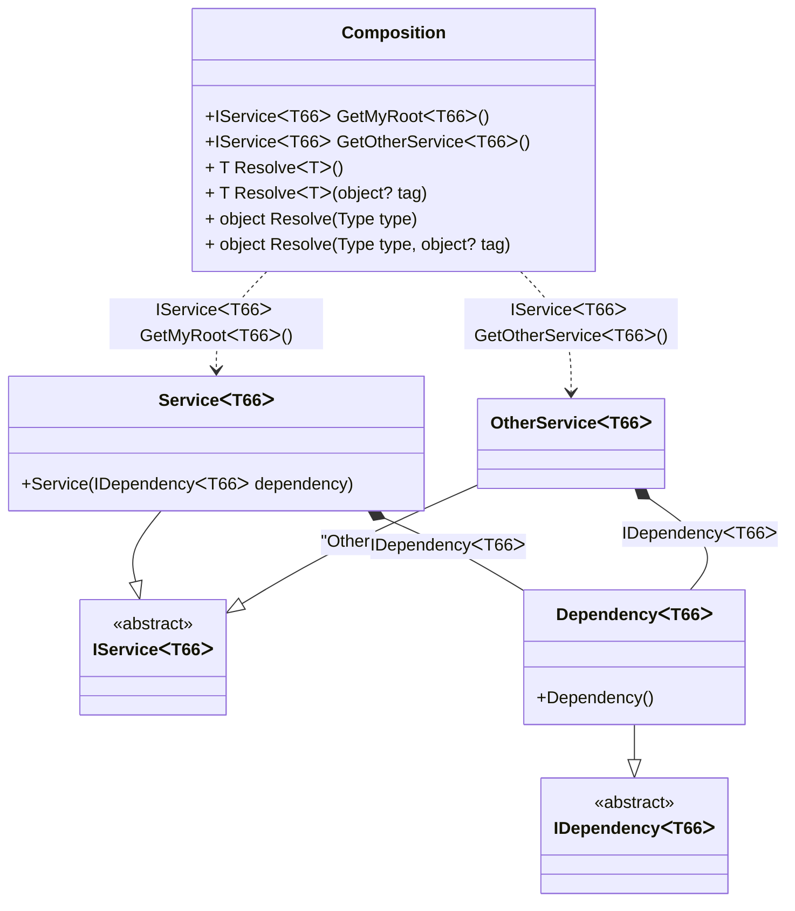

#### Generic composition roots

[](../tests/Pure.DI.UsageTests/Generics/GenericsCompositionRootsScenario.cs)

A generic composition root is represented by a method.

```c#
interface IDependency<T>;

class Dependency<T> : IDependency<T>;

interface IService<T>;

class Service<T>(IDependency<T> dependency) : IService<T>;

class OtherService<T>(IDependency<T> dependency) : IService<T>;

DI.Setup(nameof(Composition))
    .Bind().To<Dependency<TT>>()
    .Bind().To<Service<TT>>()
    // Creates OtherService manually,
    // just for the sake of example
    .Bind("Other").To(ctx =>
    {
        ctx.Inject(out IDependency<TT> dependency);
        return new OtherService<TT>(dependency);
    })

    // Specifies to create a regular public method
    // to get a composition root of type Service<T>
    // with the name "GetMyRoot"
    .Root<IService<TT>>("GetMyRoot")

    // Specifies to create a regular public method
    // to get a composition root of type OtherService<T>
    // with the name "GetOtherService"
    // using the "Other" tag
    .Root<IService<TT>>("GetOtherService", "Other");

var composition = new Composition();
        
// service = new Service<int>(new Dependency<int>());
var service = composition.GetMyRoot<int>();
        
// someOtherService = new OtherService<int>(new Dependency<int>());
var someOtherService = composition.GetOtherService<string>();
```

When a generic composition root is used, `Resolve` methods cannot be used to resolve them.

<details open>
<summary>Class Diagram</summary>



</details>

<details>
<summary>Pure.DI-generated partial class Composition</summary><blockquote>

```c#
partial class Composition
{
  private readonly Composition _rootM03D15di;
  
  public Composition()
  {
    _rootM03D15di = this;
  }
  
  internal Composition(Composition baseComposition)
  {
    _rootM03D15di = baseComposition._rootM03D15di;
  }
  
  public Pure.DI.UsageTests.Generics.GenericsCompositionRootsScenario.IService<T66> GetMyRoot<T66>()
  {
    return new Pure.DI.UsageTests.Generics.GenericsCompositionRootsScenario.Service<T66>(new Pure.DI.UsageTests.Generics.GenericsCompositionRootsScenario.Dependency<T66>());
  }
  
  public Pure.DI.UsageTests.Generics.GenericsCompositionRootsScenario.IService<T66> GetOtherService<T66>()
  {
    Pure.DI.UsageTests.Generics.GenericsCompositionRootsScenario.OtherService<T66> transientM03D15di0_OtherService;
    {
        var dependency_M03D15di1 = new Pure.DI.UsageTests.Generics.GenericsCompositionRootsScenario.Dependency<T66>();
        transientM03D15di0_OtherService = new OtherService<T66>(dependency_M03D15di1);
    }
    return transientM03D15di0_OtherService;
  }
  
  public T Resolve<T>()
  {
    return ResolverM03D15di<T>.Value.Resolve(this);
  }
  
  public T Resolve<T>(object? tag)
  {
    return ResolverM03D15di<T>.Value.ResolveByTag(this, tag);
  }
  
  public object Resolve(global::System.Type type)
  {
    throw new global::System.InvalidOperationException($"Cannot resolve composition root of type {type}.");
  }
  
  public object Resolve(global::System.Type type, object? tag)
  {
    throw new global::System.InvalidOperationException($"Cannot resolve composition root \"{tag}\" of type {type}.");
  }
  
  public override string ToString()
  {
    return
      "classDiagram\n" +
        "  class Composition {\n" +
          "    +IServiceᐸT66ᐳ GetMyRootᐸT66ᐳ()\n" +
          "    +IServiceᐸT66ᐳ GetOtherServiceᐸT66ᐳ()\n" +
          "    + T ResolveᐸTᐳ()\n" +
          "    + T ResolveᐸTᐳ(object? tag)\n" +
          "    + object Resolve(Type type)\n" +
          "    + object Resolve(Type type, object? tag)\n" +
        "  }\n" +
        "  ServiceᐸT66ᐳ --|> IServiceᐸT66ᐳ : \n" +
        "  class ServiceᐸT66ᐳ {\n" +
          "    +Service(IDependencyᐸT66ᐳ dependency)\n" +
        "  }\n" +
        "  OtherServiceᐸT66ᐳ --|> IServiceᐸT66ᐳ : \"Other\" \n" +
        "  class OtherServiceᐸT66ᐳ\n" +
        "  DependencyᐸT66ᐳ --|> IDependencyᐸT66ᐳ : \n" +
        "  class DependencyᐸT66ᐳ {\n" +
          "    +Dependency()\n" +
        "  }\n" +
        "  class IServiceᐸT66ᐳ {\n" +
          "    <<abstract>>\n" +
        "  }\n" +
        "  class IDependencyᐸT66ᐳ {\n" +
          "    <<abstract>>\n" +
        "  }\n" +
        "  Composition ..> ServiceᐸT66ᐳ : IServiceᐸT66ᐳ GetMyRootᐸT66ᐳ()\n" +
        "  Composition ..> OtherServiceᐸT66ᐳ : IServiceᐸT66ᐳ GetOtherServiceᐸT66ᐳ()\n" +
        "  ServiceᐸT66ᐳ *--  DependencyᐸT66ᐳ : IDependencyᐸT66ᐳ\n" +
        "  OtherServiceᐸT66ᐳ *--  DependencyᐸT66ᐳ : IDependencyᐸT66ᐳ";
  }
  
  
  private sealed class ResolverM03D15di<T>: global::Pure.DI.IResolver<Composition, T>
  {
    public static global::Pure.DI.IResolver<Composition, T> Value = new ResolverM03D15di<T>();
    
    public T Resolve(Composition composite)
    {
      throw new global::System.InvalidOperationException($"Cannot resolve composition root of type {typeof(T)}.");
    }
    
    public T ResolveByTag(Composition composite, object tag)
    {
      throw new global::System.InvalidOperationException($"Cannot resolve composition root \"{tag}\" of type {typeof(T)}.");
    }
  }
}
```

</blockquote></details>

