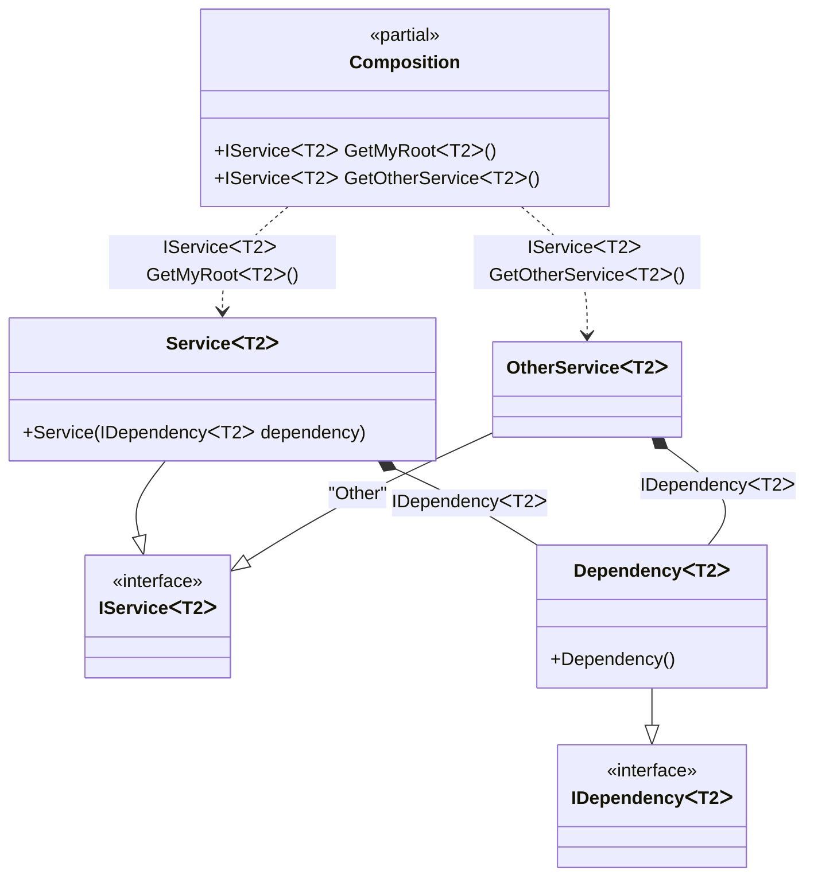

#### Generic composition roots

[](../tests/Pure.DI.UsageTests/Generics/GenericsCompositionRootsScenario.cs)

A generic composition root is represented by a method.


```c#
interface IDependency<T>;

class Dependency<T> : IDependency<T>;

interface IService<T>;

class Service<T>(IDependency<T> dependency) : IService<T>;

class OtherService<T>(IDependency<T> dependency) : IService<T>;

DI.Setup(nameof(Composition))
    // This hint indicates to not generate methods such as Resolve
    .Hint(Hint.Resolve, "Off")
    .Bind().To<Dependency<TT>>()
    .Bind().To<Service<TT>>()
    // Creates OtherService manually,
    // just for the sake of example
    .Bind("Other").To(ctx =>
    {
        ctx.Inject(out IDependency<TT> dependency);
        return new OtherService<TT>(dependency);
    })

    // Specifies to create a regular public method
    // to get a composition root of type Service<T>
    // with the name "GetMyRoot"
    .Root<IService<TT>>("GetMyRoot")

    // Specifies to create a regular public method
    // to get a composition root of type OtherService<T>
    // with the name "GetOtherService"
    // using the "Other" tag
    .Root<IService<TT>>("GetOtherService", "Other");

var composition = new Composition();
        
// service = new Service<int>(new Dependency<int>());
var service = composition.GetMyRoot<int>();
        
// someOtherService = new OtherService<int>(new Dependency<int>());
var someOtherService = composition.GetOtherService<string>();
```

When a generic composition root is used, `Resolve` methods cannot be used to resolve them.

The following partial class will be generated:

```c#
partial class Composition
{
  private readonly Composition _root;

  public Composition()
  {
    _root = this;
  }

  internal Composition(Composition parentScope)
  {
    _root = (parentScope ?? throw new ArgumentNullException(nameof(parentScope)))._root;
  }

  [MethodImpl(MethodImplOptions.AggressiveInlining)]
  public IService<T2> GetMyRoot<T2>()
  {
    return new Service<T2>(new Dependency<T2>());
  }

  [MethodImpl(MethodImplOptions.AggressiveInlining)]
  public IService<T2> GetOtherService<T2>()
  {
    OtherService<T2> transientOtherService0;
    {
        var localDependency0 = new Dependency<T2>();
        transientOtherService0 = new OtherService<T2>(localDependency0);
    }

    return transientOtherService0;
  }
}
```

Class diagram:



