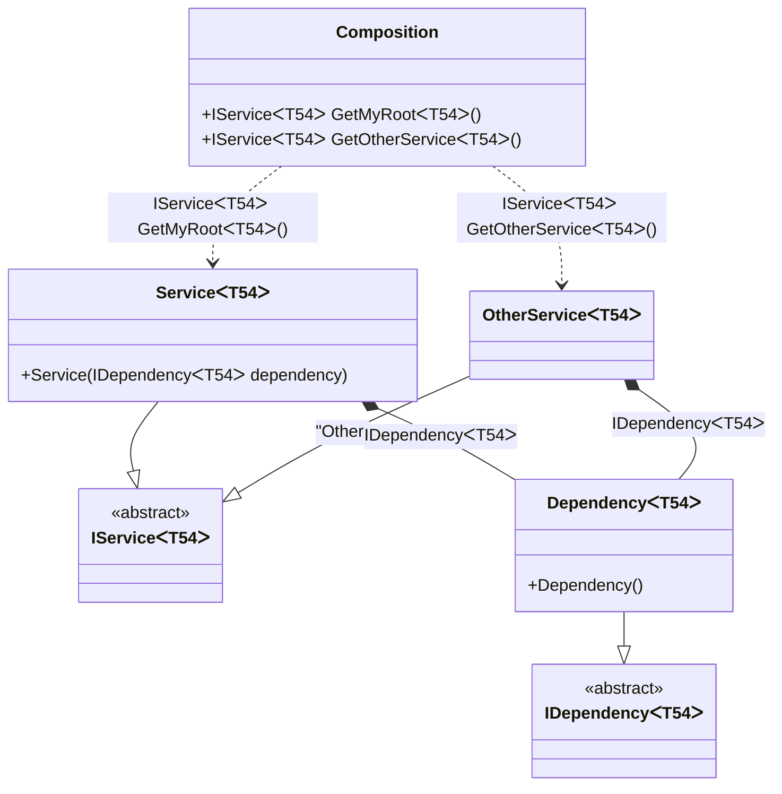

#### Generic composition roots

[](../tests/Pure.DI.UsageTests/Generics/GenericsCompositionRootsScenario.cs)

A generic composition root is represented by a method.

```c#
interface IDependency<T>;

class Dependency<T> : IDependency<T>;

interface IService<T>;

class Service<T>(IDependency<T> dependency) : IService<T>;

class OtherService<T>(IDependency<T> dependency) : IService<T>;

DI.Setup(nameof(Composition))
    // This hint indicates to not generate methods such as Resolve
    .Hint(Hint.Resolve, "Off")
    .Bind().To<Dependency<TT>>()
    .Bind().To<Service<TT>>()
    // Creates OtherService manually,
    // just for the sake of example
    .Bind("Other").To(ctx =>
    {
        ctx.Inject(out IDependency<TT> dependency);
        return new OtherService<TT>(dependency);
    })

    // Specifies to create a regular public method
    // to get a composition root of type Service<T>
    // with the name "GetMyRoot"
    .Root<IService<TT>>("GetMyRoot")

    // Specifies to create a regular public method
    // to get a composition root of type OtherService<T>
    // with the name "GetOtherService"
    // using the "Other" tag
    .Root<IService<TT>>("GetOtherService", "Other");

var composition = new Composition();
        
// service = new Service<int>(new Dependency<int>());
var service = composition.GetMyRoot<int>();
        
// someOtherService = new OtherService<int>(new Dependency<int>());
var someOtherService = composition.GetOtherService<string>();
```

When a generic composition root is used, `Resolve` methods cannot be used to resolve them.

<details open>
<summary>Class Diagram</summary>



</details>

<details>
<summary>Pure.DI-generated partial class Composition</summary><blockquote>

```c#
partial class Composition
{
  private readonly Composition _rootM04D03di;
  
  public Composition()
  {
    _rootM04D03di = this;
  }
  
  internal Composition(Composition baseComposition)
  {
    _rootM04D03di = baseComposition._rootM04D03di;
  }
  
  public Pure.DI.UsageTests.Generics.GenericsCompositionRootsScenario.IService<T54> GetMyRoot<T54>()
  {
    return new Pure.DI.UsageTests.Generics.GenericsCompositionRootsScenario.Service<T54>(new Pure.DI.UsageTests.Generics.GenericsCompositionRootsScenario.Dependency<T54>());
  }
  
  public Pure.DI.UsageTests.Generics.GenericsCompositionRootsScenario.IService<T54> GetOtherService<T54>()
  {
    Pure.DI.UsageTests.Generics.GenericsCompositionRootsScenario.OtherService<T54> transientM04D03di0_OtherService;
    {
        var dependency_M04D03di1 = new Pure.DI.UsageTests.Generics.GenericsCompositionRootsScenario.Dependency<T54>();
        transientM04D03di0_OtherService = new OtherService<T54>(dependency_M04D03di1);
    }
    return transientM04D03di0_OtherService;
  }
  
  public override string ToString()
  {
    return
      "classDiagram\n" +
        "  class Composition {\n" +
          "    +IServiceᐸT54ᐳ GetMyRootᐸT54ᐳ()\n" +
          "    +IServiceᐸT54ᐳ GetOtherServiceᐸT54ᐳ()\n" +
        "  }\n" +
        "  ServiceᐸT54ᐳ --|> IServiceᐸT54ᐳ : \n" +
        "  class ServiceᐸT54ᐳ {\n" +
          "    +Service(IDependencyᐸT54ᐳ dependency)\n" +
        "  }\n" +
        "  OtherServiceᐸT54ᐳ --|> IServiceᐸT54ᐳ : \"Other\" \n" +
        "  class OtherServiceᐸT54ᐳ\n" +
        "  DependencyᐸT54ᐳ --|> IDependencyᐸT54ᐳ : \n" +
        "  class DependencyᐸT54ᐳ {\n" +
          "    +Dependency()\n" +
        "  }\n" +
        "  class IServiceᐸT54ᐳ {\n" +
          "    <<abstract>>\n" +
        "  }\n" +
        "  class IDependencyᐸT54ᐳ {\n" +
          "    <<abstract>>\n" +
        "  }\n" +
        "  Composition ..> ServiceᐸT54ᐳ : IServiceᐸT54ᐳ GetMyRootᐸT54ᐳ()\n" +
        "  Composition ..> OtherServiceᐸT54ᐳ : IServiceᐸT54ᐳ GetOtherServiceᐸT54ᐳ()\n" +
        "  ServiceᐸT54ᐳ *--  DependencyᐸT54ᐳ : IDependencyᐸT54ᐳ\n" +
        "  OtherServiceᐸT54ᐳ *--  DependencyᐸT54ᐳ : IDependencyᐸT54ᐳ";
  }
}
```

</blockquote></details>

