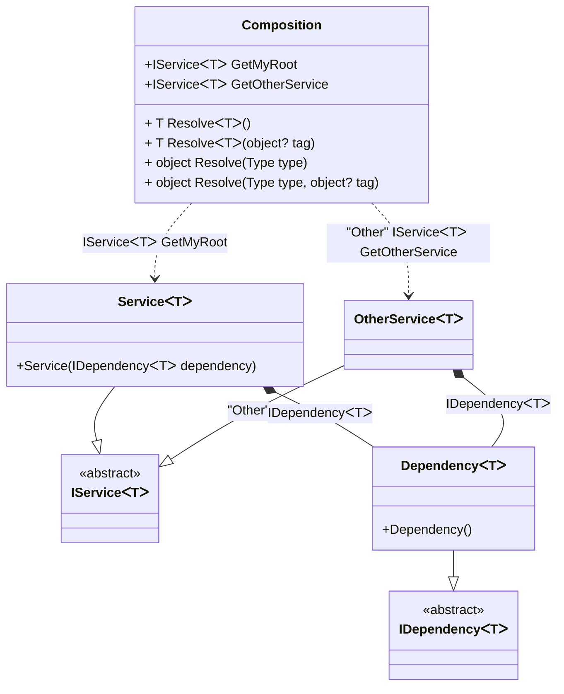

#### Generic composition roots

[](../tests/Pure.DI.UsageTests/Basics/GenericsCompositionRootsScenario.cs)

A generic composition root is represented by a method.

```c#
interface IDependency<T>;

class Dependency<T> : IDependency<T>;

interface IService<T>;

class Service<T>(IDependency<T> dependency) : IService<T>;

class OtherService<T>(IDependency<T> dependency) : IService<T>;

DI.Setup(nameof(Composition))
    .Bind().To<Dependency<TT>>()
    .Bind().To<Service<TT>>()
    // Creates OtherService manually,
    // just for the sake of example
    .Bind("Other").To(ctx =>
    {
        ctx.Inject(out IDependency<TT> dependency);
        return new OtherService<TT>(dependency);
    })

    // Specifies to create a regular public method
    // to get a composition root of type Service<T>
    // with the name "GetMyRoot"
    .Root<IService<TT>>("GetMyRoot")

    // Specifies to create a regular public method
    // to get a composition root of type OtherService<T>
    // with the name "GetOtherService"
    // using the "Other" tag
    .Root<IService<TT>>("GetOtherService", "Other");

var composition = new Composition();
        
// service = new Service<int>(new Dependency<int>());
var service = composition.GetMyRoot<int>();
        
// someOtherService = new OtherService<int>(new Dependency<int>());
var someOtherService = composition.GetOtherService<string>();
```

When a generic composition root is used, `Resolve` methods cannot be used to resolve them.

<details open>
<summary>Class Diagram</summary>



</details>

<details>
<summary>Pure.DI-generated partial class Composition</summary><blockquote>

```c#
/// <para>
/// Composition roots:<br/>
/// <list type="table">
/// <listheader>
/// <term>Root</term>
/// <description>Description</description>
/// </listheader>
/// <item>
/// <term>
/// <see cref="Pure.DI.UsageTests.Basics.GenericsCompositionRootsScenario.IService{T}"/> GetMyRoot
/// </term>
/// <description>
/// Specifies to create a regular public method<br/>
/// to get a composition root of type Service&lt;T&gt;<br/>
/// with the name "GetMyRoot"
/// </description>
/// </item>
/// <item>
/// <term>
/// <see cref="Pure.DI.UsageTests.Basics.GenericsCompositionRootsScenario.IService{T}"/> GetOtherService
/// </term>
/// <description>
/// Specifies to create a regular public method<br/>
/// to get a composition root of type OtherService&lt;T&gt;<br/>
/// with the name "GetOtherService"<br/>
/// using the "Other" tag
/// </description>
/// </item>
/// </list>
/// </para>
/// <example>
/// This shows how to get an instance of type <see cref="Pure.DI.UsageTests.Basics.GenericsCompositionRootsScenario.Service{T}"/> using the composition root <see cref="GetMyRoot"/>:
/// <code>
/// var composition = new Composition();
/// var instance = composition.GetMyRoot;
/// </code>
/// </example>
/// <a href="https://mermaid.live/view#pako:eNqlVEFugzAQ_Iq15x6i5JA2twTSKoeqUsrRFwdWKWnAyLiRUJQ_5C-99Dv5SbENhYCBKL2szO54PN5ZcwSfBwgz8PcsTd2QbQWLqKCx_iYOjxKehjLkMaFfo9F0oWpqNV6s3lEcQh8v5x_vcv4mLyhfszXnshfyJj9QFOkKSDyyxpTvDyVUpx91fBqE8c0OfanWk2ci2ba1zQDKvWaTlyVIZB7uQDuk_8ipq1aNy2uIW8Wpo7cvSbNLOj0nlQuWet2Ispta6MrFBOMAYz8r8cFfxqaybsjdUkGzUKiJtvCqYlte92F27FVr7JB6dyqEbaZMDwyX7XIV08TIctgmlYIV3i-LaGMbknY7YfMVjjXKxLxPdk96n-cAY9dMXFl9w-O2jdW87jfpMFDpb1V6p_V_tPAAEYqIhUH-KzxSyE-JkMKMQsDEJ4UTnH4Busr1Yg">Class diagram</a><br/>
/// This class was created by <a href="https://github.com/DevTeam/Pure.DI">Pure.DI</a> source code generator.
/// </summary>
/// <seealso cref="Pure.DI.DI.Setup"/>
[global::System.Diagnostics.CodeAnalysis.ExcludeFromCodeCoverage]
partial class Composition
{
  private readonly Composition _rootM03D12di;
  
  /// <summary>
  /// This constructor creates a new instance of <see cref="Composition"/>.
  /// </summary>
  public Composition()
  {
    _rootM03D12di = this;
  }
  
  /// <summary>
  /// This constructor creates a new instance of <see cref="Composition"/> scope based on <paramref name="baseComposition"/>. This allows the <see cref="Lifetime.Scoped"/> life time to be applied.
  /// </summary>
  /// <param name="baseComposition">Base composition.</param>
  internal Composition(Composition baseComposition)
  {
    _rootM03D12di = baseComposition._rootM03D12di;
  }
  
  #region Composition Roots
  #if NETSTANDARD2_0_OR_GREATER || NETCOREAPP || NET40_OR_GREATER || NET
  [global::System.Diagnostics.Contracts.Pure]
  #endif
  /// <summary>
  /// Specifies to create a regular public method<br/>
  /// to get a composition root of type Service&lt;T&gt;<br/>
  /// with the name "GetMyRoot"
  /// </summary>
  public Pure.DI.UsageTests.Basics.GenericsCompositionRootsScenario.IService<T> GetMyRoot<T>()
  {
    return new Pure.DI.UsageTests.Basics.GenericsCompositionRootsScenario.Service<T>(new Pure.DI.UsageTests.Basics.GenericsCompositionRootsScenario.Dependency<T>());
  }
  
  #if NETSTANDARD2_0_OR_GREATER || NETCOREAPP || NET40_OR_GREATER || NET
  [global::System.Diagnostics.Contracts.Pure]
  #endif
  /// <summary>
  /// Specifies to create a regular public method<br/>
  /// to get a composition root of type OtherService&lt;T&gt;<br/>
  /// with the name "GetOtherService"<br/>
  /// using the "Other" tag
  /// </summary>
  public Pure.DI.UsageTests.Basics.GenericsCompositionRootsScenario.IService<T> GetOtherService<T>()
  {
    Pure.DI.UsageTests.Basics.GenericsCompositionRootsScenario.OtherService<T> transientM03D12di0_OtherService;
    {
        var dependency_M03D12di1 = new Pure.DI.UsageTests.Basics.GenericsCompositionRootsScenario.Dependency<T>();
        transientM03D12di0_OtherService = new OtherService<T>(dependency_M03D12di1);
    }
    return transientM03D12di0_OtherService;
  }
  #endregion
  
  #region API
  /// <summary>
  /// Resolves the composition root.
  /// </summary>
  /// <typeparam name="T">The type of the composition root.</typeparam>
  /// <returns>A composition root.</returns>
  #if NETSTANDARD2_0_OR_GREATER || NETCOREAPP || NET40_OR_GREATER || NET
  [global::System.Diagnostics.Contracts.Pure]
  #endif
  public T Resolve<T>()
  {
    return ResolverM03D12di<T>.Value.Resolve(this);
  }
  
  /// <summary>
  /// Resolves the composition root by tag.
  /// </summary>
  /// <typeparam name="T">The type of the composition root.</typeparam>
  /// <param name="tag">The tag of a composition root.</param>
  /// <returns>A composition root.</returns>
  #if NETSTANDARD2_0_OR_GREATER || NETCOREAPP || NET40_OR_GREATER || NET
  [global::System.Diagnostics.Contracts.Pure]
  #endif
  public T Resolve<T>(object? tag)
  {
    return ResolverM03D12di<T>.Value.ResolveByTag(this, tag);
  }
  
  /// <summary>
  /// Resolves the composition root.
  /// </summary>
  /// <param name="type">The type of the composition root.</param>
  /// <returns>A composition root.</returns>
  #if NETSTANDARD2_0_OR_GREATER || NETCOREAPP || NET40_OR_GREATER || NET
  [global::System.Diagnostics.Contracts.Pure]
  #endif
  public object Resolve(global::System.Type type)
  {
    throw new global::System.InvalidOperationException($"Cannot resolve composition root of type {type}.");
  }
  
  /// <summary>
  /// Resolves the composition root by tag.
  /// </summary>
  /// <param name="type">The type of the composition root.</param>
  /// <param name="tag">The tag of a composition root.</param>
  /// <returns>A composition root.</returns>
  #if NETSTANDARD2_0_OR_GREATER || NETCOREAPP || NET40_OR_GREATER || NET
  [global::System.Diagnostics.Contracts.Pure]
  #endif
  public object Resolve(global::System.Type type, object? tag)
  {
    throw new global::System.InvalidOperationException($"Cannot resolve composition root \"{tag}\" of type {type}.");
  }
  #endregion
  
  /// <summary>
  /// This method provides a class diagram in mermaid format. To see this diagram, simply call the method and copy the text to this site https://mermaid.live/.
  /// </summary>
  public override string ToString()
  {
    return
      "classDiagram\n" +
        "  class Composition {\n" +
          "    +IServiceᐸTᐳ GetMyRoot\n" +
          "    +IServiceᐸTᐳ GetOtherService\n" +
          "    + T ResolveᐸTᐳ()\n" +
          "    + T ResolveᐸTᐳ(object? tag)\n" +
          "    + object Resolve(Type type)\n" +
          "    + object Resolve(Type type, object? tag)\n" +
        "  }\n" +
        "  ServiceᐸTᐳ --|> IServiceᐸTᐳ : \n" +
        "  class ServiceᐸTᐳ {\n" +
          "    +Service(IDependencyᐸTᐳ dependency)\n" +
        "  }\n" +
        "  OtherServiceᐸTᐳ --|> IServiceᐸTᐳ : \"Other\" \n" +
        "  class OtherServiceᐸTᐳ\n" +
        "  DependencyᐸTᐳ --|> IDependencyᐸTᐳ : \n" +
        "  class DependencyᐸTᐳ {\n" +
          "    +Dependency()\n" +
        "  }\n" +
        "  class IServiceᐸTᐳ {\n" +
          "    <<abstract>>\n" +
        "  }\n" +
        "  class IDependencyᐸTᐳ {\n" +
          "    <<abstract>>\n" +
        "  }\n" +
        "  Composition ..> ServiceᐸTᐳ : IServiceᐸTᐳ GetMyRoot\n" +
        "  Composition ..> OtherServiceᐸTᐳ : \"Other\" IServiceᐸTᐳ GetOtherService\n" +
        "  ServiceᐸTᐳ *--  DependencyᐸTᐳ : IDependencyᐸTᐳ\n" +
        "  OtherServiceᐸTᐳ *--  DependencyᐸTᐳ : IDependencyᐸTᐳ";
  }
  
  
  #region Resolvers
  private sealed class ResolverM03D12di<T>: global::Pure.DI.IResolver<Composition, T>
  {
    public static global::Pure.DI.IResolver<Composition, T> Value = new ResolverM03D12di<T>();
    
    public T Resolve(Composition composite)
    {
      throw new global::System.InvalidOperationException($"Cannot resolve composition root of type {typeof(T)}.");
    }
    
    public T ResolveByTag(Composition composite, object tag)
    {
      throw new global::System.InvalidOperationException($"Cannot resolve composition root \"{tag}\" of type {typeof(T)}.");
    }
  }
  #endregion
}
```

</blockquote></details>

