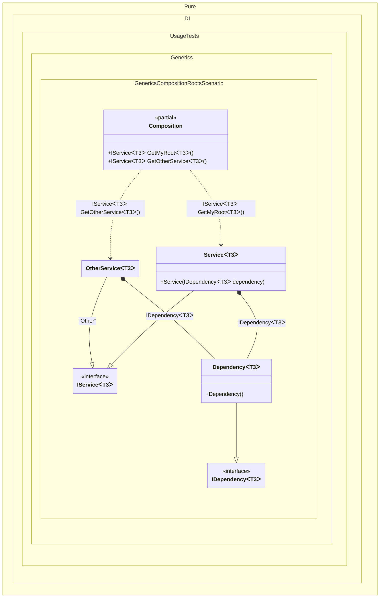

#### Generic composition roots

[](../tests/Pure.DI.UsageTests/Generics/GenericsCompositionRootsScenario.cs)

Sometimes you want to be able to create composition roots with type parameters. In this case, the composition root can only be represented by a method.
> [!IMPORTANT]
> `Resolve()' methods cannot be used to resolve generic composition roots.


```c#
using Pure.DI;

DI.Setup(nameof(Composition))
    // This hint indicates to not generate methods such as Resolve
    .Hint(Hint.Resolve, "Off")
    .Bind().To<Dependency<TT>>()
    .Bind().To<Service<TT>>()
    // Creates OtherService manually,
    // just for the sake of example
    .Bind("Other").To(ctx =>
    {
        ctx.Inject(out IDependency<TT> dependency);
        return new OtherService<TT>(dependency);
    })

    // Specifies to create a regular public method
    // to get a composition root of type Service<T>
    // with the name "GetMyRoot"
    .Root<IService<TT>>("GetMyRoot")

    // Specifies to create a regular public method
    // to get a composition root of type OtherService<T>
    // with the name "GetOtherService"
    // using the "Other" tag
    .Root<IService<TT>>("GetOtherService", "Other");

var composition = new Composition();

// service = new Service<int>(new Dependency<int>());
var service = composition.GetMyRoot<int>();

// someOtherService = new OtherService<int>(new Dependency<int>());
var someOtherService = composition.GetOtherService<string>();

interface IDependency<T>;

class Dependency<T> : IDependency<T>;

interface IService<T>;

class Service<T>(IDependency<T> dependency) : IService<T>;

class OtherService<T>(IDependency<T> dependency) : IService<T>;
```

<details>
<summary>Running this code sample locally</summary>

- Make sure you have the [.NET SDK 9.0](https://dotnet.microsoft.com/en-us/download/dotnet/9.0) or later is installed
```bash
dotnet --list-sdk
```
- Create a net9.0 (or later) console application
```bash
dotnet new console -n Sample
```
- Add reference to NuGet package
  - [Pure.DI](https://www.nuget.org/packages/Pure.DI)
```bash
dotnet add package Pure.DI
```
- Copy the example code into the _Program.cs_ file

You are ready to run the example 🚀
```bash
dotnet run
```

</details>

> [!IMPORTANT]
> The method `Inject()`cannot be used outside of the binding setup.

The following partial class will be generated:

```c#
partial class Composition
{
  private readonly Composition _root;

  [OrdinalAttribute(256)]
  public Composition()
  {
    _root = this;
  }

  internal Composition(Composition parentScope)
  {
    _root = (parentScope ?? throw new ArgumentNullException(nameof(parentScope)))._root;
  }

  [MethodImpl(MethodImplOptions.AggressiveInlining)]
  public IService<T3> GetOtherService<T3>()
  {
    OtherService<T3> transientOtherService0;
    IDependency<T3> localDependency96 = new Dependency<T3>();
    transientOtherService0 = new OtherService<T3>(localDependency96);
    return transientOtherService0;
  }

  [MethodImpl(MethodImplOptions.AggressiveInlining)]
  public IService<T3> GetMyRoot<T3>()
  {
    return new Service<T3>(new Dependency<T3>());
  }
}
```

Class diagram:



