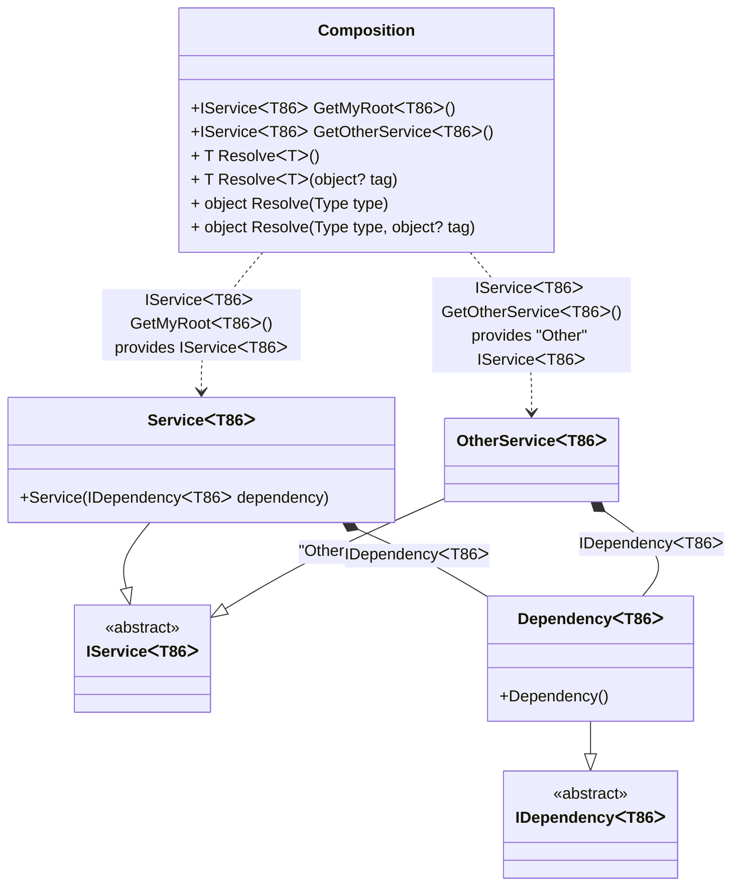

#### Generic composition roots

[](../tests/Pure.DI.UsageTests/Basics/GenericsCompositionRootsScenario.cs)

A generic composition root is represented by a method.

```c#
interface IDependency<T>;

class Dependency<T> : IDependency<T>;

interface IService<T>;

class Service<T>(IDependency<T> dependency) : IService<T>;

class OtherService<T>(IDependency<T> dependency) : IService<T>;

DI.Setup(nameof(Composition))
    .Bind().To<Dependency<TT>>()
    .Bind().To<Service<TT>>()
    // Creates OtherService manually,
    // just for the sake of example
    .Bind("Other").To(ctx =>
    {
        ctx.Inject(out IDependency<TT> dependency);
        return new OtherService<TT>(dependency);
    })

    // Specifies to create a regular public method
    // to get a composition root of type Service<T>
    // with the name "GetMyRoot"
    .Root<IService<TT>>("GetMyRoot")

    // Specifies to create a regular public method
    // to get a composition root of type OtherService<T>
    // with the name "GetOtherService"
    // using the "Other" tag
    .Root<IService<TT>>("GetOtherService", "Other");

var composition = new Composition();
        
// service = new Service<int>(new Dependency<int>());
var service = composition.GetMyRoot<int>();
        
// someOtherService = new OtherService<int>(new Dependency<int>());
var someOtherService = composition.GetOtherService<string>();
```

When a generic composition root is used, `Resolve` methods cannot be used to resolve them.

<details open>
<summary>Class Diagram</summary>



</details>

<details>
<summary>Pure.DI-generated partial class Composition</summary><blockquote>

```c#
/// <para>
/// <b>Composition roots</b><br/>
/// <list type="table">
/// <listheader>
/// <term>Root</term>
/// <description>Description</description>
/// </listheader>
/// <item>
/// <term>
/// <see cref="Pure.DI.UsageTests.Basics.GenericsCompositionRootsScenario.IService{T86}"/> <see cref="GetMyRoot{T86}()"/>
/// </term>
/// <description>
/// Specifies to create a regular public method<br/>
/// to get a composition root of type Service&lt;T&gt;<br/>
/// with the name "GetMyRoot"
/// </description>
/// </item>
/// <item>
/// <term>
/// <see cref="Pure.DI.UsageTests.Basics.GenericsCompositionRootsScenario.IService{T86}"/> <see cref="GetOtherService{T86}()"/>
/// </term>
/// <description>
/// Specifies to create a regular public method<br/>
/// to get a composition root of type OtherService&lt;T&gt;<br/>
/// with the name "GetOtherService"<br/>
/// using the "Other" tag
/// </description>
/// </item>
/// </list>
/// </para>
/// </summary>
/// <example>
/// This shows how to get an instance of type <see cref="Pure.DI.UsageTests.Basics.GenericsCompositionRootsScenario.Service{T86}"/> using the composition root <see cref="GetMyRoot{T86}()"/>:
/// <code>
/// var composition = new Composition();
/// var instance = composition.GetMyRoot&lt;T86&gt;();
/// </code>
/// </example>
/// <a href="https://mermaid.live/view#pako:eNqlVEFuwjAQ_Irlc6UikBrKDRJacagq0Rx9cZIVTUviyHEjRYg_8Jde-h1-0sSmJCXrBuhl5Xhnx5PdsTc0FBHQCQ3XPM-9mK8kT5hkqf4mrkgykccqFilhH4OBM6tz9Wo4W7yALOIQ9rsvf3y3332SR1BP5VIIddzSyLGO9z2Vz-oV5GkCryc-WUIu1oUGXgoTwRuEql6PHojiq06ZAfzUmiK_zICoKlyBdsnfRzpever0RIO8JjquJpiTbvt0YkqauaGI9vAOACN34UEGaQRpWDYV0XEPU4tO6xrJVDMx2hKPO6FKYzLtR9rQvxplA7V71WAwn5l-GDb8NxuukRHn8iBXkh8cMT9EjK9f3vmUp3d5qFEmVv2yTejia67lBJLdGuJMiiKOAGnOGaLsNrMp639GbPoaK6JKcbNP2_4jVjvVapFcz036Pzm9oQnIhMdR9cRvGK3OSoDRCaMRl--Mbun2G6OCQaE">Class diagram</a><br/>
/// This class was created by <a href="https://github.com/DevTeam/Pure.DI">Pure.DI</a> source code generator.
/// <seealso cref="Pure.DI.DI.Setup"/>
/// <seealso cref="Pure.DI.IConfiguration.Bind(object[])"/>
/// <seealso cref="Pure.DI.IConfiguration.Bind{T}(object[])"/>
[global::System.Diagnostics.CodeAnalysis.ExcludeFromCodeCoverage]
partial class Composition
{
  private readonly Composition _rootM03D14di;
  
  /// <summary>
  /// This constructor creates a new instance of <see cref="Composition"/>.
  /// </summary>
  public Composition()
  {
    _rootM03D14di = this;
  }
  
  /// <summary>
  /// This constructor creates a new instance of <see cref="Composition"/> scope based on <paramref name="baseComposition"/>. This allows the <see cref="Lifetime.Scoped"/> life time to be applied.
  /// </summary>
  /// <param name="baseComposition">Base composition.</param>
  internal Composition(Composition baseComposition)
  {
    _rootM03D14di = baseComposition._rootM03D14di;
  }
  
  #region Composition Roots
  /// <summary>
  /// Specifies to create a regular public method<br/>
  /// to get a composition root of type Service&lt;T&gt;<br/>
  /// with the name "GetMyRoot"
  /// </summary>
  /// <example>
  /// This shows how to get an instance of type <see cref="Pure.DI.UsageTests.Basics.GenericsCompositionRootsScenario.Service{T86}"/>:
  /// <code>
  /// var composition = new Composition();
  /// var instance = composition.GetMyRoot&lt;T86&gt;();
  /// </code>
  /// </example>
  #if NETSTANDARD2_0_OR_GREATER || NETCOREAPP || NET40_OR_GREATER || NET
  [global::System.Diagnostics.Contracts.Pure]
  #endif
  public Pure.DI.UsageTests.Basics.GenericsCompositionRootsScenario.IService<T86> GetMyRoot<T86>()
  {
    return new Pure.DI.UsageTests.Basics.GenericsCompositionRootsScenario.Service<T86>(new Pure.DI.UsageTests.Basics.GenericsCompositionRootsScenario.Dependency<T86>());
  }
  
  /// <summary>
  /// Specifies to create a regular public method<br/>
  /// to get a composition root of type OtherService&lt;T&gt;<br/>
  /// with the name "GetOtherService"<br/>
  /// using the "Other" tag
  /// </summary>
  /// <example>
  /// This shows how to get an instance of type <see cref="Pure.DI.UsageTests.Basics.GenericsCompositionRootsScenario.OtherService{T86}"/>:
  /// <code>
  /// var composition = new Composition();
  /// var instance = composition.GetOtherService&lt;T86&gt;();
  /// </code>
  /// </example>
  #if NETSTANDARD2_0_OR_GREATER || NETCOREAPP || NET40_OR_GREATER || NET
  [global::System.Diagnostics.Contracts.Pure]
  #endif
  public Pure.DI.UsageTests.Basics.GenericsCompositionRootsScenario.IService<T86> GetOtherService<T86>()
  {
    Pure.DI.UsageTests.Basics.GenericsCompositionRootsScenario.OtherService<T86> transientM03D14di0_OtherService;
    {
        var dependency_M03D14di1 = new Pure.DI.UsageTests.Basics.GenericsCompositionRootsScenario.Dependency<T86>();
        transientM03D14di0_OtherService = new OtherService<T86>(dependency_M03D14di1);
    }
    return transientM03D14di0_OtherService;
  }
  #endregion
  
  #region API
  /// <summary>
  /// Resolves the composition root.
  /// </summary>
  /// <typeparam name="T">The type of the composition root.</typeparam>
  /// <returns>A composition root.</returns>
  #if NETSTANDARD2_0_OR_GREATER || NETCOREAPP || NET40_OR_GREATER || NET
  [global::System.Diagnostics.Contracts.Pure]
  #endif
  public T Resolve<T>()
  {
    return ResolverM03D14di<T>.Value.Resolve(this);
  }
  
  /// <summary>
  /// Resolves the composition root by tag.
  /// </summary>
  /// <typeparam name="T">The type of the composition root.</typeparam>
  /// <param name="tag">The tag of a composition root.</param>
  /// <returns>A composition root.</returns>
  #if NETSTANDARD2_0_OR_GREATER || NETCOREAPP || NET40_OR_GREATER || NET
  [global::System.Diagnostics.Contracts.Pure]
  #endif
  public T Resolve<T>(object? tag)
  {
    return ResolverM03D14di<T>.Value.ResolveByTag(this, tag);
  }
  
  /// <summary>
  /// Resolves the composition root.
  /// </summary>
  /// <param name="type">The type of the composition root.</param>
  /// <returns>A composition root.</returns>
  #if NETSTANDARD2_0_OR_GREATER || NETCOREAPP || NET40_OR_GREATER || NET
  [global::System.Diagnostics.Contracts.Pure]
  #endif
  public object Resolve(global::System.Type type)
  {
    throw new global::System.InvalidOperationException($"Cannot resolve composition root of type {type}.");
  }
  
  /// <summary>
  /// Resolves the composition root by tag.
  /// </summary>
  /// <param name="type">The type of the composition root.</param>
  /// <param name="tag">The tag of a composition root.</param>
  /// <returns>A composition root.</returns>
  #if NETSTANDARD2_0_OR_GREATER || NETCOREAPP || NET40_OR_GREATER || NET
  [global::System.Diagnostics.Contracts.Pure]
  #endif
  public object Resolve(global::System.Type type, object? tag)
  {
    throw new global::System.InvalidOperationException($"Cannot resolve composition root \"{tag}\" of type {type}.");
  }
  #endregion
  
  /// <summary>
  /// This method provides a class diagram in mermaid format. To see this diagram, simply call the method and copy the text to this site https://mermaid.live/.
  /// </summary>
  public override string ToString()
  {
    return
      "classDiagram\n" +
        "  class Composition {\n" +
          "    +IServiceᐸT86ᐳ GetMyRootᐸT86ᐳ()\n" +
          "    +IServiceᐸT86ᐳ GetOtherServiceᐸT86ᐳ()\n" +
          "    + T ResolveᐸTᐳ()\n" +
          "    + T ResolveᐸTᐳ(object? tag)\n" +
          "    + object Resolve(Type type)\n" +
          "    + object Resolve(Type type, object? tag)\n" +
        "  }\n" +
        "  ServiceᐸT86ᐳ --|> IServiceᐸT86ᐳ : \n" +
        "  class ServiceᐸT86ᐳ {\n" +
          "    +Service(IDependencyᐸT86ᐳ dependency)\n" +
        "  }\n" +
        "  OtherServiceᐸT86ᐳ --|> IServiceᐸT86ᐳ : \"Other\" \n" +
        "  class OtherServiceᐸT86ᐳ\n" +
        "  DependencyᐸT86ᐳ --|> IDependencyᐸT86ᐳ : \n" +
        "  class DependencyᐸT86ᐳ {\n" +
          "    +Dependency()\n" +
        "  }\n" +
        "  class IServiceᐸT86ᐳ {\n" +
          "    <<abstract>>\n" +
        "  }\n" +
        "  class IDependencyᐸT86ᐳ {\n" +
          "    <<abstract>>\n" +
        "  }\n" +
        "  Composition ..> ServiceᐸT86ᐳ : IServiceᐸT86ᐳ GetMyRootᐸT86ᐳ()<br/>provides IServiceᐸT86ᐳ\n" +
        "  Composition ..> OtherServiceᐸT86ᐳ : IServiceᐸT86ᐳ GetOtherServiceᐸT86ᐳ()<br/>provides \"Other\" IServiceᐸT86ᐳ\n" +
        "  ServiceᐸT86ᐳ *--  DependencyᐸT86ᐳ : IDependencyᐸT86ᐳ\n" +
        "  OtherServiceᐸT86ᐳ *--  DependencyᐸT86ᐳ : IDependencyᐸT86ᐳ";
  }
  
  
  #region Resolvers
  private sealed class ResolverM03D14di<T>: global::Pure.DI.IResolver<Composition, T>
  {
    public static global::Pure.DI.IResolver<Composition, T> Value = new ResolverM03D14di<T>();
    
    public T Resolve(Composition composite)
    {
      throw new global::System.InvalidOperationException($"Cannot resolve composition root of type {typeof(T)}.");
    }
    
    public T ResolveByTag(Composition composite, object tag)
    {
      throw new global::System.InvalidOperationException($"Cannot resolve composition root \"{tag}\" of type {typeof(T)}.");
    }
  }
  #endregion
}
```

</blockquote></details>

