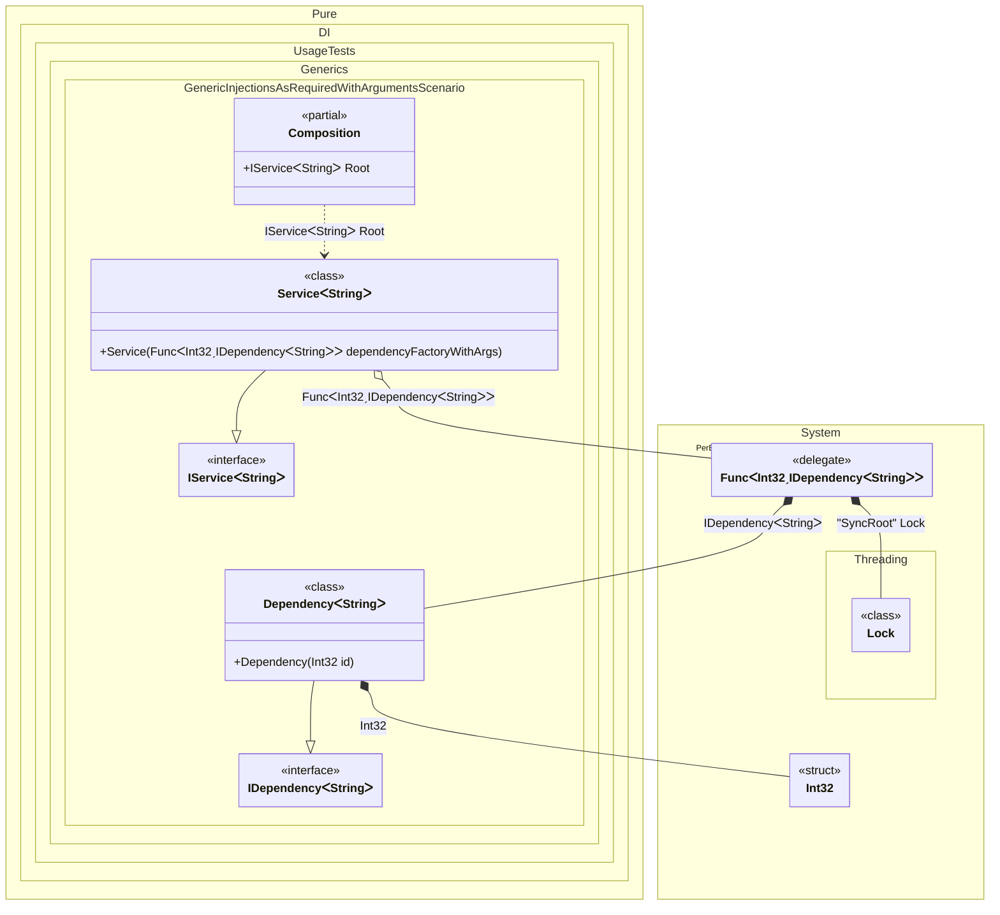

#### Generic injections as required with arguments


```c#
using Shouldly;
using Pure.DI;
using System.Collections.Generic;

DI.Setup(nameof(Composition))
    .Bind().To<Dependency<TT>>()
    .Bind().To<Service<TT>>()

    // Composition root
    .Root<IService<string>>("Root");

var composition = new Composition();
var service = composition.Root;
var dependencies = service.Dependencies;
dependencies.Count.ShouldBe(2);
dependencies[0].Id.ShouldBe(33);
dependencies[1].Id.ShouldBe(99);

interface IDependency<out T>
{
    int Id { get; }
}

class Dependency<T>(int id) : IDependency<T>
{
    public int Id { get; } = id;
}

interface IService<out T>
{
    IReadOnlyList<IDependency<T>> Dependencies { get; }
}

class Service<T>(Func<int, IDependency<T>> dependencyFactoryWithArgs): IService<T>
{
    public IReadOnlyList<IDependency<T>> Dependencies { get; } =
    [
        dependencyFactoryWithArgs(33),
        dependencyFactoryWithArgs(99)
    ];
}
```

<details>
<summary>Running this code sample locally</summary>

- Make sure you have the [.NET SDK 9.0](https://dotnet.microsoft.com/en-us/download/dotnet/9.0) or later is installed
```bash
dotnet --list-sdk
```
- Create a net9.0 (or later) console application
```bash
dotnet new console -n Sample
```
- Add references to NuGet packages
  - [Pure.DI](https://www.nuget.org/packages/Pure.DI)
  - [Shouldly](https://www.nuget.org/packages/Shouldly)
```bash
dotnet add package Pure.DI
dotnet add package Shouldly
```
- Copy the example code into the _Program.cs_ file

You are ready to run the example 🚀
```bash
dotnet run
```

</details>

The following partial class will be generated:

```c#
partial class Composition
{
#if NET9_0_OR_GREATER
  private readonly Lock _lock;
#else
  private readonly Object _lock;
#endif

  [OrdinalAttribute(256)]
  public Composition()
  {
#if NET9_0_OR_GREATER
    _lock = new Lock();
#else
    _lock = new Object();
#endif
  }

  internal Composition(Composition parentScope)
  {
    _lock = parentScope._lock;
  }

  public IService<string> Root
  {
    [MethodImpl(MethodImplOptions.AggressiveInlining)]
    get
    {
      Func<int, IDependency<string>> blockFunc1;
      Func<int, IDependency<string>> localFactory157 = new Func<int, IDependency<string>>((int localArg18) =>
      {
        Lock transLock2 = _lock;
        Lock localLockObject158 = transLock2;
        lock (localLockObject158)
        {
          int overrInt32 = localArg18;
          IDependency<string> localValue159 = new Dependency<string>(overrInt32);
          return localValue159;
        }
      });
      blockFunc1 = localFactory157;
      return new Service<string>(blockFunc1);
    }
  }
}
```

Class diagram:



