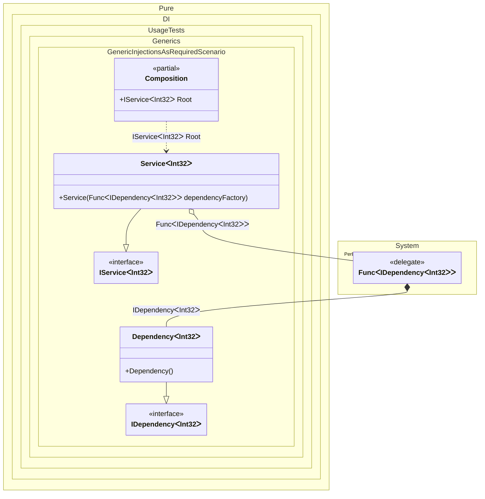

#### Generic injections as required


```c#
using Shouldly;
using Pure.DI;
using System.Collections.Generic;

DI.Setup(nameof(Composition))
    .Bind().To<Dependency<TT>>()
    .Bind().To<Service<TT>>()

    // Composition root
    .Root<IService<int>>("Root");

var composition = new Composition();
var service = composition.Root;
service.Dependencies.Count.ShouldBe(2);

interface IDependency<T>;

class Dependency<T> : IDependency<T>;

interface IService<T>
{
    IReadOnlyList<IDependency<T>> Dependencies { get; }
}

class Service<T>(Func<IDependency<T>> dependencyFactory): IService<T>
{
    public IReadOnlyList<IDependency<T>> Dependencies { get; } =
    [
        dependencyFactory(),
        dependencyFactory()
    ];
}
```

<details>
<summary>Running this code sample locally</summary>

- Make sure you have the [.NET SDK 9.0](https://dotnet.microsoft.com/en-us/download/dotnet/9.0) or later is installed
```bash
dotnet --list-sdk
```
- Create a net9.0 (or later) console application
```bash
dotnet new console -n Sample
```
- Add references to NuGet packages
  - [Pure.DI](https://www.nuget.org/packages/Pure.DI)
  - [Shouldly](https://www.nuget.org/packages/Shouldly)
```bash
dotnet add package Pure.DI
dotnet add package Shouldly
```
- Copy the example code into the _Program.cs_ file

You are ready to run the example 🚀
```bash
dotnet run
```

</details>

The following partial class will be generated:

```c#
partial class Composition
{
  private readonly Composition _root;

  [OrdinalAttribute(256)]
  public Composition()
  {
    _root = this;
  }

  internal Composition(Composition parentScope)
  {
    _root = (parentScope ?? throw new ArgumentNullException(nameof(parentScope)))._root;
  }

  public IService<int> Root
  {
    [MethodImpl(MethodImplOptions.AggressiveInlining)]
    get
    {
      Func<IDependency<int>> perBlockFunc1 = new Func<IDependency<int>>(
      [MethodImpl(MethodImplOptions.AggressiveInlining)]
      () =>
      {
        IDependency<int> localValue141 = new Dependency<int>();
        return localValue141;
      });
      return new Service<int>(perBlockFunc1);
    }
  }
}
```

Class diagram:



