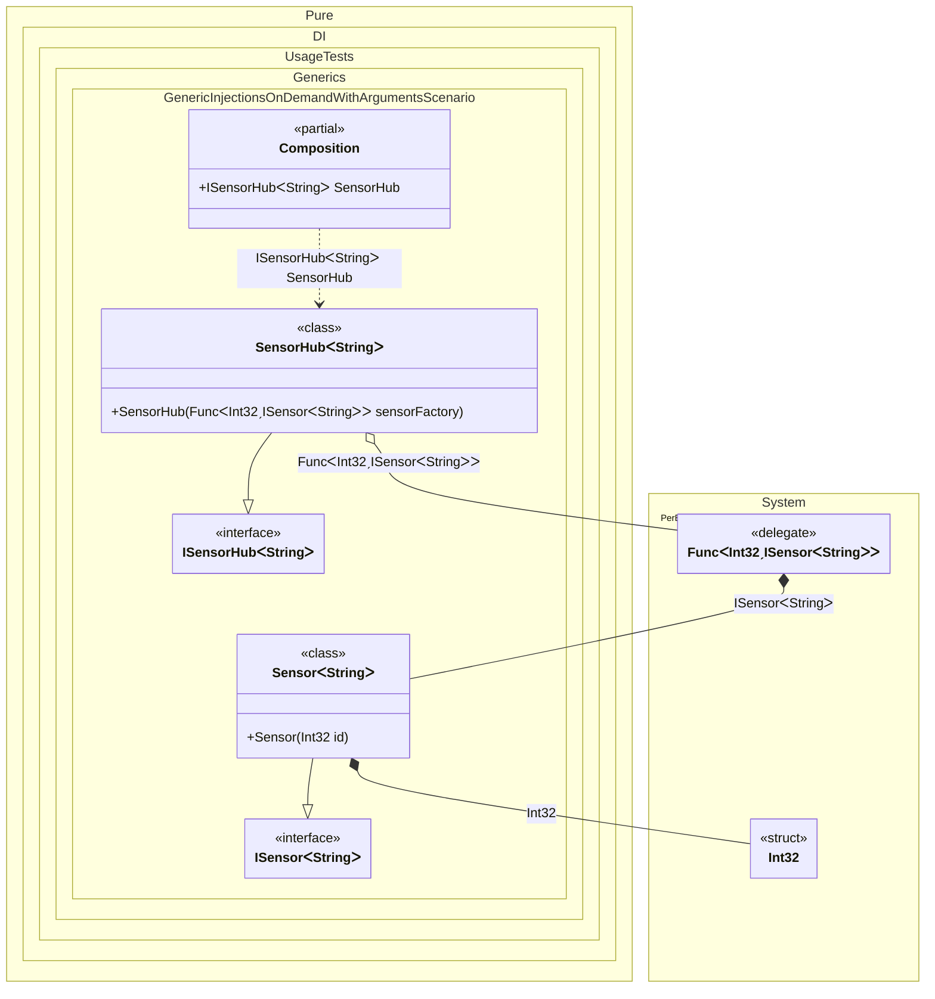

#### Generic injections on demand with arguments

When creating a generic dependency requires a runtime value, inject a factory with arguments. `SensorHub<T>` receives a `Func<int, ISensor<T>>` and calls it with a specific `id` for each sensor; the `int` argument is mapped to the `Sensor<T>` constructor parameter.
This keeps the composition in charge of wiring while letting the consumer supply per-instance data at creation time.


```c#
using Shouldly;
using Pure.DI;
using System.Collections.Generic;

DI.Setup(nameof(Composition))
    .Bind().To<Sensor<TT>>()
    .Bind().To<SensorHub<TT>>()

    // Composition root
    .Root<ISensorHub<string>>("SensorHub");

var composition = new Composition();
var hub = composition.SensorHub;
var sensors = hub.Sensors;
sensors.Count.ShouldBe(2);
sensors[0].Id.ShouldBe(1);
sensors[1].Id.ShouldBe(2);

interface ISensor<out T>
{
    int Id { get; }
}

class Sensor<T>(int id) : ISensor<T>
{
    public int Id { get; } = id;
}

interface ISensorHub<out T>
{
    IReadOnlyList<ISensor<T>> Sensors { get; }
}

class SensorHub<T>(Func<int, ISensor<T>> sensorFactory) : ISensorHub<T>
{
    public IReadOnlyList<ISensor<T>> Sensors { get; } =
    [
        sensorFactory(1),
        sensorFactory(2)
    ];
}
```

<details>
<summary>Running this code sample locally</summary>

- Make sure you have the [.NET SDK 10.0](https://dotnet.microsoft.com/en-us/download/dotnet/10.0) or later installed
```bash
dotnet --list-sdk
```
- Create a net10.0 (or later) console application
```bash
dotnet new console -n Sample
```
- Add references to the NuGet packages
  - [Pure.DI](https://www.nuget.org/packages/Pure.DI)
  - [Shouldly](https://www.nuget.org/packages/Shouldly)
```bash
dotnet add package Pure.DI
dotnet add package Shouldly
```
- Copy the example code into the _Program.cs_ file

You are ready to run the example 🚀
```bash
dotnet run
```

</details>

>[!NOTE]
>Generic factories with arguments allow passing runtime parameters while maintaining type safety.

<details>
<summary>The following partial class will be generated</summary>

```c#
partial class Composition
{
  public ISensorHub<string> SensorHub
  {
    [MethodImpl(MethodImplOptions.AggressiveInlining)]
    get
    {
      Func<int, ISensor<string>> perBlockFuncInt32ISensorString;
      // Creates a factory with runtime arguments
      Func<int, ISensor<string>> localFactory = new Func<int, ISensor<string>>((int localArg1) =>
      {
        // Creates the result
        int overriddenInt32 = localArg1;
        return new Sensor<string>(overriddenInt32);
      });
      perBlockFuncInt32ISensorString = localFactory;
      return new SensorHub<string>(perBlockFuncInt32ISensorString);
    }
  }
}
```

</details>

Class diagram:



See also:

- [Generic injections on demand](generic-injections-on-demand.md)
- [Injections on demand with arguments](injections-on-demand-with-arguments.md)

