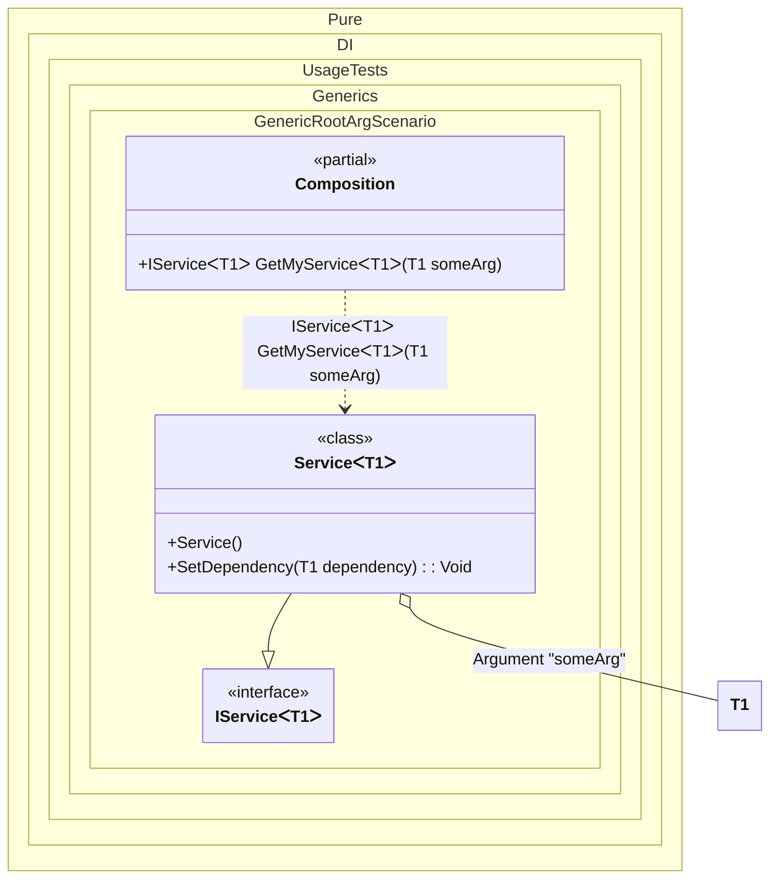

#### Generic root arguments


```c#
using Pure.DI;

DI.Setup(nameof(Composition))
    .RootArg<TT>("someArg")
    .Bind<IService<TT>>().To<Service<TT>>()

    // Composition root
    .Root<IService<TT>>("GetMyService");

var composition = new Composition();
IService<int> service = composition.GetMyService<int>(someArg: 33);

interface IService<out T>
{
    T? Dependency { get; }
}

class Service<T> : IService<T>
{
    // The Dependency attribute specifies to perform an injection,
    // the integer value in the argument specifies
    // the ordinal of injection
    [Dependency]
    public void SetDependency(T dependency) =>
        Dependency = dependency;

    public T? Dependency { get; private set; }
}
```

<details>
<summary>Running this code sample locally</summary>

- Make sure you have the [.NET SDK 9.0](https://dotnet.microsoft.com/en-us/download/dotnet/9.0) or later is installed
```bash
dotnet --list-sdk
```
- Create a net9.0 (or later) console application
```bash
dotnet new console -n Sample
```
- Add reference to NuGet package
  - [Pure.DI](https://www.nuget.org/packages/Pure.DI)
```bash
dotnet add package Pure.DI
```
- Copy the example code into the _Program.cs_ file

You are ready to run the example 🚀
```bash
dotnet run
```

</details>

The following partial class will be generated:

```c#
partial class Composition
{
#if NET9_0_OR_GREATER
  private readonly Lock _lock;
#else
  private readonly Object _lock;
#endif

  [OrdinalAttribute(256)]
  public Composition()
  {
#if NET9_0_OR_GREATER
    _lock = new Lock();
#else
    _lock = new Object();
#endif
  }

  internal Composition(Composition parentScope)
  {
  }

  [MethodImpl(MethodImplOptions.AggressiveInlining)]
  public IService<T1> GetMyService<T1>(T1 someArg)
  {
    if (someArg is null) throw new ArgumentNullException(nameof(someArg));
    var transService0 = new Service<T1>();
    transService0.SetDependency(someArg);
    return transService0;
  }
}
```

Class diagram:



