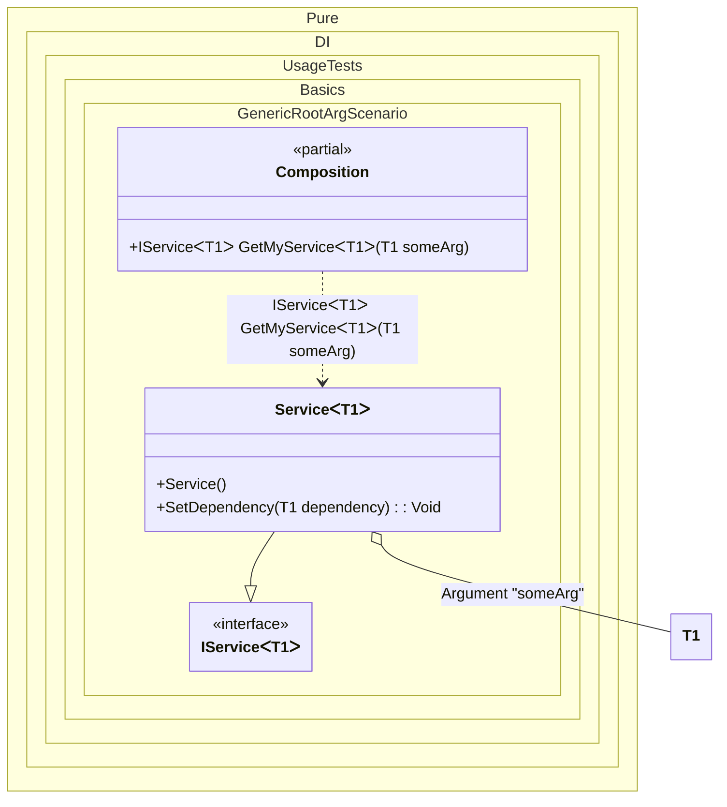

#### Generic root arguments

[](../tests/Pure.DI.UsageTests/Generics/GenericRootArgScenario.cs)


```c#
using Pure.DI;

DI.Setup(nameof(Composition))
    .RootArg<TT>("someArg")
    .Bind<IService<TT>>().To<Service<TT>>()

    // Composition root
    .Root<IService<TT>>("GetMyService");

var composition = new Composition();
IService<int> service = composition.GetMyService<int>(someArg: 33);

interface IService<out T>
{
    T? Dependency { get; }
}

class Service<T> : IService<T>
{
    // The Ordinal attribute specifies to perform an injection,
    // the integer value in the argument specifies
    // the ordinal of injection
    [Ordinal(0)]
    public void SetDependency(T dependency) =>
        Dependency = dependency;

    public T? Dependency { get; private set; }
}
```

<details>
<summary>Running this code sample locally</summary>

- Make sure you have the [.NET SDK 9.0](https://dotnet.microsoft.com/en-us/download/dotnet/9.0) or later is installed
- Create a net9.0 (or later) console application
- Add reference to NuGet package
  - [Pure.DI](https://www.nuget.org/packages/Pure.DI)
- Copy the example code into the _Program.cs_ file

You are ready to run the example!

</details>

The following partial class will be generated:

```c#
partial class Composition
{
  private readonly Composition _root;

  [OrdinalAttribute(128)]
  public Composition()
  {
    _root = this;
  }

  internal Composition(Composition parentScope)
  {
    _root = (parentScope ?? throw new ArgumentNullException(nameof(parentScope)))._root;
  }

  [MethodImpl(MethodImplOptions.AggressiveInlining)]
  public IService<T1> GetMyService<T1>(T1 someArg)
  {
    Service<T1> transientService0 = new Service<T1>();
    transientService0.SetDependency(someArg);
    return transientService0;
  }
}
```

Class diagram:



