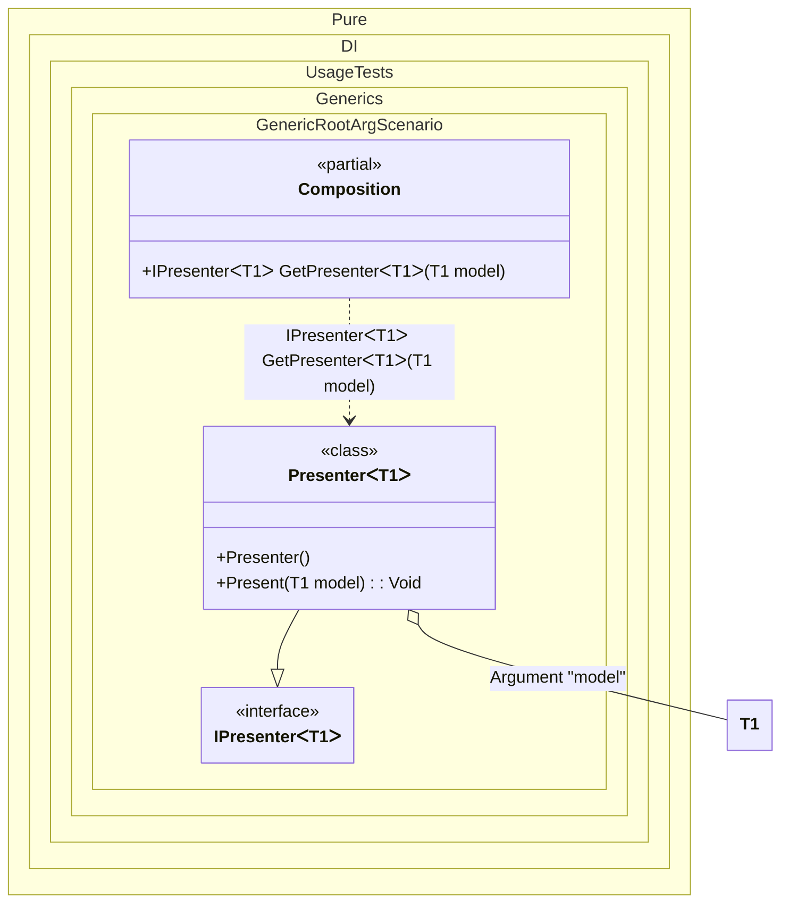

#### Generic root arguments

Sometimes a composition root needs an argument whose type depends on the root's own type parameter. Declaring `RootArg<TT>("model")` together with the generic root `Root<IPresenter<TT>>("GetPresenter")` produces a generic method `GetPresenter<T>(T model)`.
The value passed to that method is injected into `Presenter<T>` through the method marked with the `[Dependency]` attribute.


```c#
using Shouldly;
using Pure.DI;

DI.Setup(nameof(Composition))
    .RootArg<TT>("model")
    .Bind<IPresenter<TT>>().To<Presenter<TT>>()

    // Composition root
    .Root<IPresenter<TT>>("GetPresenter");

var composition = new Composition();

// The "model" argument is passed to the composition root
// and then injected into the "Presenter" class
var presenter = composition.GetPresenter<string>(model: "Hello World");

presenter.Model.ShouldBe("Hello World");

interface IPresenter<out T>
{
    T? Model { get; }
}

class Presenter<T> : IPresenter<T>
{
    // The Dependency attribute specifies to perform an injection
    [Dependency]
    public void Present(T model) =>
        Model = model;

    public T? Model { get; private set; }
}
```

<details>
<summary>Running this code sample locally</summary>

- Make sure you have the [.NET SDK 10.0](https://dotnet.microsoft.com/en-us/download/dotnet/10.0) or later installed
```bash
dotnet --list-sdk
```
- Create a net10.0 (or later) console application
```bash
dotnet new console -n Sample
```
- Add references to the NuGet packages
  - [Pure.DI](https://www.nuget.org/packages/Pure.DI)
  - [Shouldly](https://www.nuget.org/packages/Shouldly)
```bash
dotnet add package Pure.DI
dotnet add package Shouldly
```
- Copy the example code into the _Program.cs_ file

You are ready to run the example 🚀
```bash
dotnet run
```

</details>

>[!NOTE]
>Generic root arguments enable flexible type parameterization while maintaining compile-time type safety.

<details>
<summary>The following partial class will be generated</summary>

```c#
partial class Composition
{
  [MethodImpl(MethodImplOptions.AggressiveInlining)]
  public IPresenter<T1> GetPresenter<T1>(T1 model)
  {
    if (model is null) throw new ArgumentNullException(nameof(model));
    var transientPresenterTT = new Presenter<T1>();
    transientPresenterTT.Present(model);
    return transientPresenterTT;
  }
}
```

</details>

Class diagram:


```mermaid
---
 config:
  class:
   hideEmptyMembersBox: true
---
classDiagram
	PresenterᐸT1ᐳ --|> IPresenterᐸT1ᐳ
	Composition ..> PresenterᐸT1ᐳ : IPresenterᐸT1ᐳ GetPresenterᐸT1ᐳ(T1 model)
	PresenterᐸT1ᐳ o-- T1 : Argument "model"
	namespace Pure.DI.UsageTests.Generics.GenericRootArgScenario {
		class Composition {
		<<partial>>
		+IPresenterᐸT1ᐳ GetPresenterᐸT1ᐳ(T1 model)
		}
		class IPresenterᐸT1ᐳ {
			<<interface>>
		}
		class PresenterᐸT1ᐳ {
				<<class>>
			+Presenter()
			+Present(T1 model) : Void
		}
	}
```

See also:

- [Root arguments](root-arguments.md)
- [Complex generic root arguments](complex-generic-root-arguments.md)

