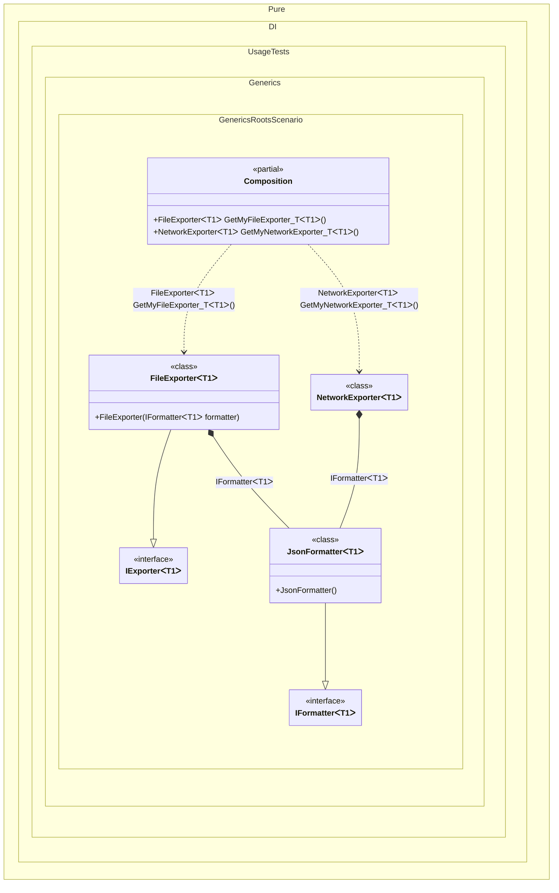

#### Generic roots


```c#
using Pure.DI;

DI.Setup(nameof(Composition))
    // This hint indicates to not generate methods such as Resolve
    .Hint(Hint.Resolve, "Off")
    .Bind().To<JsonFormatter<TT>>()
    .Bind().To<FileExporter<TT>>()
    // Creates NetworkExporter manually,
    // just for the sake of example
    .Bind<NetworkExporter<TT>>().To(ctx => {
        ctx.Inject(out IFormatter<TT> formatter);
        return new NetworkExporter<TT>(formatter);
    })

    // Specifies to define composition roots for all types inherited from IExporter<TT>
    // available at compile time at the point where the method is called
    .Roots<IExporter<TT>>("GetMy{type}");

var composition = new Composition();

// fileExporter = new FileExporter<int>(new JsonFormatter<int>());
var fileExporter = composition.GetMyFileExporter_T<int>();

// networkExporter = new NetworkExporter<string>(new JsonFormatter<string>());
var networkExporter = composition.GetMyNetworkExporter_T<string>();

interface IFormatter<T>;

class JsonFormatter<T> : IFormatter<T>;

interface IExporter<T>;

class FileExporter<T>(IFormatter<T> formatter) : IExporter<T>;

class NetworkExporter<T>(IFormatter<T> formatter) : IExporter<T>;
```

<details>
<summary>Running this code sample locally</summary>

- Make sure you have the [.NET SDK 10.0](https://dotnet.microsoft.com/en-us/download/dotnet/10.0) or later is installed
```bash
dotnet --list-sdk
```
- Create a net10.0 (or later) console application
```bash
dotnet new console -n Sample
```
- Add reference to NuGet package
  - [Pure.DI](https://www.nuget.org/packages/Pure.DI)
```bash
dotnet add package Pure.DI
```
- Copy the example code into the _Program.cs_ file

You are ready to run the example 🚀
```bash
dotnet run
```

</details>

The following partial class will be generated:

```c#
partial class Composition
{
  [MethodImpl(MethodImplOptions.AggressiveInlining)]
  public NetworkExporter<T1> GetMyNetworkExporter_T<T1>()
  {
    NetworkExporter<T1> transientNetworkExporter;
    IFormatter<T1> localFormatter = new JsonFormatter<T1>();
    transientNetworkExporter = new NetworkExporter<T1>(localFormatter);
    return transientNetworkExporter;
  }

  [MethodImpl(MethodImplOptions.AggressiveInlining)]
  public FileExporter<T1> GetMyFileExporter_T<T1>()
  {
    return new FileExporter<T1>(new JsonFormatter<T1>());
  }
}
```

Class diagram:



