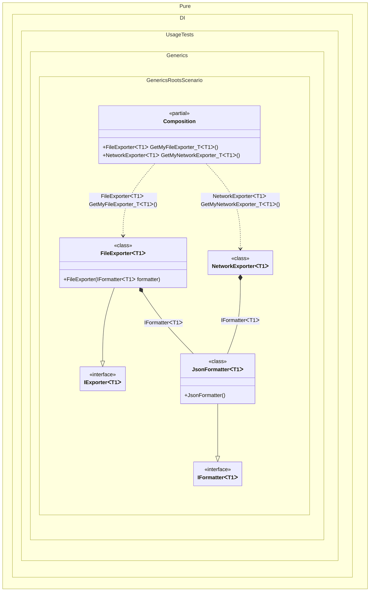

#### Generic roots

Demonstrates how to create roots for all generic types that inherit from a given base type at compile time.


```c#
using Shouldly;
using Pure.DI;

DI.Setup(nameof(Composition))
    // Disable Resolve methods to keep the public API minimal
    .Hint(Hint.Resolve, "Off")
    .Bind().To<JsonFormatter<TT>>()
    .Bind().To<FileExporter<TT>>()
    // Creates NetworkExporter manually,
    // just for the sake of example
    .Bind<NetworkExporter<TT>>().To(ctx => {
        ctx.Inject(out IFormatter<TT> formatter);
        return new NetworkExporter<TT>(formatter);
    })

    // Specifies to define composition roots for all types inherited from IExporter<TT>
    // available at compile time at the point where the method is called
    .Roots<IExporter<TT>>("GetMy{type}");

var composition = new Composition();

// fileExporter = new FileExporter<int>(new JsonFormatter<int>());
var fileExporter = composition.GetMyFileExporter_T<int>();

// networkExporter = new NetworkExporter<string>(new JsonFormatter<string>());
var networkExporter = composition.GetMyNetworkExporter_T<string>();

interface IFormatter<T>;

class JsonFormatter<T> : IFormatter<T>;

interface IExporter<T>;

class FileExporter<T>(IFormatter<T> formatter) : IExporter<T>;

class NetworkExporter<T>(IFormatter<T> formatter) : IExporter<T>;
```

<details>
<summary>Running this code sample locally</summary>

- Make sure you have the [.NET SDK 10.0](https://dotnet.microsoft.com/en-us/download/dotnet/10.0) or later installed
```bash
dotnet --list-sdk
```
- Create a net10.0 (or later) console application
```bash
dotnet new console -n Sample
```
- Add references to the NuGet packages
  - [Pure.DI](https://www.nuget.org/packages/Pure.DI)
  - [Shouldly](https://www.nuget.org/packages/Shouldly)
```bash
dotnet add package Pure.DI
dotnet add package Shouldly
```
- Copy the example code into the _Program.cs_ file

You are ready to run the example 🚀
```bash
dotnet run
```

</details>

>[!NOTE]
>Generic roots enable exposing multiple generic implementations without explicitly registering each one.

The following partial class will be generated:

```c#
partial class Composition
{
  [MethodImpl(MethodImplOptions.AggressiveInlining)]
  public NetworkExporter<T1> GetMyNetworkExporter_T<T1>()
  {
    NetworkExporter<T1> transientNetworkExporter531;
    IFormatter<T1> localFormatter = new JsonFormatter<T1>();
    transientNetworkExporter531 = new NetworkExporter<T1>(localFormatter);
    return transientNetworkExporter531;
  }

  [MethodImpl(MethodImplOptions.AggressiveInlining)]
  public FileExporter<T1> GetMyFileExporter_T<T1>()
  {
    return new FileExporter<T1>(new JsonFormatter<T1>());
  }
}
```

Class diagram:


```mermaid
---
 config:
  maxTextSize: 2147483647
  maxEdges: 2147483647
  class:
   hideEmptyMembersBox: true
---
classDiagram
	FileExporterᐸT1ᐳ --|> IExporterᐸT1ᐳ
	JsonFormatterᐸT1ᐳ --|> IFormatterᐸT1ᐳ
	Composition ..> NetworkExporterᐸT1ᐳ : NetworkExporterᐸT1ᐳ GetMyNetworkExporter_TᐸT1ᐳ()
	Composition ..> FileExporterᐸT1ᐳ : FileExporterᐸT1ᐳ GetMyFileExporter_TᐸT1ᐳ()
	NetworkExporterᐸT1ᐳ *--  JsonFormatterᐸT1ᐳ : IFormatterᐸT1ᐳ
	FileExporterᐸT1ᐳ *--  JsonFormatterᐸT1ᐳ : IFormatterᐸT1ᐳ
	namespace Pure.DI.UsageTests.Generics.GenericsRootsScenario {
		class Composition {
		<<partial>>
		+FileExporterᐸT1ᐳ GetMyFileExporter_TᐸT1ᐳ()
		+NetworkExporterᐸT1ᐳ GetMyNetworkExporter_TᐸT1ᐳ()
		}
		class FileExporterᐸT1ᐳ {
				<<class>>
			+FileExporter(IFormatterᐸT1ᐳ formatter)
		}
		class IExporterᐸT1ᐳ {
			<<interface>>
		}
		class IFormatterᐸT1ᐳ {
			<<interface>>
		}
		class JsonFormatterᐸT1ᐳ {
				<<class>>
			+JsonFormatter()
		}
		class NetworkExporterᐸT1ᐳ {
				<<class>>
		}
	}
```

