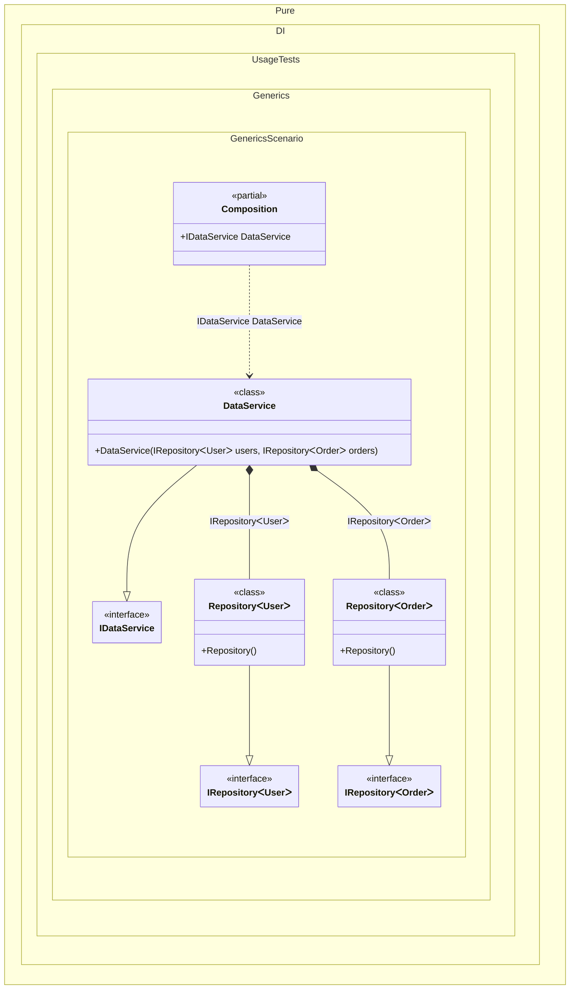

#### Generics

Generic types are also supported.
> [!IMPORTANT]
> Instead of open generic types, as in classical DI container libraries, regular generic types with _marker_ types as type parameters are used here. Such "marker" types allow to define dependency graph more precisely.

For the case of `IDependency<TT>`, `TT` is a _marker_ type, which allows the usual `IDependency<TT>` to be used instead of an open generic type like `IDependency<>`. This makes it easy to bind generic types by specifying _marker_ types such as `TT`, `TT1`, etc. as parameters of generic types:


```c#
using Shouldly;
using Pure.DI;

DI.Setup(nameof(Composition))
    // This hint indicates to not generate methods such as Resolve
    .Hint(Hint.Resolve, "Off")
    // Binding a generic interface to a generic implementation
    // using the marker type TT. This allows Pure.DI to match
    // IRepository<User> to Repository<User>, IRepository<Order> to Repository<Order>, etc.
    .Bind<IRepository<TT>>().To<Repository<TT>>()
    .Bind<IDataService>().To<DataService>()

    // Composition root
    .Root<IDataService>("DataService");

var composition = new Composition();
var dataService = composition.DataService;

// Verifying that the correct generic types were injected
dataService.Users.ShouldBeOfType<Repository<User>>();
dataService.Orders.ShouldBeOfType<Repository<Order>>();

interface IRepository<T>;

class Repository<T> : IRepository<T>;

// Domain entities
record User;

record Order;

interface IDataService
{
    IRepository<User> Users { get; }

    IRepository<Order> Orders { get; }
}

class DataService(
    IRepository<User> users,
    IRepository<Order> orders)
    : IDataService
{
    public IRepository<User> Users { get; } = users;

    public IRepository<Order> Orders { get; } = orders;
}
```

<details>
<summary>Running this code sample locally</summary>

- Make sure you have the [.NET SDK 10.0](https://dotnet.microsoft.com/en-us/download/dotnet/10.0) or later is installed
```bash
dotnet --list-sdk
```
- Create a net10.0 (or later) console application
```bash
dotnet new console -n Sample
```
- Add references to NuGet packages
  - [Pure.DI](https://www.nuget.org/packages/Pure.DI)
  - [Shouldly](https://www.nuget.org/packages/Shouldly)
```bash
dotnet add package Pure.DI
dotnet add package Shouldly
```
- Copy the example code into the _Program.cs_ file

You are ready to run the example 🚀
```bash
dotnet run
```

</details>

Actually, the property _Root_ looks like:
```c#
public IService Root
{
  get
  {
    return new Service(new Dependency<int>(), new Dependency<string>());
  }
}
```
Even in this simple scenario, it is not possible to precisely define the binding of an abstraction to its implementation using open generic types:
```c#
.Bind(typeof(IMap<,>)).To(typeof(Map<,>))
```
You can try to match them by order or by name derived from the .NET type reflection. But this is not reliable, since order and name matching is not guaranteed. For example, there is some interface with two arguments of type _key and _value_. But in its implementation the sequence of type arguments is mixed up: first comes the _value_ and then the _key_ and the names do not match:
```c#
class Map<TV, TK>: IMap<TKey, TValue> { }
```
At the same time, the marker types `TT1` and `TT2` handle this easily. They determine the exact correspondence between the type arguments in the interface and its implementation:
```c#
.Bind<IMap<TT1, TT2>>().To<Map<TT2, TT1>>()
```
The first argument of the type in the interface, corresponds to the second argument of the type in the implementation and is a _key_. The second argument of the type in the interface, corresponds to the first argument of the type in the implementation and is a _value_. This is a simple example. Obviously, there are plenty of more complex scenarios where tokenized types will be useful.
Marker types are regular .NET types marked with a special attribute, such as:
```c#
[GenericTypeArgument]
internal abstract class TT1 { }

[GenericTypeArgument]
internal abstract class TT2 { }
```
This way you can easily create your own, including making them fit the constraints on the type parameter, for example:
```c#
[GenericTypeArgument]
internal struct TTS { }

[GenericTypeArgument]
internal interface TTDisposable: IDisposable { }

[GenericTypeArgument]
internal interface TTEnumerator<out T>: IEnumerator<T> { }
```

The following partial class will be generated:

```c#
partial class Composition
{
  public IDataService DataService
  {
    [MethodImpl(MethodImplOptions.AggressiveInlining)]
    get
    {
      return new DataService(new Repository<User>(), new Repository<Order>());
    }
  }
}
```

Class diagram:



