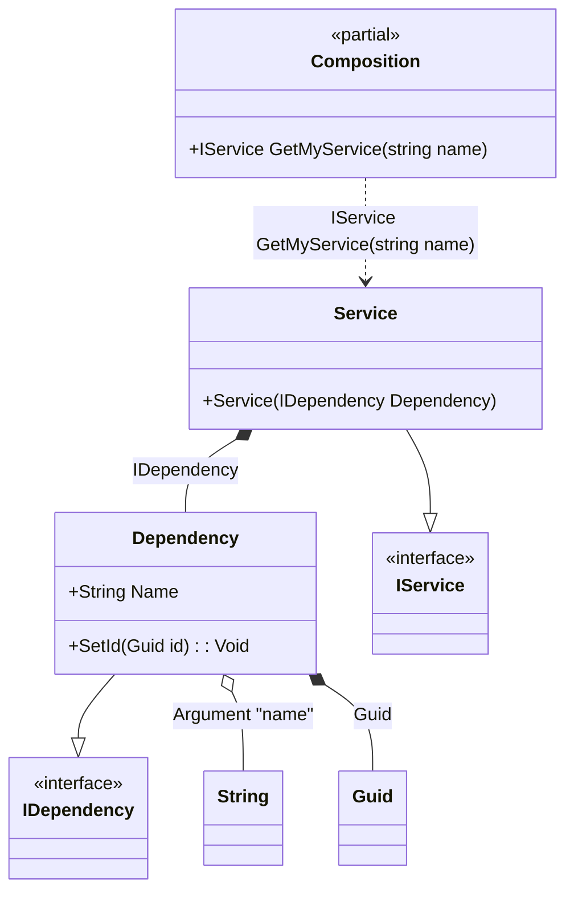

#### Initialization

[](../tests/Pure.DI.UsageTests/Basics/InitializationScenario.cs)

It is possible to create an object yourself and then inject the required dependencies via methods, properties or fields.


```c#
interface IDependency
{
    string Name { get; }

    Guid Id { get; }
}

class Dependency : IDependency
{
    // The Ordinal attribute specifies to perform an injection and its order
    [Ordinal(3)]
    public string Name { get; set; } = "";

    public Guid Id { get; private set; } = Guid.Empty;

    // The Ordinal attribute specifies to perform an injection and its order
    [Ordinal(0)]
    public void SetId(Guid id) => Id = id;
}

interface IService
{
    IDependency Dependency { get; }
}

record Service(IDependency Dependency) : IService
{
}

DI.Setup(nameof(Composition))
    .RootArg<string>("name")
    .Bind().To(_ => Guid.NewGuid())
    .Bind<IDependency>().To(ctx =>
    {
        var dependency = new Dependency();
        ctx.Initialize(dependency);
        return dependency;
    })
    .Bind<IService>().To<Service>()

    // Composition root
    .Root<IService>("GetMyService");

var composition = new Composition();
var service = composition.GetMyService("Some name");
service.Dependency.Name.ShouldBe("Some name");
service.Dependency.Id.ShouldNotBe(Guid.Empty);
```

The following partial class will be generated:

```c#
partial class Composition
{
  private readonly Composition _root;

  [OrdinalAttribute(10)]
  public Composition()
  {
    _root = this;
  }

  internal Composition(Composition parentScope)
  {
    _root = (parentScope ?? throw new ArgumentNullException(nameof(parentScope)))._root;
  }

  [MethodImpl(MethodImplOptions.AggressiveInlining)]
  public IService GetMyService(string name)
  {
    Guid transientGuid2 = Guid.NewGuid();
    Dependency transientDependency1;
    var localDependency28= new Dependency();
    localDependency28.Name = name;
    localDependency28.SetId(transientGuid2);
    transientDependency1 = localDependency28;
    return new Service(transientDependency1);
  }
}
```

Class diagram:



