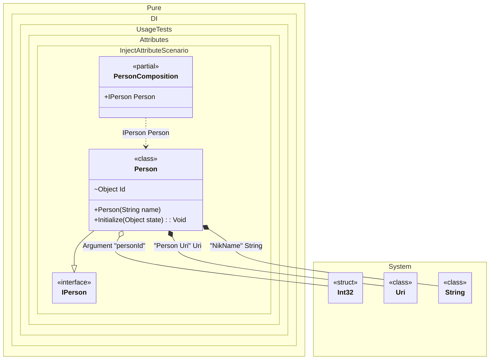

#### Inject attribute

If you want to use attributes in your libraries but don't want to create your own, you can add this package to your projects:

[](https://www.nuget.org/packages/Pure.DI.Abstractions)

It contains attributes like `Inject` and `Inject<T>` that work for constructors and their arguments, methods and their arguments, properties and fields. They allow you to setup all injection parameters.


```c#
using Shouldly;
using Pure.DI.Abstractions;
using Pure.DI;

DI.Setup(nameof(PersonComposition))
    .Arg<int>("personId")
    .Bind<Uri>("Person Uri").To(_ => new Uri("https://github.com/DevTeam/Pure.DI"))
    .Bind("NikName").To(_ => "Nik")
    .Bind().To<Person>()

    // Composition root
    .Root<IPerson>("Person");

var composition = new PersonComposition(personId: 123);
var person = composition.Person;
person.ToString().ShouldBe("123 Nik https://github.com/DevTeam/Pure.DI");

interface IPerson;

class Person([Inject("NikName")] string name) : IPerson
{
    private object? _state;

    [Inject<int>] internal object Id = "";

    public void Initialize([Inject<Uri>("Person Uri", 1)] object state) =>
        _state = state;

    public override string ToString() => $"{Id} {name} {_state}";
}
```

<details>
<summary>Running this code sample locally</summary>

- Make sure you have the [.NET SDK 9.0](https://dotnet.microsoft.com/en-us/download/dotnet/9.0) or later is installed
```bash
dotnet --list-sdk
```
- Create a net9.0 (or later) console application
```bash
dotnet new console -n Sample
```
- Add references to NuGet packages
  - [Pure.DI](https://www.nuget.org/packages/Pure.DI)
  - [Shouldly](https://www.nuget.org/packages/Shouldly)
  - [Pure.DI.Abstractions](https://www.nuget.org/packages/Pure.DI.Abstractions)
```bash
dotnet add package Pure.DI
dotnet add package Shouldly
dotnet add package Pure.DI.Abstractions
```
- Copy the example code into the _Program.cs_ file

You are ready to run the example 🚀
```bash
dotnet run
```

</details>

This package should also be included in a project:

[](https://www.nuget.org/packages/Pure.DI)

The following partial class will be generated:

```c#
partial class PersonComposition
{
#if NET9_0_OR_GREATER
  private readonly Lock _lock;
#else
  private readonly Object _lock;
#endif

  private readonly int _argPersonId;

  [OrdinalAttribute(128)]
  public PersonComposition(int personId)
  {
    _argPersonId = personId;
#if NET9_0_OR_GREATER
    _lock = new Lock();
#else
    _lock = new Object();
#endif
  }

  internal PersonComposition(PersonComposition parentScope)
  {
    _argPersonId = parentScope._argPersonId;
    _lock = parentScope._lock;
  }

  public IPerson Person
  {
    [MethodImpl(MethodImplOptions.AggressiveInlining)]
    get
    {
      string transString1 = "Nik";
      Uri transUri3 = new Uri("https://github.com/DevTeam/Pure.DI");
      var transPerson = new Person(transString1);
      transPerson.Id = _argPersonId;
      transPerson.Initialize(transUri3);
      return transPerson;
    }
  }
}
```

Class diagram:



