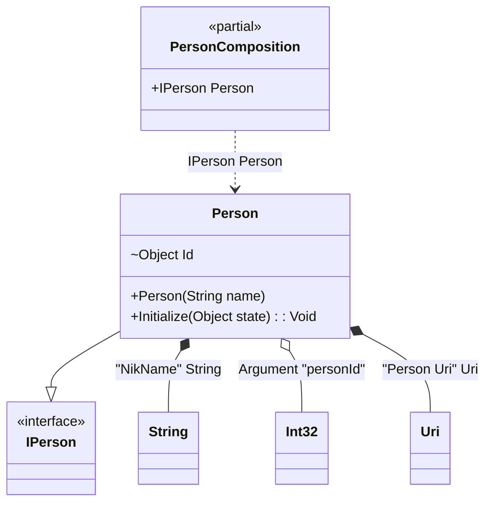

#### Inject attribute

[](../tests/Pure.DI.UsageTests/Attributes/InjectAttributeScenario.cs)

If you want to use attributes in your libraries but don't want to create your own, you can add this package to your projects:

[](https://www.nuget.org/packages/Pure.DI.Abstractions)

It contains attributes like `Inject` and `Inject<T>` that work for constructors and their arguments, methods and their arguments, properties and fields. They allow you to setup all injection parameters.


```c#
using Pure.DI.Abstractions;

interface IPerson;

class Person([Inject("NikName")] string name) : IPerson
{
    private object? _state;

    [Inject<int>]
    internal object Id = "";

    public void Initialize([Inject<Uri>("Person Uri", 1)] object state) =>
        _state = state;

    public override string ToString() => $"{Id} {name} {_state}";
}

DI.Setup(nameof(PersonComposition))
    .Arg<int>("personId")
    .Bind<Uri>("Person Uri").To(_ => new Uri("https://github.com/DevTeam/Pure.DI"))
    .Bind("NikName").To(_ => "Nik")
    .Bind().To<Person>()

    // Composition root
    .Root<IPerson>("Person");

var composition = new PersonComposition(personId: 123);
var person = composition.Person;
person.ToString().ShouldBe("123 Nik https://github.com/DevTeam/Pure.DI");
```

This package should also be included in a project:

[](https://www.nuget.org/packages/Pure.DI)

The following partial class will be generated:

```c#
partial class PersonComposition
{
  private readonly PersonComposition _root;

  private readonly int _argPersonId;

  public PersonComposition(int personId)
  {
    _argPersonId = personId;
    _root = this;
  }

  internal PersonComposition(PersonComposition parentScope)
  {
    _root = (parentScope ?? throw new ArgumentNullException(nameof(parentScope)))._root;
    _argPersonId = _root._argPersonId;
  }

  public IPerson Person
  {
    [MethodImpl(MethodImplOptions.AggressiveInlining)]
    get
    {
      Uri transientUri2 = new Uri("https://github.com/DevTeam/Pure.DI");
      string transientString1 = "Nik";
      Person transientPerson0 = new Person(transientString1);
      transientPerson0.Id = _argPersonId;
      transientPerson0.Initialize(transientUri2);
      return transientPerson0;
    }
  }
}
```

Class diagram:



