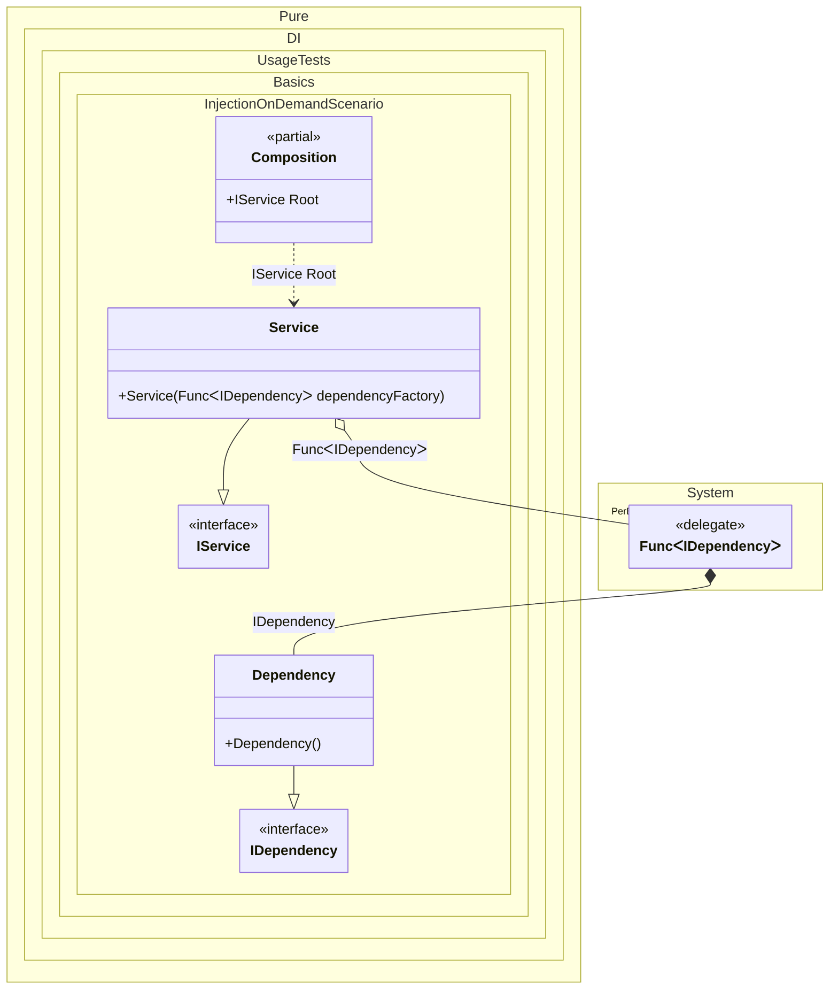

#### Injection on demand

This example demonstrates using dependency injection with Pure.DI to dynamically create dependencies as needed via a factory function. The code defines a service (`Service`) that requires multiple instances of a dependency (`Dependency`). Instead of injecting pre-created instances, the service receives a `Func<IDependency>` factory delegate, allowing it to generate dependencies on demand.


```c#
using Shouldly;
using Pure.DI;
using System.Collections.Generic;

DI.Setup(nameof(Composition))
    .Bind().To<Dependency>()
    .Bind().To<Service>()

    // Composition root
    .Root<IService>("Root");

var composition = new Composition();
var service = composition.Root;
service.Dependencies.Count.ShouldBe(2);

interface IDependency;

class Dependency : IDependency;

interface IService
{
    IReadOnlyList<IDependency> Dependencies { get; }
}

class Service(Func<IDependency> dependencyFactory): IService
{
    public IReadOnlyList<IDependency> Dependencies { get; } =
    [
        dependencyFactory(),
        dependencyFactory()
    ];
}
```

<details>
<summary>Running this code sample locally</summary>

- Make sure you have the [.NET SDK 9.0](https://dotnet.microsoft.com/en-us/download/dotnet/9.0) or later is installed
```bash
dotnet --list-sdk
```
- Create a net9.0 (or later) console application
```bash
dotnet new console -n Sample
```
- Add references to NuGet packages
  - [Pure.DI](https://www.nuget.org/packages/Pure.DI)
  - [Shouldly](https://www.nuget.org/packages/Shouldly)
```bash
dotnet add package Pure.DI
dotnet add package Shouldly
```
- Copy the example code into the _Program.cs_ file

You are ready to run the example 🚀
```bash
dotnet run
```

</details>

Key elements:
- `Dependency` is bound to the `IDependency` interface, and `Service` is bound to `IService`.
- The `Service` constructor accepts `Func<IDependency>`, enabling deferred creation of dependencies.
- The `Service` calls the factory twice, resulting in two distinct `Dependency` instances stored in its `Dependencies` collection.

This approach showcases how factories can control dependency lifetime and instance creation timing in a DI container. The Pure.DI configuration ensures the factory resolves new `IDependency` instances each time it's invoked, achieving "injections as required" functionality.

The following partial class will be generated:

```c#
partial class Composition
{
  private readonly Composition _root;

  [OrdinalAttribute(256)]
  public Composition()
  {
    _root = this;
  }

  internal Composition(Composition parentScope)
  {
    _root = (parentScope ?? throw new ArgumentNullException(nameof(parentScope)))._root;
  }

  public IService Root
  {
    [MethodImpl(MethodImplOptions.AggressiveInlining)]
    get
    {
      Func<IDependency> perBlockFunc1 = new Func<IDependency>(
      [MethodImpl(MethodImplOptions.AggressiveInlining)]
      () =>
      {
        IDependency localValue96 = new Dependency();
        return localValue96;
      });
      return new Service(perBlockFunc1);
    }
  }
}
```

Class diagram:



