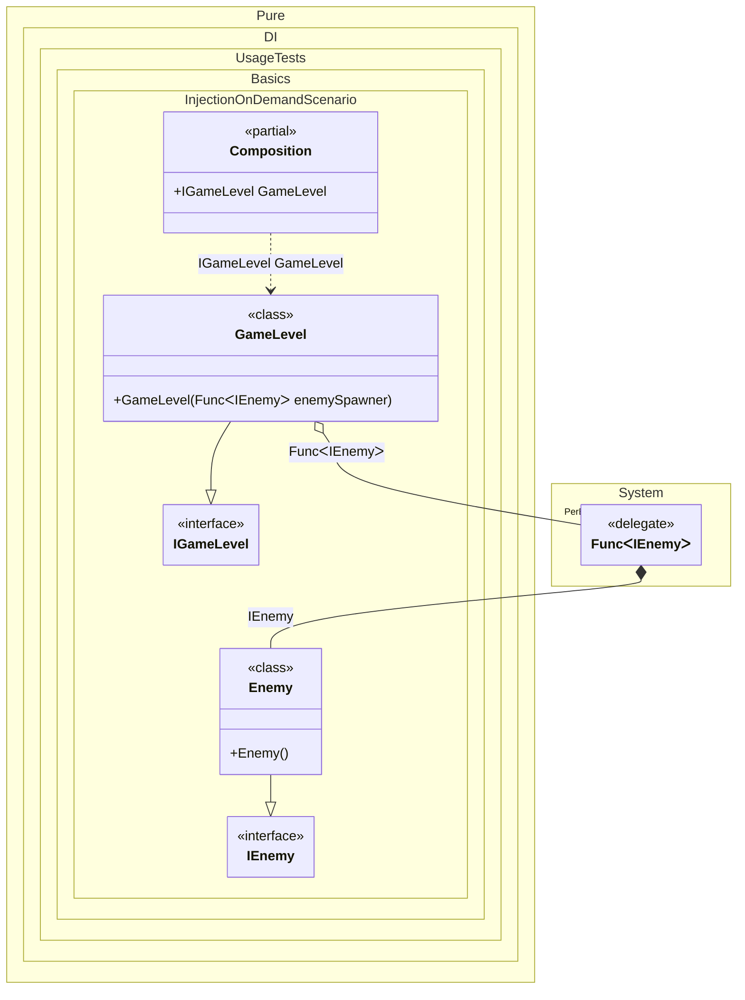

#### Injection on demand

This example demonstrates using dependency injection with Pure.DI to dynamically create dependencies as needed via a factory function. The code defines a service (`GameLevel`) that requires multiple instances of a dependency (`Enemy`). Instead of injecting pre-created instances, the service receives a `Func<IEnemy>` factory delegate, allowing it to generate entities on demand.


```c#
using Shouldly;
using Pure.DI;
using System.Collections.Generic;

DI.Setup(nameof(Composition))
    .Bind().To<Enemy>()
    .Bind().To<GameLevel>()

    // Composition root
    .Root<IGameLevel>("GameLevel");

var composition = new Composition();
var gameLevel = composition.GameLevel;

// Verifies that two distinct enemies have been spawned
gameLevel.Enemies.Count.ShouldBe(2);

// Represents a game entity that acts as an enemy
interface IEnemy;

class Enemy : IEnemy;

// Represents a game level that manages entities
interface IGameLevel
{
    IReadOnlyList<IEnemy> Enemies { get; }
}

class GameLevel(Func<IEnemy> enemySpawner) : IGameLevel
{
    // The factory acts as a "spawner" to create new enemy instances on demand.
    // Calling 'enemySpawner()' creates a fresh instance of Enemy each time.
    public IReadOnlyList<IEnemy> Enemies { get; } =
    [
        enemySpawner(),
        enemySpawner()
    ];
}
```

<details>
<summary>Running this code sample locally</summary>

- Make sure you have the [.NET SDK 10.0](https://dotnet.microsoft.com/en-us/download/dotnet/10.0) or later is installed
```bash
dotnet --list-sdk
```
- Create a net10.0 (or later) console application
```bash
dotnet new console -n Sample
```
- Add references to NuGet packages
  - [Pure.DI](https://www.nuget.org/packages/Pure.DI)
  - [Shouldly](https://www.nuget.org/packages/Shouldly)
```bash
dotnet add package Pure.DI
dotnet add package Shouldly
```
- Copy the example code into the _Program.cs_ file

You are ready to run the example 🚀
```bash
dotnet run
```

</details>

Key elements:
- `Enemy` is bound to the `IEnemy` interface, and `GameLevel` is bound to `IGameLevel`.
- The `GameLevel` constructor accepts `Func<IEnemy>`, enabling deferred creation of entities.
- The `GameLevel` calls the factory twice, resulting in two distinct `Enemy` instances stored in its `Enemies` collection.

This approach showcases how factories can control dependency lifetime and instance creation timing in a DI container. The Pure.DI configuration ensures the factory resolves new `IEnemy` instances each time it's invoked, achieving "injections as required" functionality.

The following partial class will be generated:

```c#
partial class Composition
{
  public IGameLevel GameLevel
  {
    [MethodImpl(MethodImplOptions.AggressiveInlining)]
    get
    {
      Func<IEnemy> transientFunc1 = new Func<IEnemy>(
      [MethodImpl(MethodImplOptions.AggressiveInlining)]
      () =>
      {
        IEnemy localValue17 = new Enemy();
        return localValue17;
      });
      return new GameLevel(transientFunc1);
    }
  }
}
```

Class diagram:



