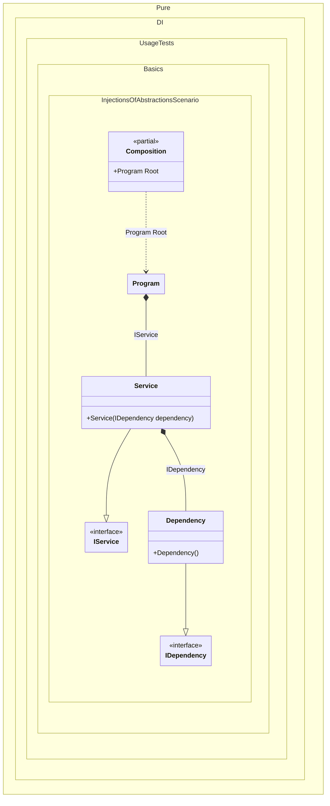

#### Injections of abstractions

[](../tests/Pure.DI.UsageTests/Basics/InjectionsOfAbstractionsScenario.cs)

This example demonstrates the recommended approach of using abstractions instead of implementations when injecting dependencies.


```c#
using Pure.DI;

DI.Setup(nameof(Composition))
    // Binding abstractions to their implementations
    .Bind<IDependency>().To<Dependency>()
    .Bind<IService>().To<Service>()

    // Specifies to create a composition root
    // of type "Program" with the name "Root"
    .Root<Program>("Root");

var composition = new Composition();

// var root = new Program(new Service(new Dependency()));
var root = composition.Root;

root.Run();

interface IDependency;

class Dependency : IDependency;

interface IService
{
    void DoSomething();
}

class Service(IDependency dependency) : IService
{
    public void DoSomething()
    {
    }
}

partial class Program(IService service)
{
    public void Run() => service.DoSomething();
}
```

<details>
<summary>Running this code sample locally</summary>

- Make sure you have the [.NET SDK 9.0](https://dotnet.microsoft.com/en-us/download/dotnet/9.0) or later is installed
- Create a net9.0 (or later) console application
- Add reference to NuGet package
  - [Pure.DI](https://www.nuget.org/packages/Pure.DI)
- Copy the example code into the _Program.cs_ file

You are ready to run the example!

</details>

Usually the biggest block in the setup is the chain of bindings, which describes which implementation corresponds to which abstraction. This is necessary so that the code generator can build a composition of objects using only NOT abstract types. This is true because the cornerstone of DI technology implementation is the principle of abstraction-based programming rather than concrete class-based programming. Thanks to it, it is possible to replace one concrete implementation by another. And each implementation can correspond to an arbitrary number of abstractions.
> [!TIP]
> Even if the binding is not defined, there is no problem with the injection, but obviously under the condition that the consumer requests an injection NOT of abstract type.


Class diagram:



