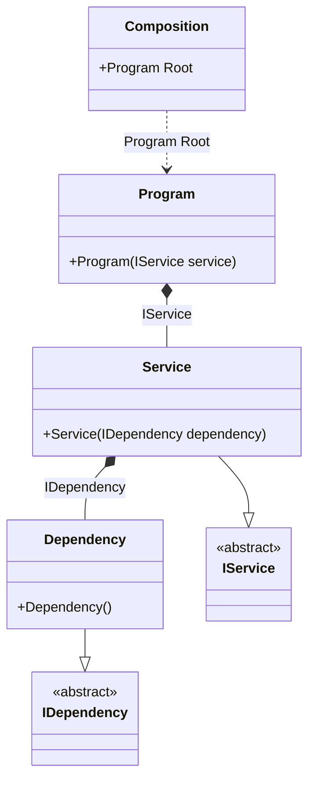

#### Injections of abstractions

[](../tests/Pure.DI.UsageTests/Basics/InjectionsOfAbstractionsScenario.cs)

This example demonstrates the recommended approach of using abstractions instead of implementations when injecting dependencies.

```c#
interface IDependency;

class Dependency : IDependency;

interface IService
{
    void DoSomething();
}

class Service(IDependency dependency) : IService
{
    public void DoSomething() { }
}

class Program(IService service)
{
    public void Run() => service.DoSomething();
}

DI.Setup("Composition")
    // Binding abstractions to their implementations:
    .Bind<IDependency>().To<Dependency>()
    .Bind<IService>().To<Service>()
    // Specifies to create a composition root (a property)
    // of type "Program" with the name "Root":
    .Root<Program>("Root");
        
var composition = new Composition();

// root = new Program(new Service(new Dependency()));
var root = composition.Root;

root.Run();
```

<details open>
<summary>Class Diagram</summary>



</details>

<details>
<summary>Pure.DI-generated partial class Composition</summary><blockquote>

```c#
partial class Composition
{
  private readonly global::System.IDisposable[] _disposableSingletonsM01D30di;
  
  public Composition()
  {
    _disposableSingletonsM01D30di = new global::System.IDisposable[0];
  }
  
  internal Composition(Composition parent)
  {
    _disposableSingletonsM01D30di = new global::System.IDisposable[0];
  }
  
  #region Composition Roots
  public Pure.DI.UsageTests.Basics.InjectionsOfAbstractionsScenario.Program Root
  {
    #if NETSTANDARD2_0_OR_GREATER || NETCOREAPP || NET40_OR_GREATER || NET
    [global::System.Diagnostics.Contracts.Pure]
    #endif
    get
    {
      return new Pure.DI.UsageTests.Basics.InjectionsOfAbstractionsScenario.Program(new Pure.DI.UsageTests.Basics.InjectionsOfAbstractionsScenario.Service(new Pure.DI.UsageTests.Basics.InjectionsOfAbstractionsScenario.Dependency()));
    }
  }
  #endregion
  
  
  public override string ToString()
  {
    return
      "classDiagram\n" +
        "  class Composition {\n" +
          "    +Program Root\n" +
        "  }\n" +
        "  class Program {\n" +
          "    +Program(IService service)\n" +
        "  }\n" +
        "  Dependency --|> IDependency : \n" +
        "  class Dependency {\n" +
          "    +Dependency()\n" +
        "  }\n" +
        "  Service --|> IService : \n" +
        "  class Service {\n" +
          "    +Service(IDependency dependency)\n" +
        "  }\n" +
        "  class IDependency {\n" +
          "    <<abstract>>\n" +
        "  }\n" +
        "  class IService {\n" +
          "    <<abstract>>\n" +
        "  }\n" +
        "  Program *--  Service : IService\n" +
        "  Service *--  Dependency : IDependency\n" +
        "  Composition ..> Program : Program Root";
  }
}
```

</blockquote></details>

