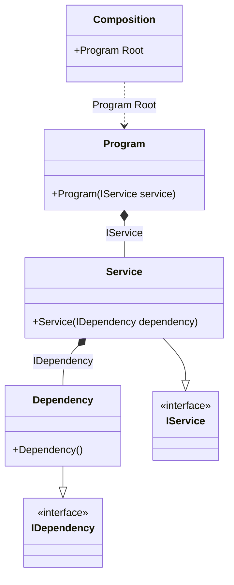

#### Injections of abstractions

[](../tests/Pure.DI.UsageTests/Basics/InjectionsOfAbstractionsScenario.cs)

This example demonstrates the recommended approach of using abstractions instead of implementations when injecting dependencies.

```c#
interface IDependency;

class Dependency : IDependency;

interface IService
{
    void DoSomething();
}

class Service(IDependency dependency) : IService
{
    public void DoSomething() { }
}

class Program(IService service)
{
    public void Run() => service.DoSomething();
}

DI.Setup(nameof(Composition))
    // Binding abstractions to their implementations
    .Bind<IDependency>().To<Dependency>()
    .Bind<IService>().To<Service>()

    // Specifies to create a composition root
    // of type "Program" with the name "Root"
    .Root<Program>("Root");
        
var composition = new Composition();

// var root = new Program(new Service(new Dependency()));
var root = composition.Root;

root.Run();
```

<details open>
<summary>Class Diagram</summary>



</details>

<details>
<summary>Pure.DI-generated partial class Composition</summary><blockquote>

```c#
partial class Composition
{
  private readonly Composition _root;

  public Composition()
  {
    _root = this;
  }

  internal Composition(Composition parentScope)
  {
    _root = (parentScope ?? throw new ArgumentNullException(nameof(parentScope)))._root;
  }

  public Program Root
  {
    [MethodImpl(MethodImplOptions.AggressiveInlining)]
    get
    {
      return new Program(new Service(new Dependency()));
    }
  }
}
```

</blockquote></details>

