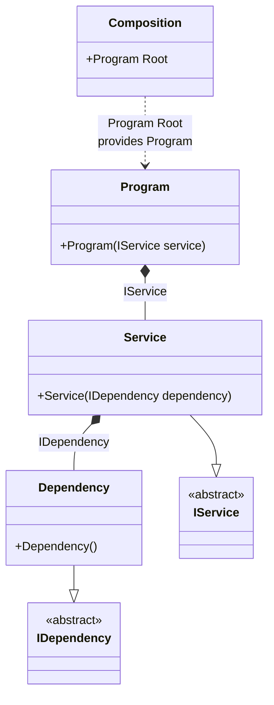

#### Injections of abstractions

[](../tests/Pure.DI.UsageTests/Basics/InjectionsOfAbstractionsScenario.cs)

This example demonstrates the recommended approach of using abstractions instead of implementations when injecting dependencies.

```c#
interface IDependency;

class Dependency : IDependency;

interface IService
{
    void DoSomething();
}

class Service(IDependency dependency) : IService
{
    public void DoSomething() { }
}

class Program(IService service)
{
    public void Run() => service.DoSomething();
}

DI.Setup(nameof(Composition))
    // Binding abstractions to their implementations:
    .Bind<IDependency>().To<Dependency>()
    .Bind<IService>().To<Service>()
    // Specifies to create a composition root (a property)
    // of type "Program" with the name "Root":
    .Root<Program>("Root");
        
var composition = new Composition();

// root = new Program(new Service(new Dependency()));
var root = composition.Root;

root.Run();
```

<details open>
<summary>Class Diagram</summary>



</details>

<details>
<summary>Pure.DI-generated partial class Composition</summary><blockquote>

```c#
/// <para>
/// <b>Composition roots</b><br/>
/// <list type="table">
/// <listheader>
/// <term>Root</term>
/// <description>Description</description>
/// </listheader>
/// <item>
/// <term>
/// <see cref="Pure.DI.UsageTests.Basics.InjectionsOfAbstractionsScenario.Program"/> <see cref="Root"/><br/>or using <see cref="Resolve{T}()"/> method: <c>Resolve&lt;Pure.DI.UsageTests.Basics.InjectionsOfAbstractionsScenario.Program&gt;()</c>
/// </term>
/// <description>
/// Specifies to create a composition root (a property)<br/>
/// of type "Program" with the name "Root":
/// </description>
/// </item>
/// </list>
/// </para>
/// </summary>
/// <example>
/// This shows how to get an instance of type <see cref="Pure.DI.UsageTests.Basics.InjectionsOfAbstractionsScenario.Program"/> using the composition root <see cref="Root"/>:
/// <code>
/// var composition = new Composition();
/// var instance = composition.Root;
/// </code>
/// </example>
/// <a href="https://mermaid.live/view#pako:eNqNk01vwyAMhv8K8nnSquSQrbc26aG3abtyoWBtaCNEhFWaqv73BUjGR1NpFydg-_VjAxfgWiBsgX-xcewkezdMUUN7vyatVoMepZW6J_R7s2n2zuf-qv2L0S6YvGptl92mi7mL_06eXzwd39CcJUcyhq_ffc7lOhywF9jzH69VddE2rbP1gRyLoHpHIknhS2GiK_Cs1V8Q7xdPI7LKqSMtO-_PM0j4RM5TkATRstcoXAeilp1Gaxi3gW-2a0rrfP-XSc-42qUDIlnv01CWWjcTLdJuDzLp1yWXd7LyZMFOh5EiTcnZLfVdnQx9DLGD0Wcp8O-qOnV4AIVGMSmmR3GhYD9QIYUtBcHMJ4UrXH8Bbu4SGw">Class diagram</a><br/>
/// This class was created by <a href="https://github.com/DevTeam/Pure.DI">Pure.DI</a> source code generator.
/// <seealso cref="Pure.DI.DI.Setup"/>
/// <seealso cref="Pure.DI.IConfiguration.Bind(object[])"/>
/// <seealso cref="Pure.DI.IConfiguration.Bind{T}(object[])"/>
[global::System.Diagnostics.CodeAnalysis.ExcludeFromCodeCoverage]
partial class Composition
{
  private readonly Composition _rootM03D14di;
  
  /// <summary>
  /// This constructor creates a new instance of <see cref="Composition"/>.
  /// </summary>
  public Composition()
  {
    _rootM03D14di = this;
  }
  
  /// <summary>
  /// This constructor creates a new instance of <see cref="Composition"/> scope based on <paramref name="baseComposition"/>. This allows the <see cref="Lifetime.Scoped"/> life time to be applied.
  /// </summary>
  /// <param name="baseComposition">Base composition.</param>
  internal Composition(Composition baseComposition)
  {
    _rootM03D14di = baseComposition._rootM03D14di;
  }
  
  #region Composition Roots
  /// <summary>
  /// Specifies to create a composition root (a property)<br/>
  /// of type "Program" with the name "Root":
  /// </summary>
  /// <example>
  /// This shows how to get an instance of type <see cref="Pure.DI.UsageTests.Basics.InjectionsOfAbstractionsScenario.Program"/>:
  /// <code>
  /// var composition = new Composition();
  /// var instance = composition.Root;
  /// </code>
  /// </example>
  public Pure.DI.UsageTests.Basics.InjectionsOfAbstractionsScenario.Program Root
  {
    #if NETSTANDARD2_0_OR_GREATER || NETCOREAPP || NET40_OR_GREATER || NET
    [global::System.Diagnostics.Contracts.Pure]
    #endif
    get
    {
      return new Pure.DI.UsageTests.Basics.InjectionsOfAbstractionsScenario.Program(new Pure.DI.UsageTests.Basics.InjectionsOfAbstractionsScenario.Service(new Pure.DI.UsageTests.Basics.InjectionsOfAbstractionsScenario.Dependency()));
    }
  }
  #endregion
  
  /// <summary>
  /// This method provides a class diagram in mermaid format. To see this diagram, simply call the method and copy the text to this site https://mermaid.live/.
  /// </summary>
  public override string ToString()
  {
    return
      "classDiagram\n" +
        "  class Composition {\n" +
          "    +Program Root\n" +
        "  }\n" +
        "  class Program {\n" +
          "    +Program(IService service)\n" +
        "  }\n" +
        "  Dependency --|> IDependency : \n" +
        "  class Dependency {\n" +
          "    +Dependency()\n" +
        "  }\n" +
        "  Service --|> IService : \n" +
        "  class Service {\n" +
          "    +Service(IDependency dependency)\n" +
        "  }\n" +
        "  class IDependency {\n" +
          "    <<abstract>>\n" +
        "  }\n" +
        "  class IService {\n" +
          "    <<abstract>>\n" +
        "  }\n" +
        "  Program *--  Service : IService\n" +
        "  Service *--  Dependency : IDependency\n" +
        "  Composition ..> Program : Program Root<br/>provides Program";
  }
}
```

</blockquote></details>

