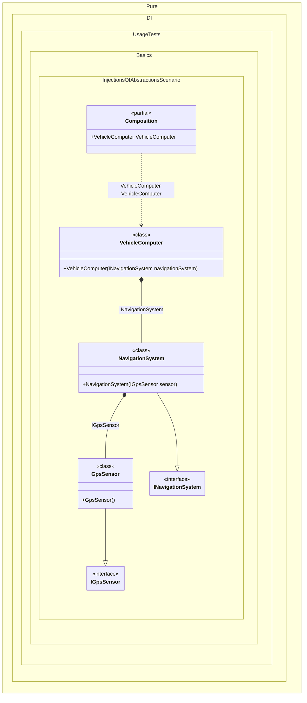

#### Injections of abstractions

This example demonstrates the recommended approach of using abstractions instead of implementations when injecting dependencies.


```c#
using Pure.DI;

DI.Setup(nameof(Composition))
    // Binding abstractions to their implementations:
    // The interface IGpsSensor is bound to the implementation GpsSensor
    .Bind<IGpsSensor>().To<GpsSensor>()
    // The interface INavigationSystem is bound to the implementation NavigationSystem
    .Bind<INavigationSystem>().To<NavigationSystem>()

    // Specifies to create a composition root
    // of type "VehicleComputer" with the name "VehicleComputer"
    .Root<VehicleComputer>("VehicleComputer");

var composition = new Composition();

// Usage:
// var vehicleComputer = new VehicleComputer(new NavigationSystem(new GpsSensor()));
var vehicleComputer = composition.VehicleComputer;

vehicleComputer.StartTrip();

// The sensor abstraction
interface IGpsSensor;

// The sensor implementation
class GpsSensor : IGpsSensor;

// The service abstraction
interface INavigationSystem
{
    void Navigate();
}

// The service implementation
class NavigationSystem(IGpsSensor sensor) : INavigationSystem
{
    public void Navigate()
    {
        // Navigation logic using the sensor...
    }
}

// The consumer of the abstraction
partial class VehicleComputer(INavigationSystem navigationSystem)
{
    public void StartTrip() => navigationSystem.Navigate();
}
```

<details>
<summary>Running this code sample locally</summary>

- Make sure you have the [.NET SDK 10.0](https://dotnet.microsoft.com/en-us/download/dotnet/10.0) or later is installed
```bash
dotnet --list-sdk
```
- Create a net10.0 (or later) console application
```bash
dotnet new console -n Sample
```
- Add reference to NuGet package
  - [Pure.DI](https://www.nuget.org/packages/Pure.DI)
```bash
dotnet add package Pure.DI
```
- Copy the example code into the _Program.cs_ file

You are ready to run the example 🚀
```bash
dotnet run
```

</details>

Usually the biggest block in the setup is the chain of bindings, which describes which implementation corresponds to which abstraction. This is necessary so that the code generator can build a composition of objects using only NOT abstract types. This is true because the cornerstone of DI technology implementation is the principle of abstraction-based programming rather than concrete class-based programming. Thanks to it, it is possible to replace one concrete implementation by another. And each implementation can correspond to an arbitrary number of abstractions.
> [!TIP]
> Even if the binding is not defined, there is no problem with the injection, but obviously under the condition that the consumer requests an injection NOT of abstract type.


The following partial class will be generated:

```c#
partial class Composition
{
  [OrdinalAttribute(256)]
  public Composition()
  {
  }

  internal Composition(Composition parentScope)
  {
  }

  public VehicleComputer VehicleComputer
  {
    [MethodImpl(MethodImplOptions.AggressiveInlining)]
    get
    {
      return new VehicleComputer(new NavigationSystem(new GpsSensor()));
    }
  }
}
```

Class diagram:



