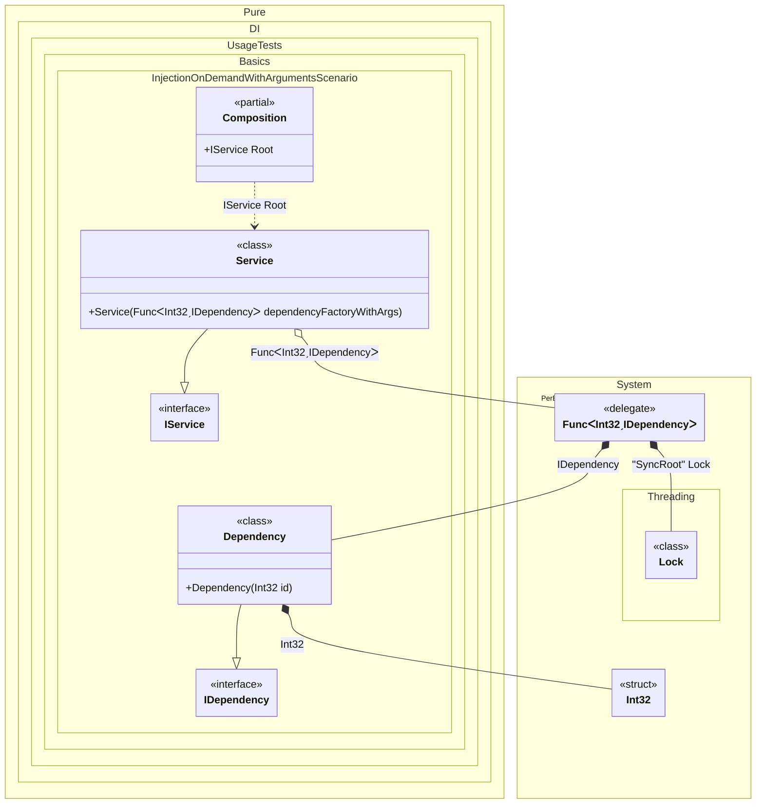

#### Injections on demand with arguments

This example illustrates dependency injection with parameterized factory functions using Pure.DI, where dependencies are created with runtime-provided arguments. The scenario features a service that generates dependencies with specific IDs passed during instantiation.


```c#
using Shouldly;
using Pure.DI;
using System.Collections.Generic;

DI.Setup(nameof(Composition))
    .Bind().To<Dependency>()
    .Bind().To<Service>()

    // Composition root
    .Root<IService>("Root");

var composition = new Composition();
var service = composition.Root;
var dependencies = service.Dependencies;
dependencies.Count.ShouldBe(2);
dependencies[0].Id.ShouldBe(33);
dependencies[1].Id.ShouldBe(99);

interface IDependency
{
    int Id { get; }
}

class Dependency(int id) : IDependency
{
    public int Id { get; } = id;
}

interface IService
{
    IReadOnlyList<IDependency> Dependencies { get; }
}

class Service(Func<int, IDependency> dependencyFactoryWithArgs): IService
{
    public IReadOnlyList<IDependency> Dependencies { get; } =
    [
        dependencyFactoryWithArgs(33),
        dependencyFactoryWithArgs(99)
    ];
}
```

<details>
<summary>Running this code sample locally</summary>

- Make sure you have the [.NET SDK 9.0](https://dotnet.microsoft.com/en-us/download/dotnet/9.0) or later is installed
```bash
dotnet --list-sdk
```
- Create a net9.0 (or later) console application
```bash
dotnet new console -n Sample
```
- Add references to NuGet packages
  - [Pure.DI](https://www.nuget.org/packages/Pure.DI)
  - [Shouldly](https://www.nuget.org/packages/Shouldly)
```bash
dotnet add package Pure.DI
dotnet add package Shouldly
```
- Copy the example code into the _Program.cs_ file

You are ready to run the example 🚀
```bash
dotnet run
```

</details>

Key components:
- `Dependency` class accepts an int id constructor argument, stored in its `Id` property.
- `Service` receives `Func<int, IDependency>` delegate, enabling creation of dependencies with dynamic values.
- `Service` creates two dependencies using the factory – one with ID `33`, another with ID `99`.

Delayed dependency instantiation:
- Injection of dependencies requiring runtime parameters
- Creation of distinct instances with different configurations
- Type-safe resolution of dependencies with constructor arguments

The following partial class will be generated:

```c#
partial class Composition
{
#if NET9_0_OR_GREATER
  private readonly Lock _lock;
#else
  private readonly Object _lock;
#endif

  [OrdinalAttribute(256)]
  public Composition()
  {
#if NET9_0_OR_GREATER
    _lock = new Lock();
#else
    _lock = new Object();
#endif
  }

  internal Composition(Composition parentScope)
  {
    _lock = parentScope._lock;
  }

  public IService Root
  {
    [MethodImpl(MethodImplOptions.AggressiveInlining)]
    get
    {
      Func<int, IDependency> blockFunc1;
      lock (_lock)
      {
        Func<int, IDependency> localFactory109 = new Func<int, IDependency>((int localArg16) =>
        {
          Lock transLock2 = _lock;
          Lock localLockObject110 = transLock2;
          lock (localLockObject110)
          {
            int overrInt32 = localArg16;
            IDependency localValue111 = new Dependency(overrInt32);
            return localValue111;
          }
        });
        blockFunc1 = localFactory109;
      }

      return new Service(blockFunc1);
    }
  }
}
```

Class diagram:



