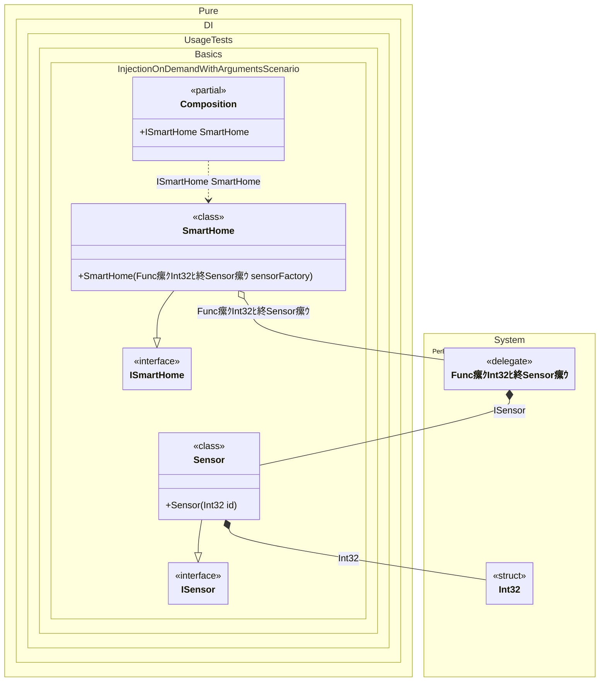

#### Injections on demand with arguments

This example illustrates dependency injection with parameterized factory functions using Pure.DI, where dependencies are created with runtime-provided arguments. The scenario features a service that generates dependencies with specific IDs passed during instantiation.


```c#
using Shouldly;
using Pure.DI;
using System.Collections.Generic;

DI.Setup(nameof(Composition))
    .Bind().To<Sensor>()
    .Bind().To<SmartHome>()

    // Composition root
    .Root<ISmartHome>("SmartHome");

var composition = new Composition();
var smartHome = composition.SmartHome;
var sensors = smartHome.Sensors;

sensors.Count.ShouldBe(2);
sensors[0].Id.ShouldBe(101);
sensors[1].Id.ShouldBe(102);

interface ISensor
{
    int Id { get; }
}

class Sensor(int id) : ISensor
{
    public int Id { get; } = id;
}

interface ISmartHome
{
    IReadOnlyList<ISensor> Sensors { get; }
}

class SmartHome(Func<int, ISensor> sensorFactory) : ISmartHome
{
    public IReadOnlyList<ISensor> Sensors { get; } =
    [
        // Use the injected factory to create a sensor with ID 101 (e.g., Kitchen Temperature)
        sensorFactory(101),

        // Create another sensor with ID 102 (e.g., Living Room Humidity)
        sensorFactory(102)
    ];
}
```

<details>
<summary>Running this code sample locally</summary>

- Make sure you have the [.NET SDK 10.0](https://dotnet.microsoft.com/en-us/download/dotnet/10.0) or later is installed
```bash
dotnet --list-sdk
```
- Create a net10.0 (or later) console application
```bash
dotnet new console -n Sample
```
- Add references to NuGet packages
  - [Pure.DI](https://www.nuget.org/packages/Pure.DI)
  - [Shouldly](https://www.nuget.org/packages/Shouldly)
```bash
dotnet add package Pure.DI
dotnet add package Shouldly
```
- Copy the example code into the _Program.cs_ file

You are ready to run the example 🚀
```bash
dotnet run
```

</details>

Delayed dependency instantiation:
- Injection of dependencies requiring runtime parameters
- Creation of distinct instances with different configurations
- Type-safe resolution of dependencies with constructor arguments

The following partial class will be generated:

```c#
partial class Composition
{
#if NET9_0_OR_GREATER
  private readonly Lock _lock;
#else
  private readonly Object _lock;
#endif

  [OrdinalAttribute(256)]
  public Composition()
  {
#if NET9_0_OR_GREATER
    _lock = new Lock();
#else
    _lock = new Object();
#endif
  }

  internal Composition(Composition parentScope)
  {
    _lock = parentScope._lock;
  }

  public ISmartHome SmartHome
  {
    [MethodImpl(MethodImplOptions.AggressiveInlining)]
    get
    {
      Func<int, ISensor> transientFunc1;
      Func<int, ISensor> localFactory1 = new Func<int, ISensor>((int localArg1) =>
      {
        lock (_lock)
        {
          int overriddenInt32 = localArg1;
          ISensor localValue18 = new Sensor(overriddenInt32);
          return localValue18;
        }
      });
      transientFunc1 = localFactory1;
      return new SmartHome(transientFunc1);
    }
  }
}
```

Class diagram:



