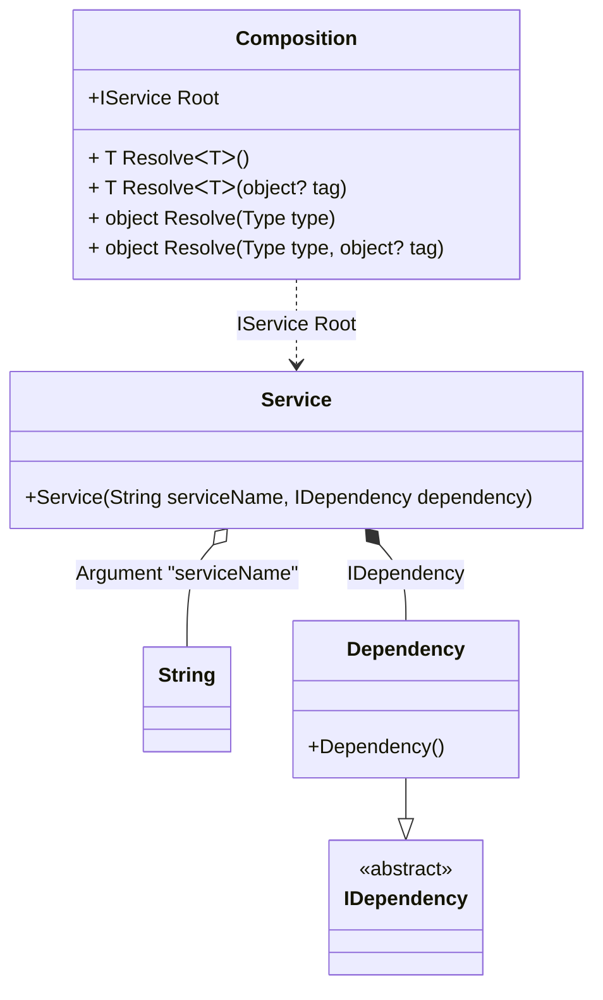

#### Instance Initialization

[](../tests/Pure.DI.UsageTests/Advanced/InstanceInitializationScenario.cs)

This example shows how to build up an instance with all the necessary dependencies and manually prepare it for further use.

```c#
interface IDependency;

class Dependency : IDependency;

interface IService
{
    string ServiceName { get; }

    IDependency Dependency { get; }

    bool IsInitialized { get; }
}

class Service(string serviceName, IDependency dependency): IService
{
    public string ServiceName { get; } = serviceName;

    public IDependency Dependency { get; } = dependency;

    public bool IsInitialized { get; private set; }

    public void Initialize() => IsInitialized = true;
}

DI.Setup(nameof(Composition))
    .Bind<IDependency>().To<Dependency>()
    .Arg<string>("serviceName")
    .Bind<IService>()
        .To<Service>(ctx =>
        {
            // Builds up an instance with all necessary dependencies
            ctx.Inject<Service>(out var service);

            // Executing all the necessary logic
            // to prepare the instance for further use
            service.Initialize();
            return service;
        })

    // Composition root
    .Root<IService>("Root");

var composition = new Composition("My Service");
var service = composition.Root;
service.ServiceName.ShouldBe("My Service");
service.IsInitialized.ShouldBeTrue();
```

<details open>
<summary>Class Diagram</summary>



</details>

<details>
<summary>Pure.DI-generated partial class Composition</summary><blockquote>

```c#
partial class Composition
{
  private readonly Composition _rootM04D27di;

  private readonly string _argM04D27di_serviceName;

  public Composition(string serviceName)
  {
    _rootM04D27di = this;
    if (ReferenceEquals(serviceName, null))
    {
      throw new ArgumentNullException("serviceName");
    }

    _argM04D27di_serviceName = serviceName;
  }

  internal Composition(Composition baseComposition)
  {
    _rootM04D27di = baseComposition._rootM04D27di;
    _argM04D27di_serviceName = baseComposition._argM04D27di_serviceName;
  }

  public IService Root
  {
    [MethodImpl((MethodImplOptions)0x100)]
    get
    {
      Service transientM04D27di0_Service;
      {
          var service_M04D27di1 = new Service(_argM04D27di_serviceName, new Dependency());
          service_M04D27di1.Initialize();
          transientM04D27di0_Service = service_M04D27di1;
      }
      return transientM04D27di0_Service;
    }
  }

  [MethodImpl((MethodImplOptions)0x100)]
  public T Resolve<T>()
  {
    return ResolverM04D27di<T>.Value.Resolve(this);
  }

  [MethodImpl((MethodImplOptions)0x100)]
  public T Resolve<T>(object? tag)
  {
    return ResolverM04D27di<T>.Value.ResolveByTag(this, tag);
  }

  [MethodImpl((MethodImplOptions)0x100)]
  public object Resolve(Type type)
  {
    var index = (int)(_bucketSizeM04D27di * ((uint)RuntimeHelpers.GetHashCode(type) % 1));
    ref var pair = ref _bucketsM04D27di[index];
    return pair.Key == type ? pair.Value.Resolve(this) : ResolveM04D27di(type, index);
  }

  [MethodImpl((MethodImplOptions)0x8)]
  private object ResolveM04D27di(Type type, int index)
  {
    var finish = index + _bucketSizeM04D27di;
    while (++index < finish)
    {
      ref var pair = ref _bucketsM04D27di[index];
      if (pair.Key == type)
      {
        return pair.Value.Resolve(this);
      }
    }

    throw new InvalidOperationException($"Cannot resolve composition root of type {type}.");
  }

  [MethodImpl((MethodImplOptions)0x100)]
  public object Resolve(Type type, object? tag)
  {
    var index = (int)(_bucketSizeM04D27di * ((uint)RuntimeHelpers.GetHashCode(type) % 1));
    ref var pair = ref _bucketsM04D27di[index];
    return pair.Key == type ? pair.Value.ResolveByTag(this, tag) : ResolveM04D27di(type, tag, index);
  }

  [MethodImpl((MethodImplOptions)0x8)]
  private object ResolveM04D27di(Type type, object? tag, int index)
  {
    var finish = index + _bucketSizeM04D27di;
    while (++index < finish)
    {
      ref var pair = ref _bucketsM04D27di[index];
      if (pair.Key == type)
      {
        return pair.Value.ResolveByTag(this, tag);
      }
    }

    throw new InvalidOperationException($"Cannot resolve composition root \"{tag}\" of type {type}.");
  }

  public override string ToString()
  {
    return
      "classDiagram\n" +
        "  class Composition {\n" +
          "    +IService Root\n" +
          "    + T ResolveᐸTᐳ()\n" +
          "    + T ResolveᐸTᐳ(object? tag)\n" +
          "    + object Resolve(Type type)\n" +
          "    + object Resolve(Type type, object? tag)\n" +
        "  }\n" +
        "  class Service {\n" +
          "    +Service(String serviceName, IDependency dependency)\n" +
        "  }\n" +
        "  class String\n" +
        "  Dependency --|> IDependency : \n" +
        "  class Dependency {\n" +
          "    +Dependency()\n" +
        "  }\n" +
        "  class IDependency {\n" +
          "    <<abstract>>\n" +
        "  }\n" +
        "  Service o-- String : Argument \"serviceName\"\n" +
        "  Service *--  Dependency : IDependency\n" +
        "  Composition ..> Service : IService Root";
  }

  private readonly static int _bucketSizeM04D27di;
  private readonly static Pair<Type, IResolver<Composition, object>>[] _bucketsM04D27di;

  static Composition()
  {
    var valResolverM04D27di_0000 = new ResolverM04D27di_0000();
    ResolverM04D27di<IService>.Value = valResolverM04D27di_0000;
    _bucketsM04D27di = Buckets<Type, IResolver<Composition, object>>.Create(
      1,
      out _bucketSizeM04D27di,
      new Pair<Type, IResolver<Composition, object>>[1]
      {
         new Pair<Type, IResolver<Composition, object>>(typeof(IService), valResolverM04D27di_0000)
      });
  }

  private sealed class ResolverM04D27di<T>: IResolver<Composition, T>
  {
    public static IResolver<Composition, T> Value = new ResolverM04D27di<T>();

    public T Resolve(Composition composite)
    {
      throw new InvalidOperationException($"Cannot resolve composition root of type {typeof(T)}.");
    }

    public T ResolveByTag(Composition composite, object tag)
    {
      throw new InvalidOperationException($"Cannot resolve composition root \"{tag}\" of type {typeof(T)}.");
    }
  }

  private sealed class ResolverM04D27di_0000: IResolver<Composition, IService>
  {
    public IService Resolve(Composition composition)
    {
      return composition.Root;
    }

    public IService ResolveByTag(Composition composition, object tag)
    {
      switch (tag)
      {
        case null:
          return composition.Root;
        default:
          throw new InvalidOperationException($"Cannot resolve composition root \"{tag}\" of type IService.");
      }
    }
  }
}
```

</blockquote></details>

