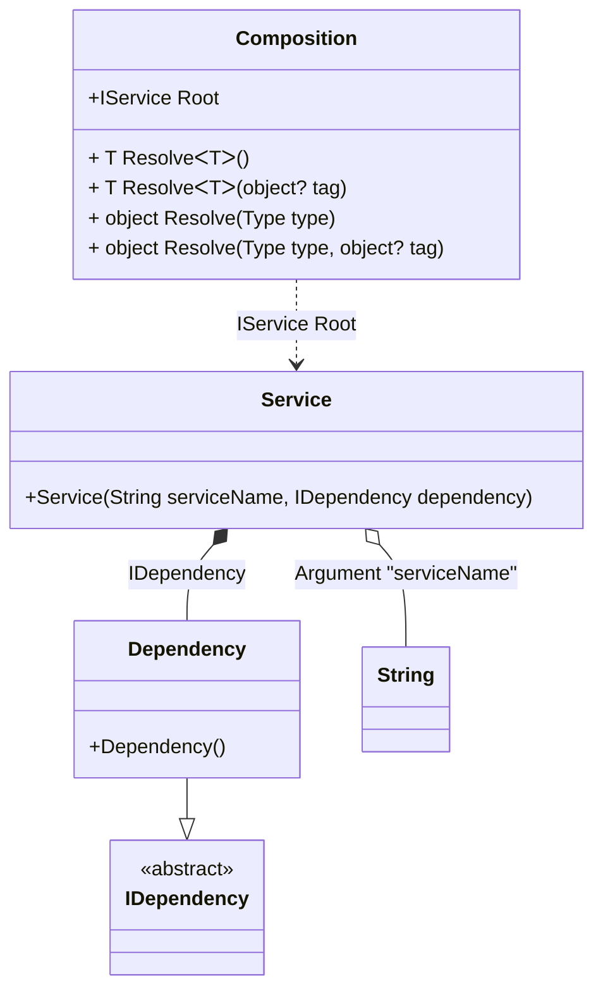

#### Instance Initialization

[](../tests/Pure.DI.UsageTests/Basics/InstanceInitializationScenario.cs)

This example shows how to build up an instance with all the necessary dependencies and manually prepare it for further use.

```c#
interface IDependency;

class Dependency : IDependency;

interface IService
{
    string ServiceName { get; }

    IDependency Dependency { get; }

    bool IsInitialized { get; }
}

class Service(string serviceName, IDependency dependency): IService
{
    public string ServiceName { get; } = serviceName;

    public IDependency Dependency { get; } = dependency;

    public bool IsInitialized { get; private set; }

    public void Initialize() =>
        IsInitialized = true;
}

DI.Setup("Composition")
    .Bind<IDependency>().To<Dependency>()
    .Arg<string>("serviceName")
    .Bind<IService>()
        .To<Service>(ctx =>
        {
            // Builds up an instance with all necessary dependencies
            ctx.Inject<Service>(out var service);

            // Executing all the necessary logic
            // to prepare the instance for further use
            service.Initialize();
            return service;
        })
        .Root<IService>("Root");

var composition = new Composition("My Service");
var service = composition.Root;
service.ServiceName.ShouldBe("My Service");
service.IsInitialized.ShouldBeTrue();
```

<details open>
<summary>Class Diagram</summary>



</details>

<details>
<summary>Pure.DI-generated partial class Composition</summary><blockquote>

```c#
partial class Composition
{
  private readonly global::System.IDisposable[] _disposableSingletonsM12D30di;
  private readonly string _argM12D30di_serviceName;
  
  public Composition(string serviceName)
  {
    if (global::System.Object.ReferenceEquals(serviceName, null))
    {
      throw new global::System.ArgumentNullException("serviceName");
    }
    
    _argM12D30di_serviceName = serviceName;
    _disposableSingletonsM12D30di = new global::System.IDisposable[0];
  }
  
  internal Composition(Composition parent)
  {
    _disposableSingletonsM12D30di = new global::System.IDisposable[0];
    _argM12D30di_serviceName = parent._argM12D30di_serviceName;
  }
  
  #region Composition Roots
  public Pure.DI.UsageTests.Basics.InstanceInitializationScenario.IService Root
  {
    #if NETSTANDARD2_0_OR_GREATER || NETCOREAPP || NET40_OR_GREATER || NET
    [global::System.Diagnostics.Contracts.Pure]
    #endif
    get
    {
      Pure.DI.UsageTests.Basics.InstanceInitializationScenario.Service transientM12D30di0_Service;
      {
          var localM12D30di1_service = new Pure.DI.UsageTests.Basics.InstanceInitializationScenario.Service(_argM12D30di_serviceName, new Pure.DI.UsageTests.Basics.InstanceInitializationScenario.Dependency());
          localM12D30di1_service.Initialize();
          transientM12D30di0_Service = localM12D30di1_service;
      }
      return transientM12D30di0_Service;
    }
  }
  #endregion
  
  #region API
  #if NETSTANDARD2_0_OR_GREATER || NETCOREAPP || NET40_OR_GREATER || NET
  [global::System.Diagnostics.Contracts.Pure]
  #endif
  public T Resolve<T>()
  {
    return ResolverM12D30di<T>.Value.Resolve(this);
  }
  
  #if NETSTANDARD2_0_OR_GREATER || NETCOREAPP || NET40_OR_GREATER || NET
  [global::System.Diagnostics.Contracts.Pure]
  #endif
  public T Resolve<T>(object? tag)
  {
    return ResolverM12D30di<T>.Value.ResolveByTag(this, tag);
  }
  
  #if NETSTANDARD2_0_OR_GREATER || NETCOREAPP || NET40_OR_GREATER || NET
  [global::System.Diagnostics.Contracts.Pure]
  #endif
  public object Resolve(global::System.Type type)
  {
    var index = (int)(_bucketSizeM12D30di * ((uint)global::System.Runtime.CompilerServices.RuntimeHelpers.GetHashCode(type) % 1));
    var finish = index + _bucketSizeM12D30di;
    do {
      ref var pair = ref _bucketsM12D30di[index];
      if (ReferenceEquals(pair.Key, type))
      {
        return pair.Value.Resolve(this);
      }
    } while (++index < finish);
    
    throw new global::System.InvalidOperationException($"Cannot resolve composition root of type {type}.");
  }
  
  #if NETSTANDARD2_0_OR_GREATER || NETCOREAPP || NET40_OR_GREATER || NET
  [global::System.Diagnostics.Contracts.Pure]
  #endif
  public object Resolve(global::System.Type type, object? tag)
  {
    var index = (int)(_bucketSizeM12D30di * ((uint)global::System.Runtime.CompilerServices.RuntimeHelpers.GetHashCode(type) % 1));
    var finish = index + _bucketSizeM12D30di;
    do {
      ref var pair = ref _bucketsM12D30di[index];
      if (ReferenceEquals(pair.Key, type))
      {
        return pair.Value.ResolveByTag(this, tag);
      }
    } while (++index < finish);
    
    throw new global::System.InvalidOperationException($"Cannot resolve composition root \"{tag}\" of type {type}.");
  }
  #endregion
  
  public override string ToString()
  {
    return
      "classDiagram\n" +
        "  class Composition {\n" +
          "    +IService Root\n" +
          "    + T ResolveᐸTᐳ()\n" +
          "    + T ResolveᐸTᐳ(object? tag)\n" +
          "    + object Resolve(Type type)\n" +
          "    + object Resolve(Type type, object? tag)\n" +
        "  }\n" +
        "  class Service {\n" +
          "    +Service(String serviceName, IDependency dependency)\n" +
        "  }\n" +
        "  Dependency --|> IDependency : \n" +
        "  class Dependency {\n" +
          "    +Dependency()\n" +
        "  }\n" +
        "  class String\n" +
        "  class IDependency {\n" +
          "    <<abstract>>\n" +
        "  }\n" +
        "  Service o-- String : Argument \"serviceName\"\n" +
        "  Service *--  Dependency : IDependency\n" +
        "  Composition ..> Service : IService Root";
  }
  
  private readonly static int _bucketSizeM12D30di;
  private readonly static global::Pure.DI.Pair<global::System.Type, global::Pure.DI.IResolver<Composition, object>>[] _bucketsM12D30di;
  
  static Composition()
  {
    var valResolverM12D30di_0000 = new ResolverM12D30di_0000();
    ResolverM12D30di<Pure.DI.UsageTests.Basics.InstanceInitializationScenario.IService>.Value = valResolverM12D30di_0000;
    _bucketsM12D30di = global::Pure.DI.Buckets<global::System.Type, global::Pure.DI.IResolver<Composition, object>>.Create(
      1,
      out _bucketSizeM12D30di,
      new global::Pure.DI.Pair<global::System.Type, global::Pure.DI.IResolver<Composition, object>>[1]
      {
         new global::Pure.DI.Pair<global::System.Type, global::Pure.DI.IResolver<Composition, object>>(typeof(Pure.DI.UsageTests.Basics.InstanceInitializationScenario.IService), valResolverM12D30di_0000)
      });
  }
  
  #region Resolvers
  private sealed class ResolverM12D30di<T>: global::Pure.DI.IResolver<Composition, T>
  {
    public static global::Pure.DI.IResolver<Composition, T> Value = new ResolverM12D30di<T>();
    
    public T Resolve(Composition composite)
    {
      throw new global::System.InvalidOperationException($"Cannot resolve composition root of type {typeof(T)}.");
    }
    
    public T ResolveByTag(Composition composite, object tag)
    {
      throw new global::System.InvalidOperationException($"Cannot resolve composition root \"{tag}\" of type {typeof(T)}.");
    }
  }
  
  private sealed class ResolverM12D30di_0000: global::Pure.DI.IResolver<Composition, Pure.DI.UsageTests.Basics.InstanceInitializationScenario.IService>
  {
    public Pure.DI.UsageTests.Basics.InstanceInitializationScenario.IService Resolve(Composition composition)
    {
      return composition.Root;
    }
    
    public Pure.DI.UsageTests.Basics.InstanceInitializationScenario.IService ResolveByTag(Composition composition, object tag)
    {
      switch (tag)
      {
        case null:
          return composition.Root;
      }
      throw new global::System.InvalidOperationException($"Cannot resolve composition root \"{tag}\" of type Pure.DI.UsageTests.Basics.InstanceInitializationScenario.IService.");
    }
  }
  #endregion
}
```

</blockquote></details>

